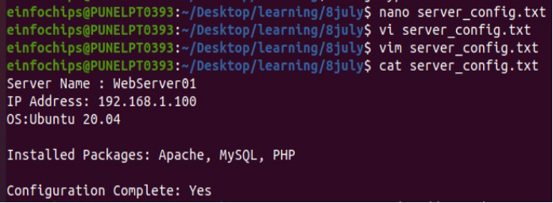

1) created and edited text file using nano ,vi and vim command

 

2) added developer user account

 

3) Added user developer in devteam group and then remove the developer from devteam group

 

 

4) Remove user developer

5) View permission of file

6) Change permissions to read and write for the owner and read-only for others and verify using ls -l command

**Creating and Deploying a Static Website with Apache2**

1) we install the apache2
1) After installation we enable the apache

3) start  and check the status of apache

