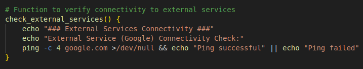
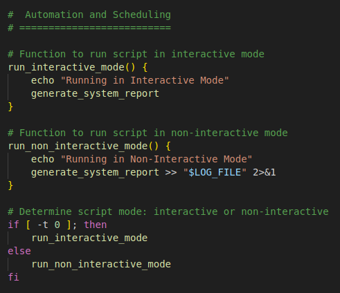

##  Develop script for sysops to automate System monitoring and generate detailed Reports.

+ The script will leverage advanced Linux shell scripting techniques to monitor system metrics, capture logs, and provide actionable insights for system administrators.

#### 1. Script Initialization:
 
  + first create repo and give permission 
  +  ` touch script.sh`
  +   ` chmod 744 script.sh ` 
  +   ` vim script.sh `

  + Initialize script with necessary variables and configurations. 
   
  

   + Validate required commands and utilities availability.
    

  

#### 2. System Metrics Collection:

   + Monitor CPU usage, memory utilization, disk space, and network statistics.
    
   

   + Capture process information including top processes consuming resources.
    
   

#### 3. Log Analysis:
  
   + Parse system logs (e.g., syslog) for critical events and errors.
    
    

#### 4. Health Checks:
   + Check the status of essential services (e.g., Apache, MySQL).
   
    

   + Verify connectivity to external services or databases.
     
    

#### 5. Alerting Mechanism:
   
  + Implement thresholds for critical metrics (CPU, memory) triggering alerts.
   
  
    

#### 6. Report Generation:
   + Compile all collected data into a detailed report.
    
   

#### 7. Automation and Scheduling :
  + Configure the script to run periodically via cron for automated monitoring.
   
  

  + Ensure the script can handle both interactive and non-interactive execution modes.
   
  