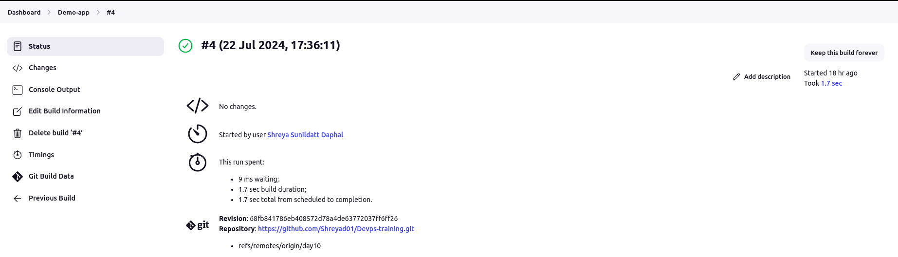

### Jenkins
+  step 1: Install  Jenkins
  + `sudo wget -O /usr/share/keyrings/jenkins-keyring.asc \ https://pkg.jenkins.io/debian-stable/jenkins.io-2023.key`

  + `echo "deb [signed-by=/usr/share/keyrings/jenkins-keyring.asc]" \ `
    `https://pkg.jenkins.io/debian-stable binary/ | sudo tee \ `
    `/etc/apt/sources.list.d/jenkins.list > /dev/null`
  + ` sudo apt-get update `

  + ` sudo apt-get install jenkins`

+ step2 :  

  +  Browse  `http://localhost:8080 `
  + To unlock jenkins use administrator passwords . To print password at console use command  : 
     + ` sudo cat /var/lib/jenkins/secrets/initialAdminPassword `
  + install plugins
  + set `username` and `password`
  
+ Step 3 :
  + click on `new item `
  + Enter project name  `Demo-app `and select freestyle project then ok
  + go to `configuration` 
  + in `source code management` select `Git`
  + write git `repository URL` and write branch name in `branch specifier`  
     

    + 

  + In `Build triggers` we select `build periodicaly`
    + in build periodicaly we can set building time in format of minute,hour,date,month,day
    + `we have to trigger build every 5 min`
     
    +  
  + In Build steps select Execute shell and write commands
   + to run java write commands :
   + `javac day10/sample-java-app-master/Sample.java`
   + ` cd day10/sample-java-app-master`
   + ` java Sample`
    
    + 
    + here `javac ` is use for java compiler  
     + java compiler work for given path `day10/sample-java-app-master/Sample.java`
     + `cd day10/sample-java-app-master` here java comiler move to given path 
     + `java Sample` is class 

  + click on save
   

    + click on `build now `
    + In build history you will see build number and if build is fail we see red tick and if bild is successful then it show green tick
    + click on build number you will see build information 
     
     +  

     + in  that build information we see console output
     + in console output we see output information
      

     + 