## jenkins

### dev compile

+ 1) on jenkins in new item create dev compile using free style project
+ 2) in configure got to source code management
+ 3) in source code management select `Git` 
+ 4) in Git write gitHub repository URL
+ 5) on Branches to build specify the branch name
   
  + 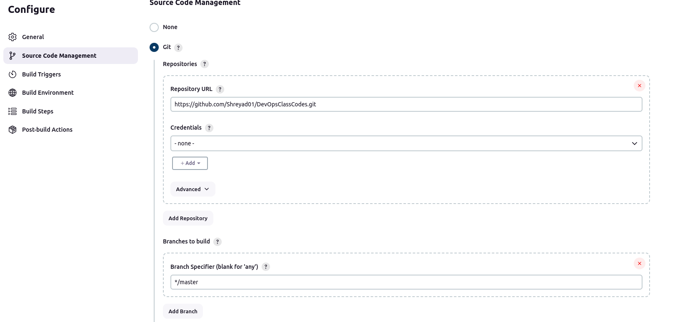

  + 6) move to Build Steps
  + 7) in build step select `Invoke top-level Maven targets` as `Maven 3.9.0` `Goal` as `compile`
   
   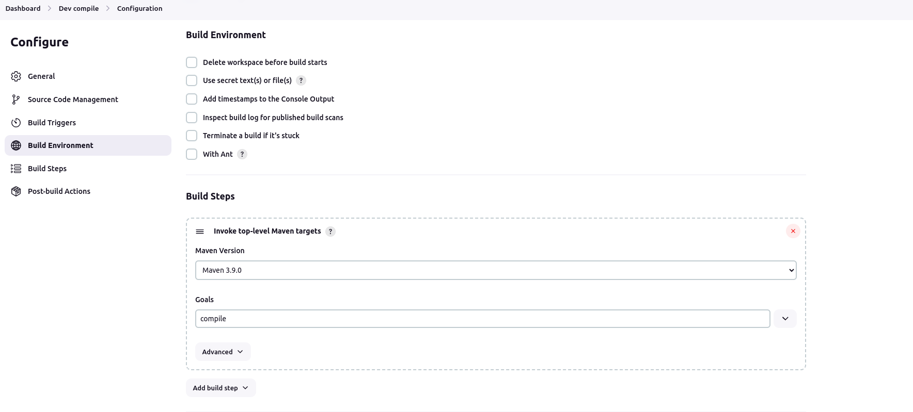
  + 8) save it and  click on `build now ` 
  + 9) after successfully build  in consoule output it show `finished : success`
   
  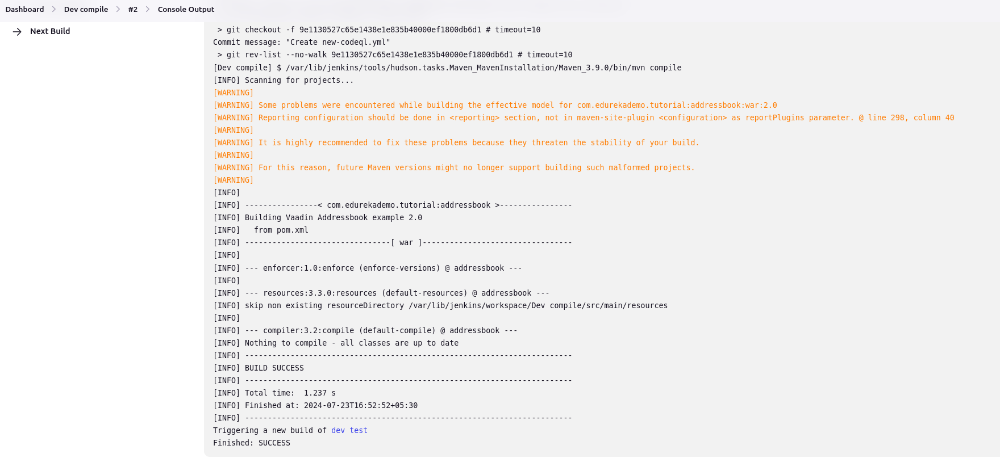

### dev test

+ 1) on jenkins in new item create dev test using free style project
+ 2) in configure got to source code management
+ 3) in source code management select `Git` 
  4) in Git write gitHub repository URL 
+ 5) on Branches to build specify the branch name
+ 6) move to Build Steps
+ 7) in build step select `Invoke top-level Maven targets` as `Maven 3.9.0` `Goal` as `test`
   
  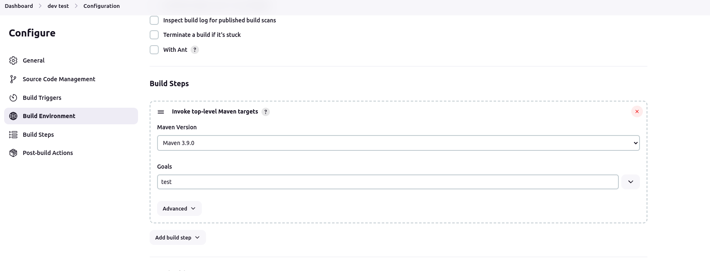
+ 8) go to `dev compile `  and do change in the `configure` 
+ 9) In configure file got to `post build action`  and select ` Build other projects` select `dev test` and click on `trigger only if build is stable` click on save
 
  
  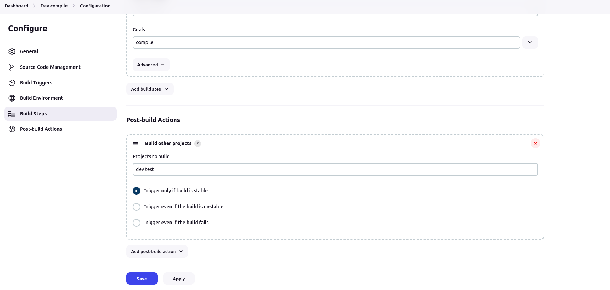
  
+ 10) again build the dev compile and check the `console output`
+ 11) afer sucessful build it will trigger new build of dev test
 

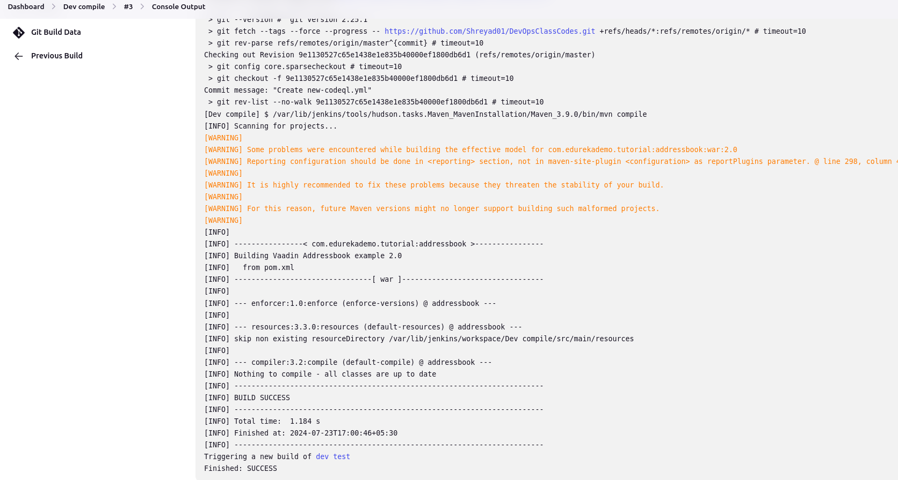

### Build Pipeline View

+ 1) install build pipeline plugins
+ 2) on Dashboard select `new view` option near All tab
 
 
  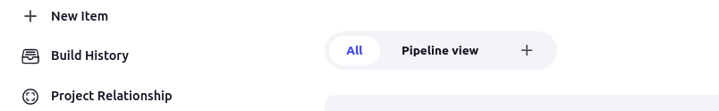

+ 3) In new view give `name` and select Type as `Build Pipeline View`then select create
+ 3) select `Filter build queue`
+ 4) write `Build Pipeline View Title`  
+ 5) in Upstream/downstream config  `select Initial job` 
 

 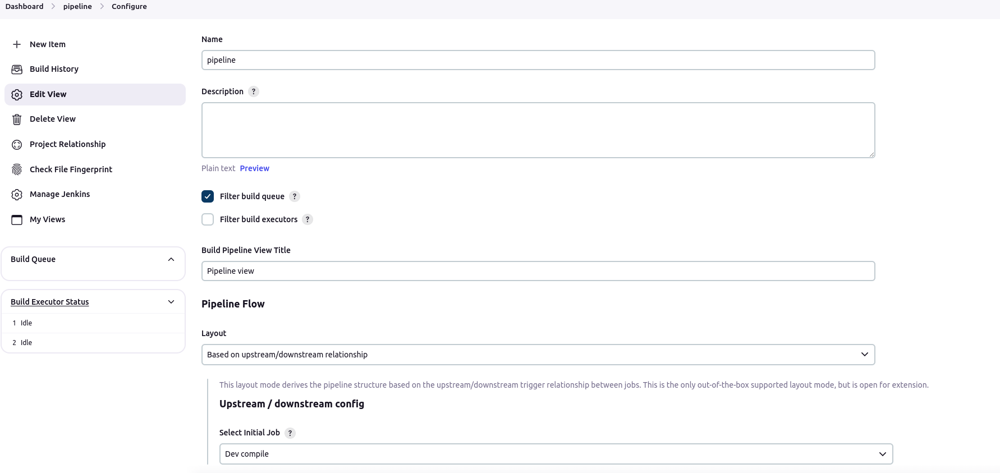

+ 6) in Trigger options select `standard build card` in `Build Cards`
+ 7) select `yes`  for ` Restrict triggers to most recent successful builds`
+ 8) select `no ` for `Always allow manual trigger on pipeline steps`
+ 9) in `Display options` select `no of Displayed Builds`
+ 10) select `Row Headers` as `Just the pipeline number`
 

  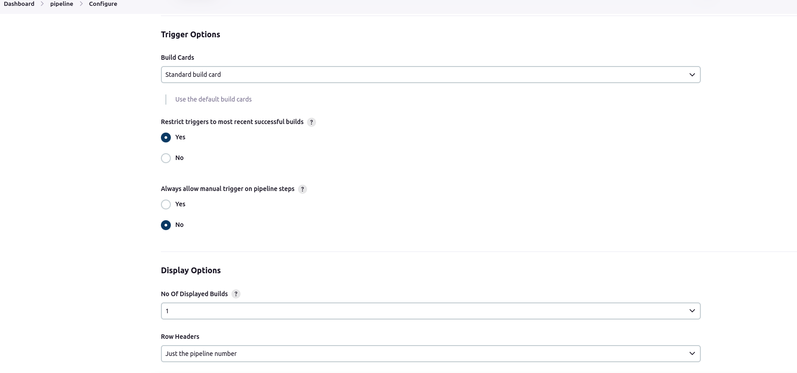

+ 11) in `column Headers` select `no header`
+ 12) in `refresh frequency` set frequency
+ 13) `in Console Output Link Style` select Lightbox
+ click on apply and ok
 

 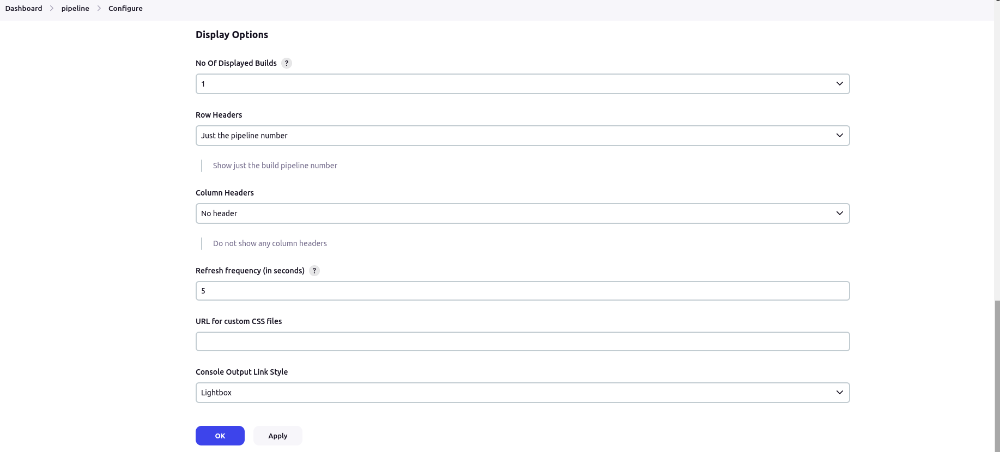

 + after completing process we see pipeline view
  

  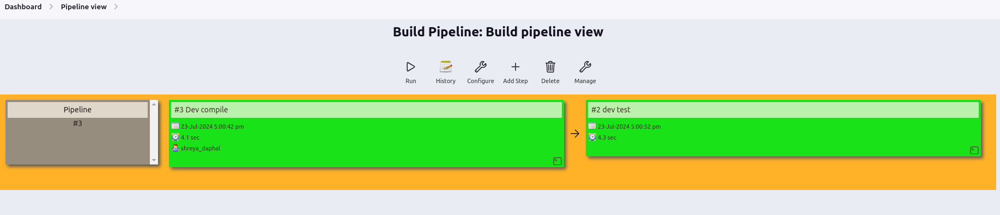

### Using Private GitHub Repository

#### Private-dev compile

+ 1) on jenkins in new item create private-dev compile using free style project
+ 2) in configure got to source code management
+ 3) in source code management select `Git` 
  
 
  + 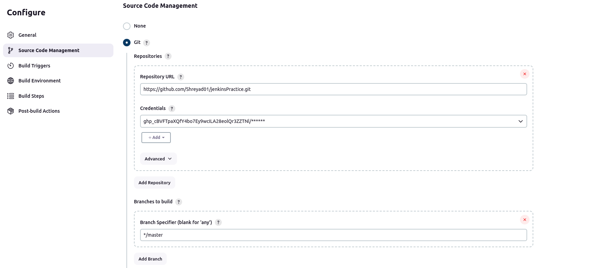
  4) in Git write gitHub repository URL ,add Credential
  5) in Credential select Add in that write `Domain` name as `Global credential`, in `kind ` put ` Username with password`,in `scope` put `Global`
  6) in ` Username` put GitHub tokden same for `password` 
   

    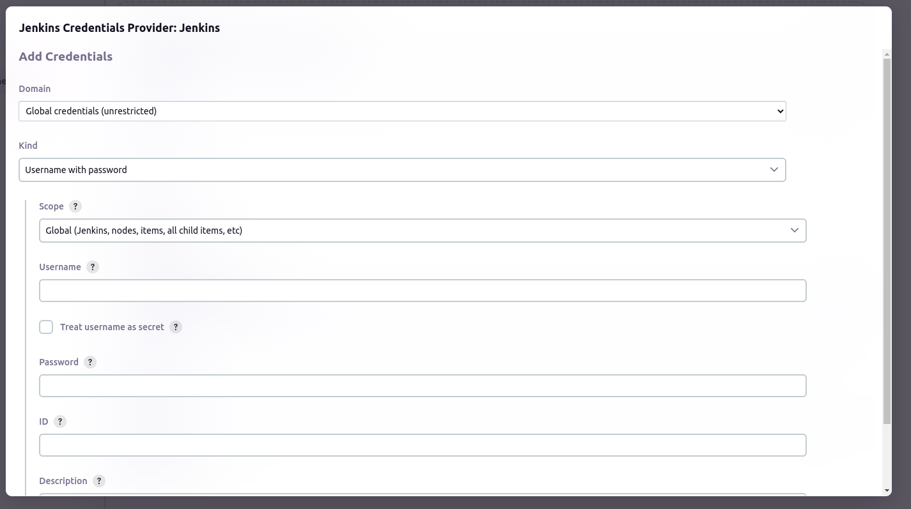
 + 7) move to Build Steps
 + 8) in build step select `Invoke top-level Maven targets` as `Maven 3.9.0` `Goal` as `compile`
   
   
    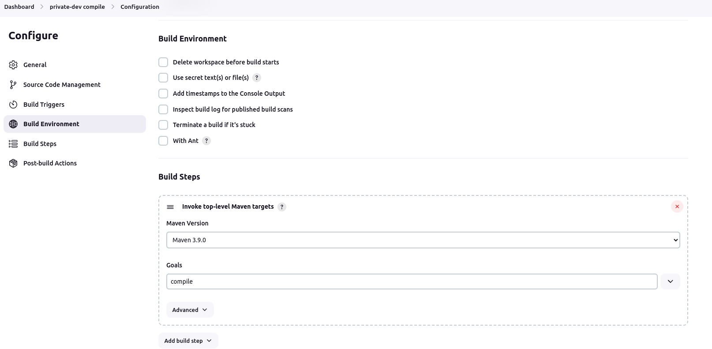
+ 9) save it and  click on `build now ` 
+ 10) after successfully build  in consoule output it show `finished : success`
   

  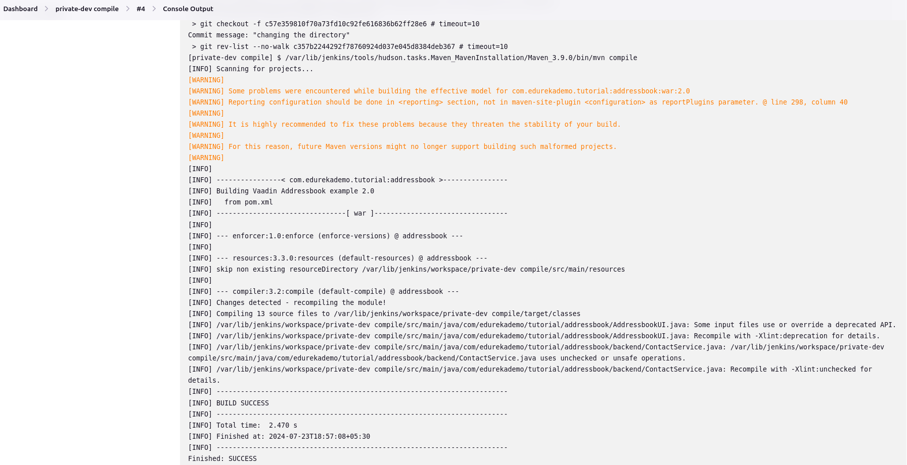

#### Private-dev test

+ 1) on jenkins in new item create private-dev test using free style project
+ 2) in configure got to source code management
+ 3) in source code management select `Git` 
  4) in Git write gitHub repository URL ,add Credential
   

   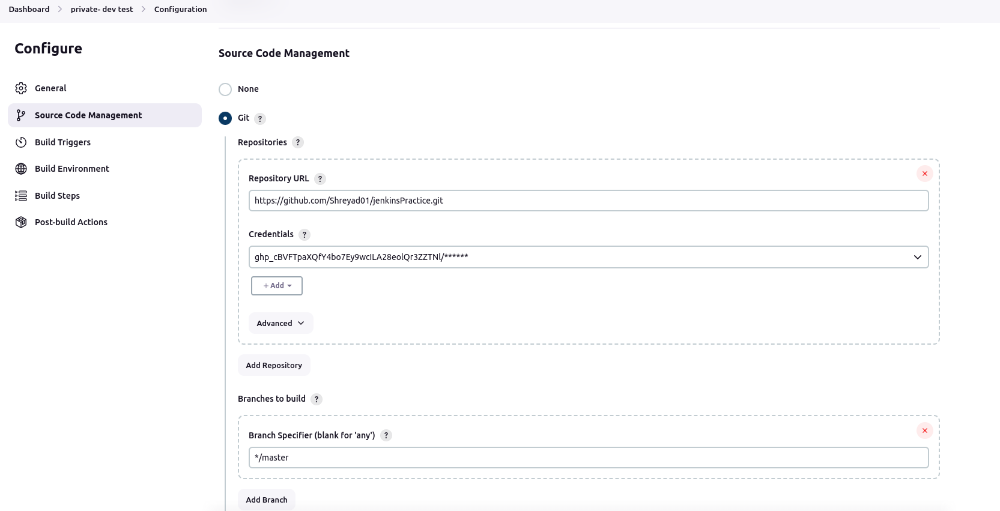
  5) in Credential select Add in that write `Domain` name as `Global credential`, in `kind ` put ` Username with password`,in `scope` put `Global`
  6) in ` Username` put GitHub tokden same for `password` 
+ 7) on Branches to build specify the branch name
+ 8) move to Build Steps
+ 9) in build step select `Invoke top-level Maven targets` as `Maven 3.9.0` `Goal` as `test`
 

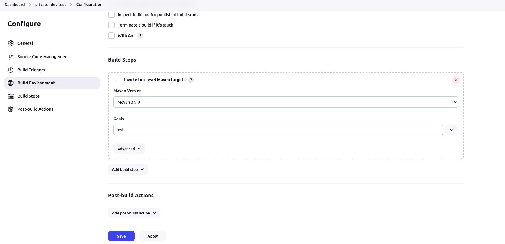  

+ 10) go to `private-dev compile `  and do change in the `configure` 
+ 11) In configure file got to `post build action`  and select ` Build other projects` select `private-dev test` and click on `trigger only if build is stable` click on save
 

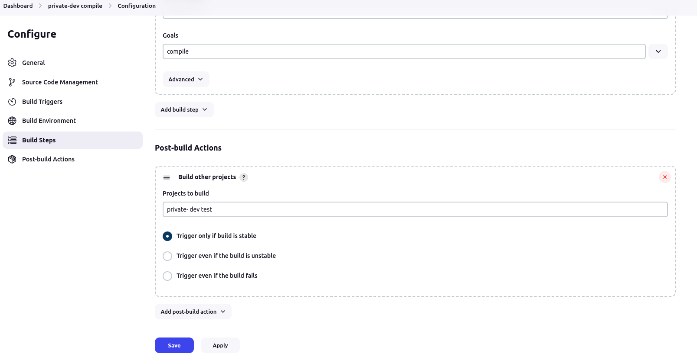
+ 12) again build the dev compile and check the `console output`
+ 13) afer sucessful build it will trigger new build of dev test
 

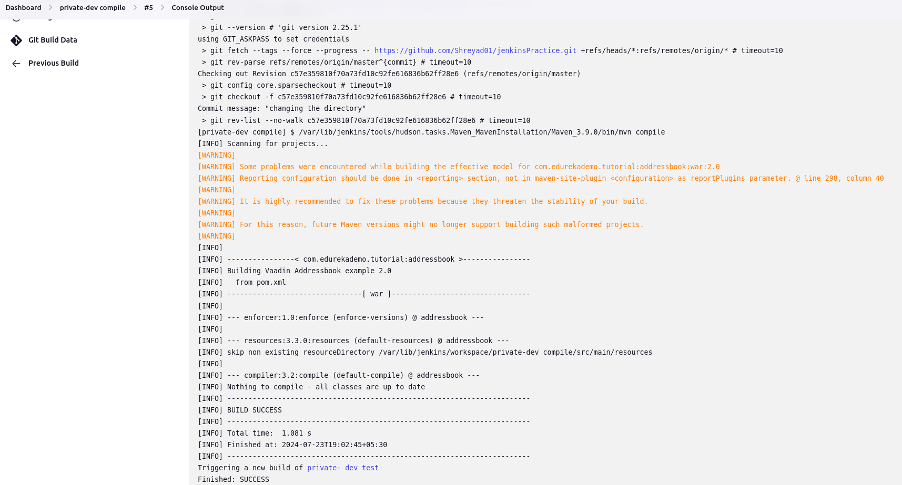
