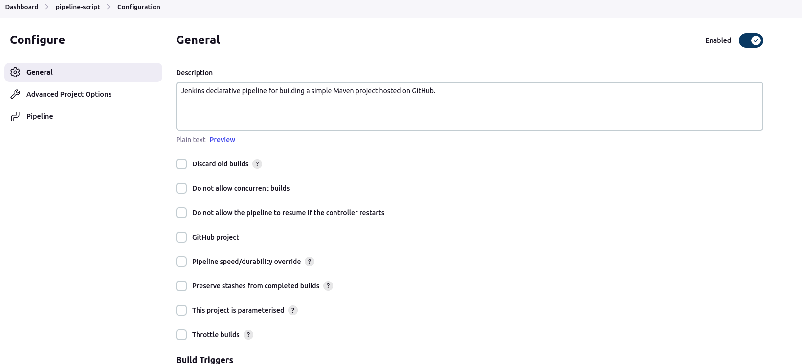
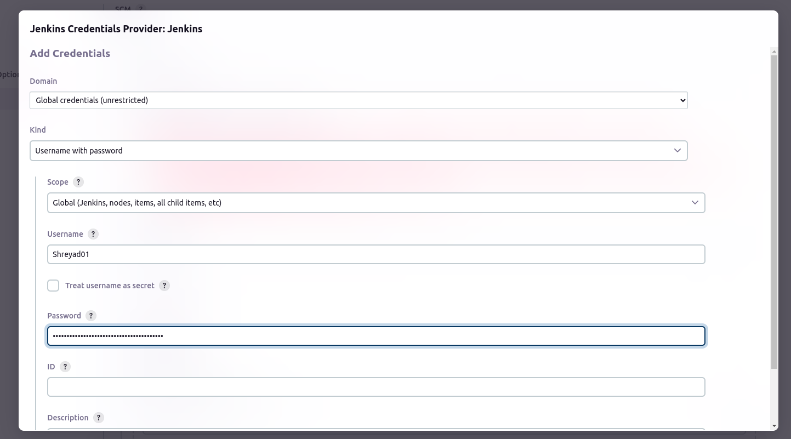
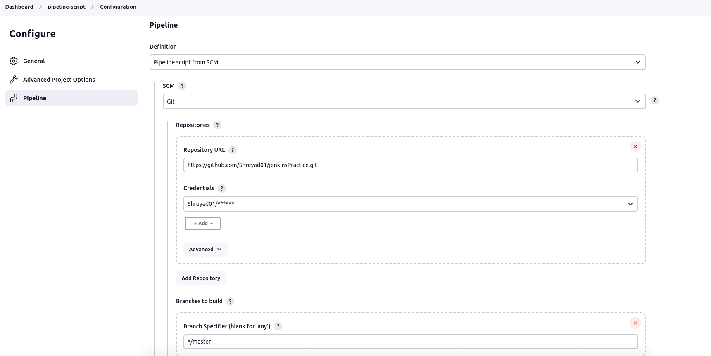
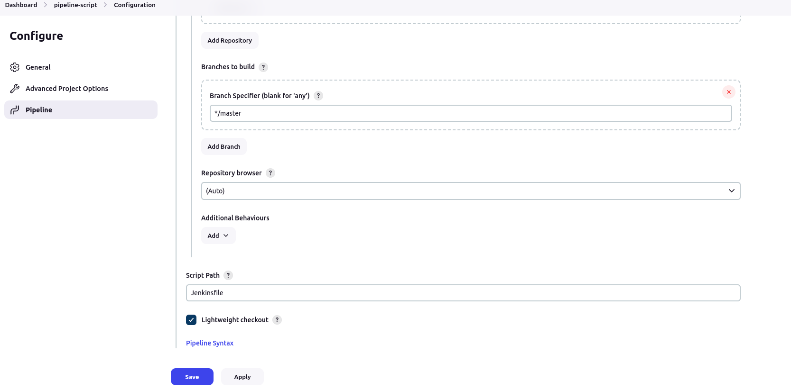
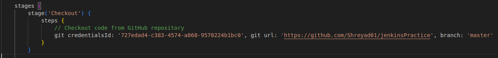
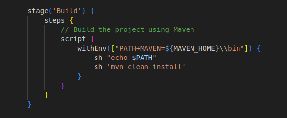
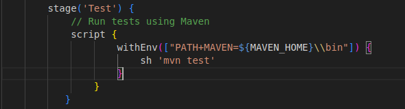
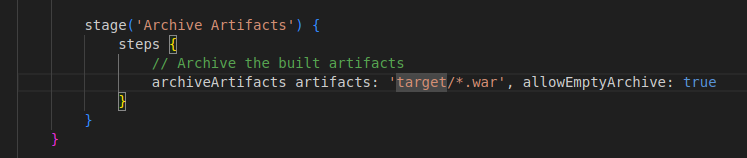
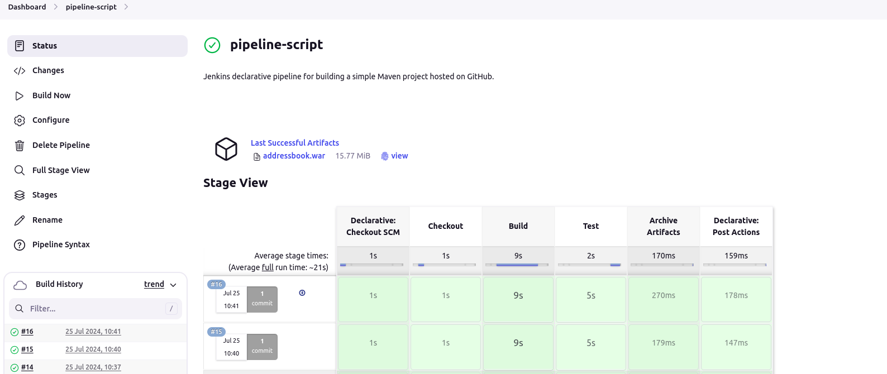

## create a Jenkins declarative pipeline for building a simple Maven project hosted on GitHub. Automate the build process, ensure code quality, and facilitate continuous delivery (CD).

#### 1. Setup Jenkins Job

+ 1) go to  `jenkins website `
+ 2) create `new item` name it `pipeline-script` using `pipeline`
+ 3) in General write `Description`
 

+ 4) go to `Advance Project Option` select Pipeline Defination as `Pipeline script from SCM`
+ 5) In `SCM` select `Git`
+ 6) write `Repository URL`
+ 7) In credential  click on `add` select `jenkins` 
+ 8) In `Domain` select `Global credential ` in `kind` select `Username with password` in `scope` select `Global` , in Username put `GitHub username` in password `use GitHUb token` then click on add

 

+ 9) in credential select your correct Credential
+ 10) In `Branch Specifier` write `branch name`

 

+ in script path default it show `Jenkinsfile`
+ now apply and save 

 

#### 2. Create Jenkinsfile

+ Write a declarative pipeline script in **Jenkinsfile** that includes the following stages:
   + 1) Clone Repository: Clone the Maven project from the GitHub repository.
     
    
   
   + 2) **Build**: Execute the Maven build process (mvn clean install).
     

     

   + 3) **Test**: Run unit tests as part of the Maven build.
     

   + 4) **Archive Artifacts**: Archive the build artifacts for future use.
    

   
 + First commit and push the **Jenkinsfile** we created  in the project repo and it must in the root directory of the project
 + ` git add `
 +  `git commit -m "adding Jenkinsfile"`
 +  `git push origin master`
 + Now got to jenkins and go to project `pipeline-script` and click on  **build now**
+ Go to Manage Jenkins select Plugins and installed `pipeline stage view` plugin for stage view
+ After complition of build the dashboard will look like following :

 

