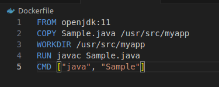

## Problem Statement:
You are tasked with setting up a CI/CD pipeline using Jenkins to streamline the deployment process of a simple Java application. The pipeline should accomplish the following tasks:

+ 1. Fetch the Dockerfile: The pipeline should clone a GitHub repository containing the source code of the Java application and a Dockerfile.
+ 2. Create a Docker Image: The pipeline should build a Docker image from the fetched Dockerfile.
+ 3. Push the Docker Image: The pipeline should push the created Docker image to a specified DockerHub repository.
+ 4. Deploy the Container: The pipeline should deploy a container using the pushed Docker image.

### 1. GitHub Repository:
+ Create on folder with the project name ` Docker-java-app` and create one `Sample.java, Dockerfile & Jenkinsfile` file use

```
mkdir Docker-java-app
cd Docker-java-app
touch Sample.java Dockerfile Jenkinsfile
```

<br>


+ clone the github repo in your folder and move all files in that repo
 
 <br>

 

+ now do `git add`, `git commit`

<br>


+ Open the Sample.java file and paste the below code which just prints the value from 1 to 10

```
public class Sample {
    public static void main(String[] args) {

        for(int i=1; i<=10;i++){

            System.out.println(i);
        }

    }
}
```

<br>


### 2. Create Dockerfile and Jenkinsfile:

 + Open the Dockerfile and write code simply used to build the image. following code uses openjdk image as a base image then copy the Sample.java file at the `/usr/src/myapp` then goes to the working directory and compile and runs the Sample.java file

```
FROM openjdk:11
WORKDIR /usr/src/myapp
COPY Sample.java /usr/src/myapp
RUN javac Sample.java
CMD ["java", "Sample"]

```

 <br>

 

 + Now open the Jenkinsfile and paste the below code

 ```
 pipeline {
    agent any
    environment {
        DOCKERHUB_CREDENTIALS = credentials('0eb1e76a-abaa-4e80-b1c1-72101f9c9f77')
        REPO_NAME = 'shreyad01/docker-java-app'
    }
    stages {
        stage('Clone Repository') {
            steps {
                git 'https://github.com/Shreyad01/docker-java.git'
            }
        }
        stage('Build Docker Image') {
            steps {
                script {
                    dockerImage = docker.build("${env.REPO_NAME}")
                }
            }
        }
        stage('Push Docker Image') {
            steps {
                script {
                    docker.withRegistry('DOCKERHUB_CREDENTIALS') {
                        // dockerImage.push("${env.BUILD_NUMBER}")
                        dockerImage.push('latest')
                    }
                }
            }
        }
        stage('Deploy Container') {
            steps {
                script {
                    sh """
                    docker run -d --name java-container \
                    ${env.REPO_NAME}:latest
                    """
                }
            }
        }
    }
    post {
        success {
            echo 'Build and test succeeded!'
        }
        failure {
            echo 'Build or test failed!'
        }
    }
}
```
<br>


+ Now push the Changes to the Github repo after commiting the changes locally
```
git add .
git commit -m "changes done in files"
git push origin master
```
<br>


<br>


### 3. Create Jenkins Project:

+ Install Docker Pipeline Plugin
+ Add DockerHub Credentials in Jenkins Credentials
+ Go to Jenkins dashboard and click on "New Item"
+ Create new pipeline job and give the name Java-Pipeline and then click on OK
<br>


+ Now in configuration provide the github repo under the Pipeline Section and choose SCM as git while configuring the Java-Pipeline job and provide the credentials if repo is private then click on SAVE 

<br>


+ After configuring the Java-Pipeline job click on Build Now to run the build

+ In the console Output we will be able to see the logs

<br>


+ After successfully building the Job the dashboard will look like this

<br>

