## Multi-Branch Project

+ on GitHub make repository with name ` my-java-app`
+ create  `my-java-app` folder on local machine . 
+ create the git repository in the my-java-app for enabling the version-control. Use following command to set do the initial commit 

```
    git init
    git status
```
+ create `pom.xml` file 
<br>


+ After creating file on local machine push the code on remote repo.use following commands

```

  git remote add origin 
  git push -u origin main

```

+ make following directories `src/main/java/com/example`
<br>

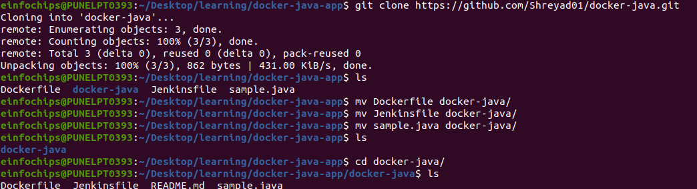

+ Go to `example ` directory and make `App.java` file
<br>


 ```
 git add
 git commit -m "Added project file"
 git status

 ```
<br>


+ push this changes on GitHub repository using command `git push -u origin main `

<br>


### Multiple branches : 

+ create branches with name `development` , ` staging`, `production` using command  
```
       git branch develpoment
       git branch staging
       git branch production

``` 

<br>

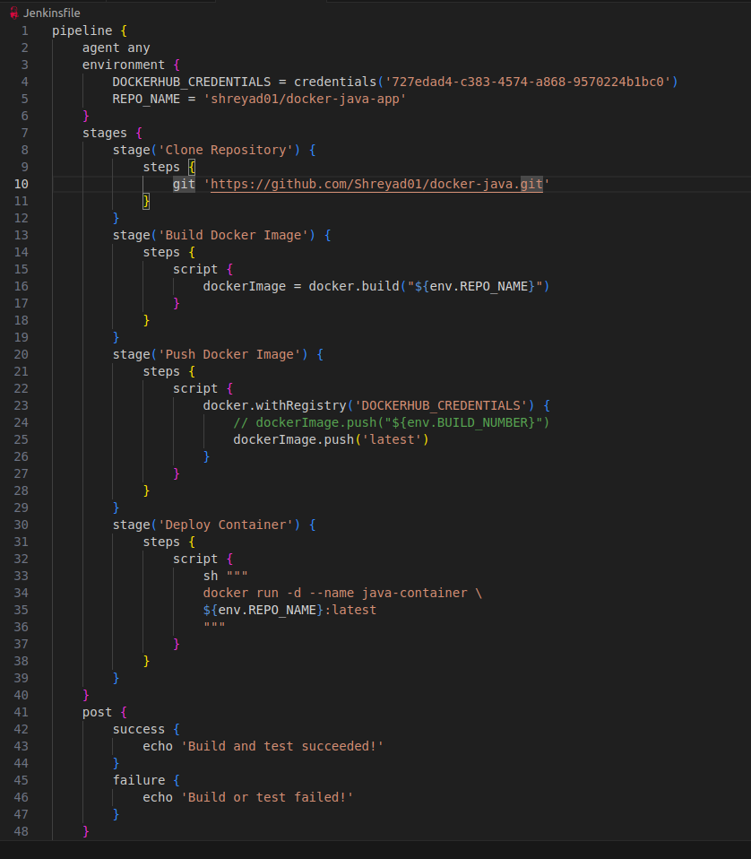

+ on each branch  do changes in  `App.java` file

<br>


<br>


+ add and commit those changes 

<br>


+ push those changes on GitHub repository

<br>

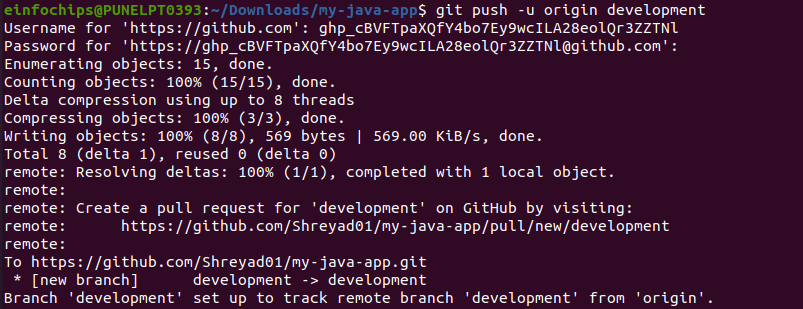

+ add  `Jenkinsfile` in each branch

<br>

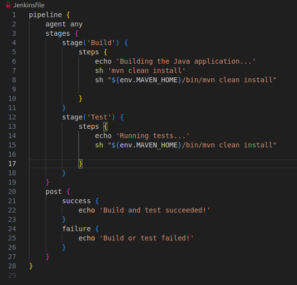

+ add ,commit changes 

<br>

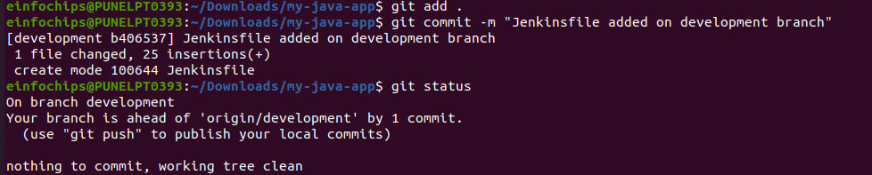

+ push changes on GitHub repository

<br>

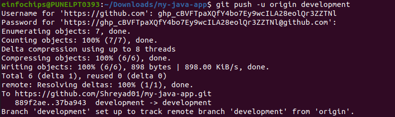

+ Do same process for `main`, `staging` and `production ` branch.

### Create a Multi-Branch Pipeline Job on Jenkins

+ Go to Jenkins Dashboard .Select  **New Item** 
+ Enter name of job `Multibranch` 
+ Select `Multi-branch Pipeline` and click OK.
+ Add a Branch source as  Git.
+ Configure the repository URL

<br>

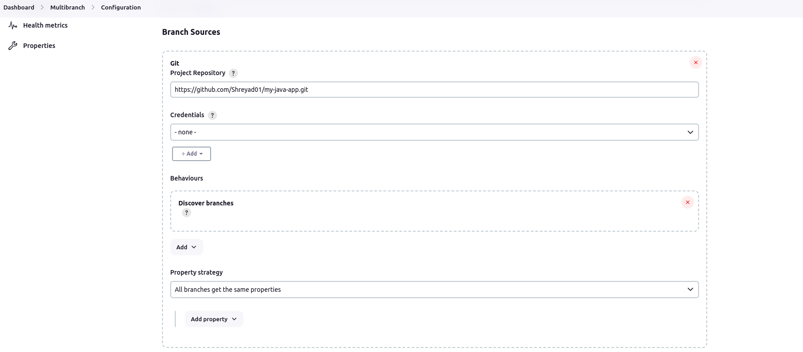

+ Go to ` Manage jenkins ` select  `system`then  go to `Global properties` in that pune name as `MAVEN_HOME` globally and write Maven path . You can check maven path by using command `mvn --version`

<br>

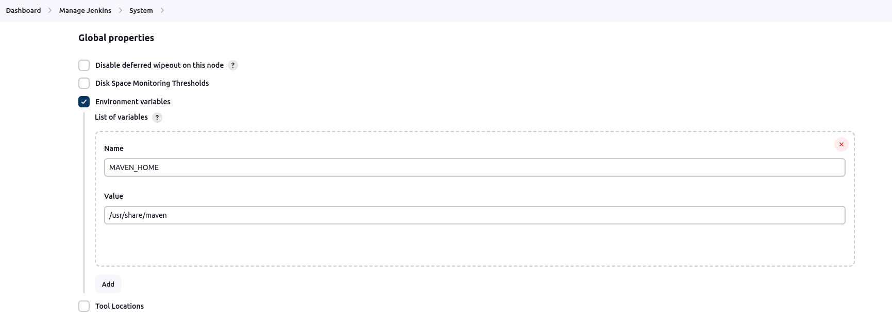

<br>

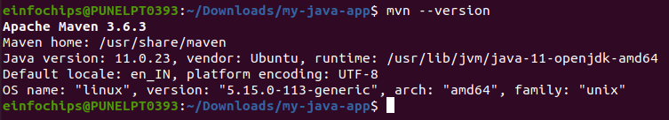

+ After saving jenkins will start building the code by checking the github repo and searches for all the other branches on the repo.

<br>

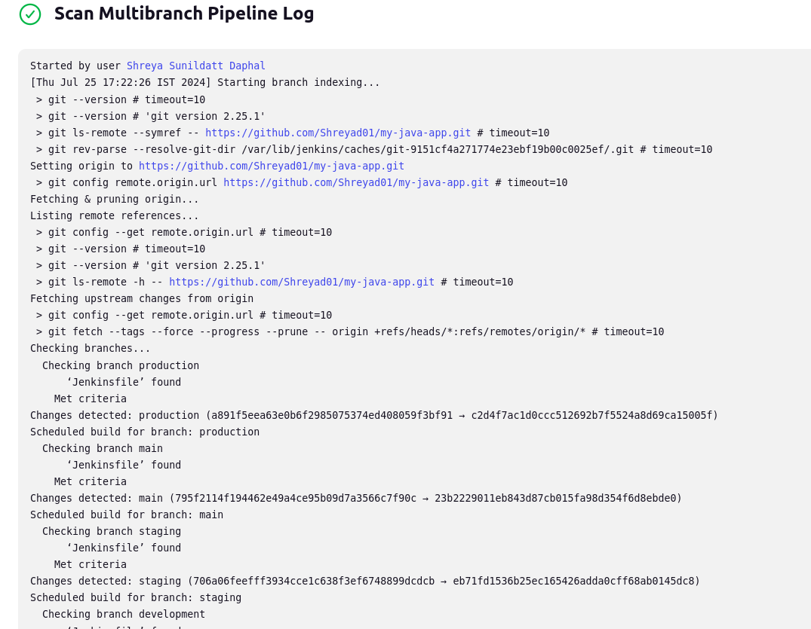

+ After scanning every branch , it will run every branch as an individual jenkins project as it find the jenkins file in each branch

<br>

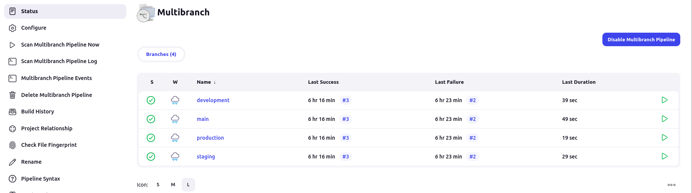

+ On each branch we can check **stage view** 

<br>

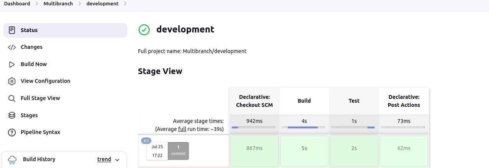