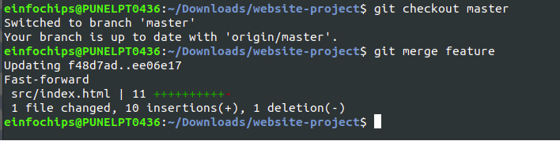

# CI/CD Pipeline for Web Application

## Project Problem Statement

The development team needs to establish a basic CI/CD pipeline for a web application. The goal is to automate version control, containerization, building, testing, and deployment processes.

## Deliverables

### 1. Git Repository

- **Create a Git repository**: Initialize a new repository for the web application.

 

- **Branching Strategy**:
  - Set up `main` and `develop` branches.

 

  - Create a feature branch for any new feature or bug fix.

 

 

### 2. Configuration Files

- **.gitignore**: Add a `.gitignore` file to exclude unnecessary files (e.g., logs, temporary files).

 

 

 

- **README.md**: Document project description, setup instructions, and contribution guidelines.

### 3. Docker Configuration

- **Dockerfile**: Write a `Dockerfile` to define how to build the Docker image for the web application.

 

- **.dockerignore**: Create a `.dockerignore` file to exclude files and directories from the Docker build context.

 

### 4. Image Management

- **Build Docker Image**: Build a Docker image using the `Dockerfile`.

- `docker build -t shreyad01/nginx-webapp:v1:o`

 

- **Push Image**: Push the Docker image to a container registry, such as Docker Hub.
`docker push shreyad01/nginx-webapp:v1.0`
### 5. Jenkins Configuration

 

- **Jenkins Job Setup**:
  - Create a Jenkins job to pull code from the Git repository.
  - Configure Jenkins to build the Docker image using the `Dockerfile`.
  - Set up Jenkins to run tests on the Docker image.
  - Configure Jenkins to push the Docker image to the container registry after a successful build.

- **Jenkins Pipeline**:
  - Define the CI/CD pipeline stages using a `Jenkinsfile`, including build, test, and deployment stages.

   

  

### 6. Ansible Playbook

- **Basic Playbook**: Develop an Ansible playbook to automat the deployment of the Docker container.

- **Tasks**:
    - Install Docker on the target server if Docker is not already installed.
    - Pull the Docker image from the container registry.
    - Run the Docker container with the required configurations.

- **Inventory File**: Specify the target server(s) for deployment in an inventory file.
