## Problem Statement: You are tasked with deploying Ansible in a multi-node environment consisting of multiple Linux servers. The goal is to set up Ansible on a control node and configure it to manage several managed nodes. This setup will be used for automating system administration tasks across the network.

### 1. Control Node Setup:

  + Install Ansible on the control node.

  <br>

  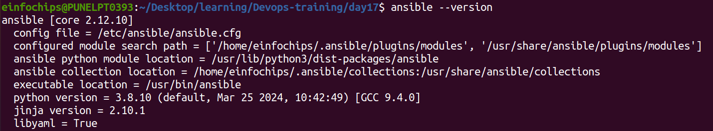

  + Configure SSH key-based authentication between the control node and managed nodes.
   
   <br>

   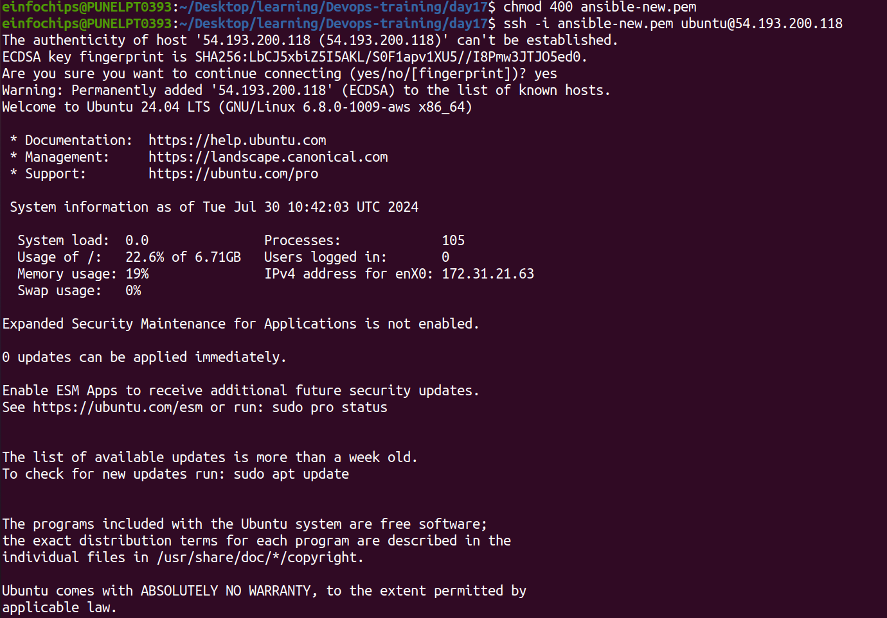

### 2. Managed Nodes Configuration:

   + Ensure all managed nodes are properly configured to be controlled by Ansible.
   
   + Verify connectivity and proper setup between the control node and managed nodes.

   <br>

  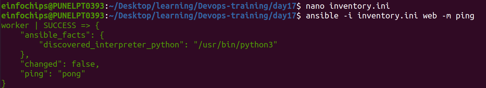

## Project 2: Ad-Hoc Ansible Commands

### Problem Statement: Your organization needs to perform frequent, one-off administrative tasks across a fleet of servers. These tasks include checking disk usage, restarting services, and updating packages. You are required to use Ansible ad-hoc commands to accomplish these tasks efficiently.

 #### 1. Task Execution:

   + Execute commands to check disk usage across all managed nodes.   Use command :
     ```
      ansible all -i inventory.ini -a "df -h" 

     ```


  <br>

   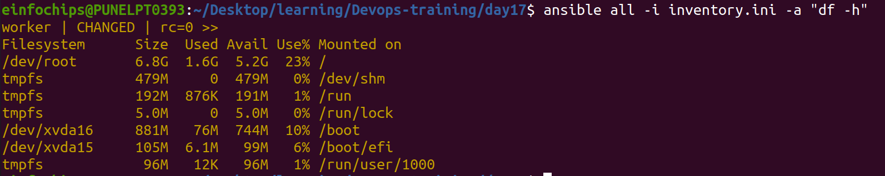

   + Now we install nginx server and then restart it on all managed node.
   
   + To install nginix server use command :
      ``` 
       ansible all -i inventory.ini -m ansible.builtin.apt -a 'name=nginx state=present update_cache=true' -b
       ```

  + To restart the service use command : 

    ```
    ansible all -i inventory.ini -m ansible.builtin.service -a 'name=nginx state=restarted' -b
    ```
   
   <br>

   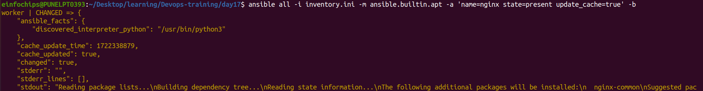

   <br>

   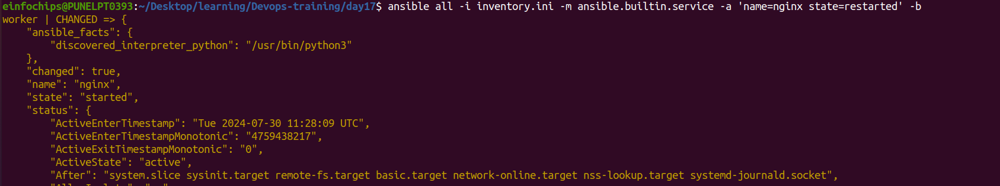

   + Update all packages on a subset of managed nodes.Use command :
   ```
   ansible all -i inventory.ini -m ansible.builtin.apt -a 'update_cache=true upgrade=yes' -b
   ```

   <br>
    
   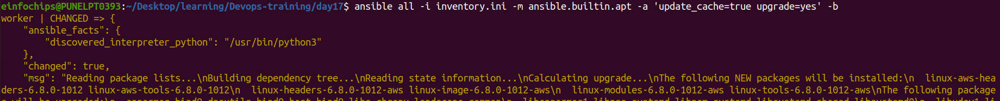

## Project 3: Working with Ansible Inventories

### Problem Statement: You need to manage a dynamic and diverse set of servers, which requires an organized and flexible inventory system. The project involves creating static and dynamic inventories in Ansible to categorize servers based on different attributes such as environment (development, staging, production) and roles (web servers, database servers).


### 1. Static Inventory:

   + Create a static inventory file with different groups for various environments and roles.

<br>

   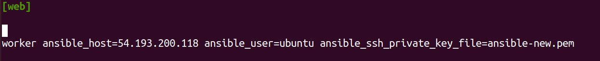


   + Verify that the inventory is correctly structured and accessible by Ansible.use command :

   ```
    ansible all -i inventory.ini --list
   ```

   <br>

   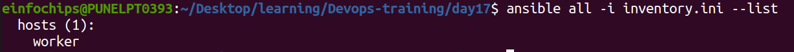


## Project 4: Ansible Playbooks: The Basics

### Problem Statement: Your team needs to automate repetitive tasks such as installing packages, configuring services, and managing files on multiple servers. The project involves writing basic Ansible playbooks to automate these tasks, ensuring consistency and efficiency in the operations.

### 1. Playbook Creation:

  + Write a playbook to install a specific package on all managed nodes.

  <br>
   
   

   + hosts: all = The playbook will run on all managed nodes.
   + become: yes = This ensures the tasks are executed with elevated privileges.
   + package: This module is used to manage packages. name specifies the package to install
   + state: present ensures it is installed.

  + Create a playbook to configure a service with specific parameters.

  <br>

  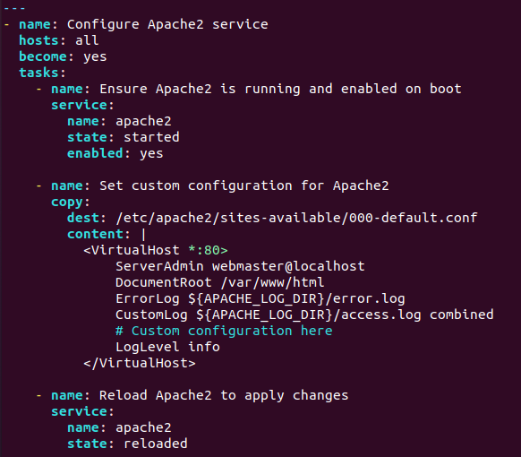

  + Develop a playbook to manage files, such as creating, deleting, and modifying files on managed nodes.

   <br>

  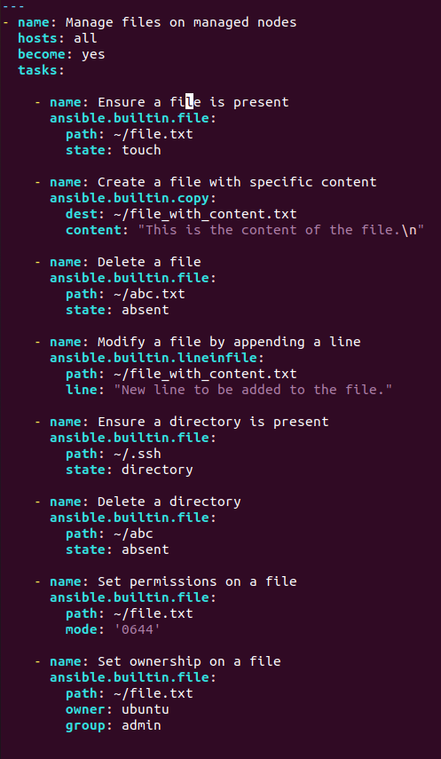

### 2. Testing and Verification:

  + Test the playbooks to ensure they run successfully and perform the intended tasks. Use command :
   ```

   ansible-playbook -i inventory.ini playbook.yml

   ```

   <br>

   
