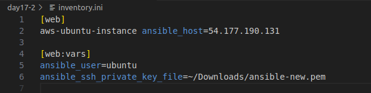
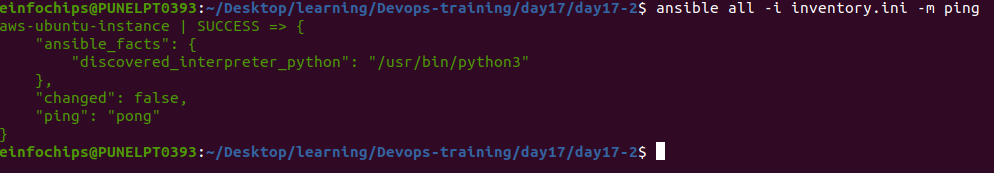
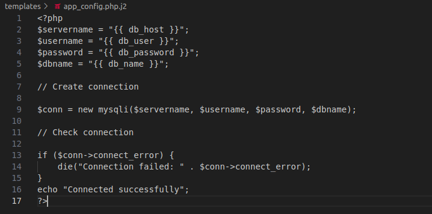
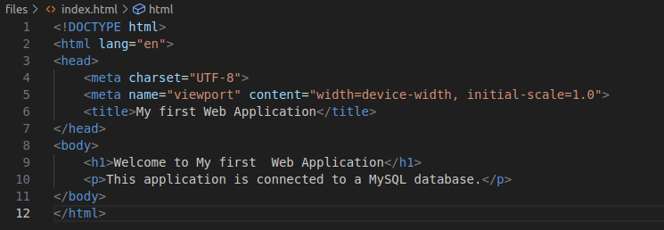
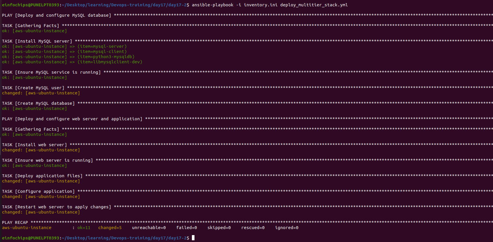

## Project 02


### Objective: Automate the setup of a multi-tier web application stack with separate database and application servers using Ansible.

### Problem Statement


### Objective: Automate the deployment and configuration of a multi-tier web application stack consisting of:

Database Server: Set up a PostgreSQL database server on one Ubuntu instance.

Application Server: Set up a web server (e.g., Apache or Nginx) on another Ubuntu instance to host a web application.

Application Deployment: Ensure the web application is deployed on the application server and is configured to connect to the PostgreSQL database on the database server.

Configuration Management: Use Ansible to automate the configuration of both servers, including the initialization of the database and the deployment of the web application.

### Deliverables

#### Ansible Inventory File

Filename: inventory.ini

Content: Defines the database server and application server instances, including their IP addresses and connection details.

<br>



To verify we will ping the server using following ad-hoc command

`ansible all -i inventory.ini -m ping`

<br>



#### Ansible Playbook

+ Filename: deploy_multitier_stack.yml

+ Content: Automates:
+ The deployment and configuration of the PostgreSQL database server.
+ The setup and configuration of the web server.
+ The deployment of the web application and its configuration to connect to the database.

```
- name: Deploy and configure MySQL database
  hosts: web
  become: yes
  vars:
    db_name: "my_database"
    db_user: "shreya"
    db_password: "shreya123"

  tasks:
  - name: Install MySQL server
    apt:
      update_cache: yes
      name: "{{ item }}"
      state: present
    with_items:
    - mysql-server
    - mysql-client
    - python3-mysqldb
    - libmysqlclient-dev

  - name: Ensure MySQL service is running
    service:
      name: mysql
      state: started
      enabled: yes

  - name: Create MySQL user
    mysql_user:
      name: "{{ db_user }}"
      password: "{{ db_password }}"
      priv: '*.*:ALL'
      host: '%'
      state: present

  - name: Create MySQL database
    mysql_db:
      name: "{{ db_name }}"
      state: present

- name: Deploy and configure web server and application
  hosts: web
  become: yes

  vars:
    db_host: "host_ip"
    db_name: "my_database"
    db_user: "user"
    db_password: "user123"

  tasks:
  - name: Install web server
    apt:
      name: nginx
      state: present
      update_cache: yes

  - name: Ensure web server is running
    service:
      name: nginx
      state: started
      enabled: yes

  - name: Deploy application files
    copy:
      src: files/index.html
      dest: /var/www/html/index.html

  - name: Configure application
    template:
      src: templates/app_config.php.j2
      dest: /var/www/html/app_config.php

  - name: Restart web server to apply changes
    service:
      name: nginx
      state: restarted
```

#### Jinja2 Template

+ Filename: templates/app_config.php.j2

+ Content: Defines a configuration file for the web application that includes placeholders for dynamic values such as database connection details.
Application Files

<br>



#### Application Files

+ Filename: files/index.html (or equivalent application files)
+ Content: Static or basic dynamic content served by the web application.

<br>



+ use command `ansible-playbook -i inventory.ini deploy_multitier_stack.yml` to check output

<br>

