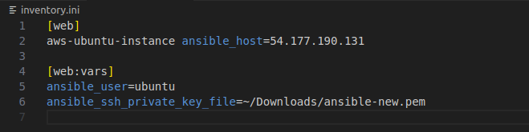
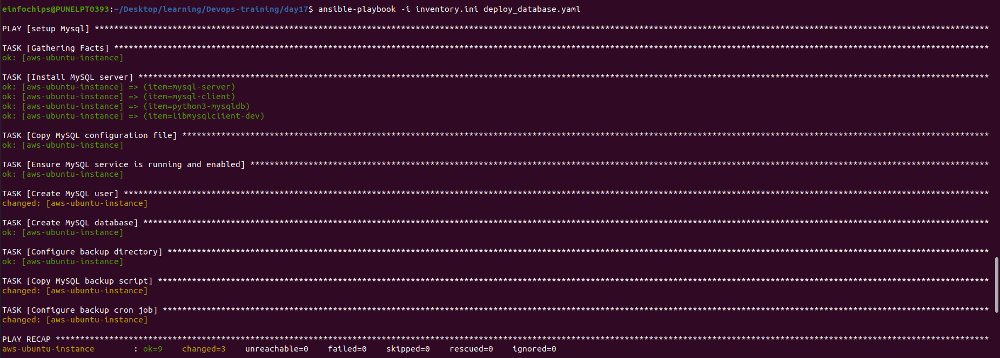
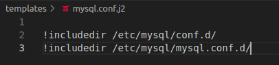
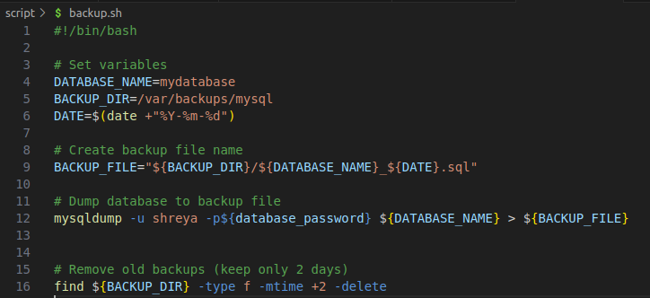
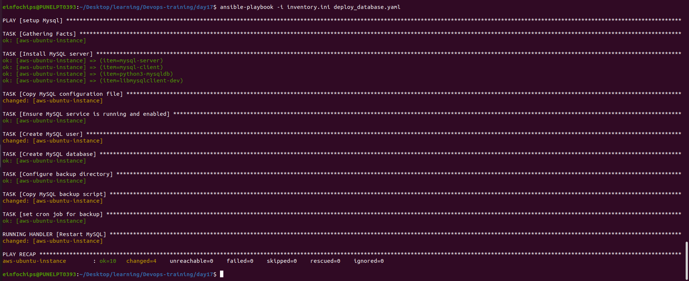

## Project 01 : Deploy a Database Server with Backup Automation

+ Objective: Automate the deployment and configuration of a PostgreSQL database server on an Ubuntu instance hosted on AWS, and set up regular backups.
### Problem Statement

+ Objective: Automate the deployment, configuration, and backup of a PostgreSQL database server on an Ubuntu instance using Ansible.


### Requirements:
+ AWS Ubuntu Instance: You have an Ubuntu server instance running on AWS.

+ Database Server Deployment: Deploy and configure PostgreSQL on the Ubuntu instance.

+ Database Initialization: Create a database and a user with specific permissions.

+ Backup Automation: Set up a cron job for regular database backups and ensure that backups are stored in a specified directory.

+ Configuration Management: Use Ansible to handle the deployment and configuration, including managing sensitive data like database passwords.


### Deliverables
#### Ansible Inventory File

+ Filename: **inventory.ini**
+ Content: Defines the AWS Ubuntu instance and connection details for Ansible.

<br>



#### Ansible Playbook

+ Filename: **deploy_database.yml**
+ Content: Automates the installation of PostgreSQL, sets up the database, creates a user, and configures a cron job for backups. It also includes variables for database configuration and backup settings.

+ in `deploy_database.yaml` file first we set the variables for database

```
- name: setup Mysql
  hosts: web
  become: yes
  vars:
    db_name: "my_database"
    db_user: "shreya"
    db_password: "shreya123"
    backup_dir: "/backup/mysql"

```

+ then we write task. in task we install the database ,copy it's configration file,create user and databse,cron job for backup.

```

  tasks:
  - name: Install MySQL server
    apt:
      update_cache: yes
      name: "{{ item }}"
      state: present
    with_items:
    - mysql-server
    - mysql-client
    - python3-mysqldb
    - libmysqlclient-dev

  - name: Copy MySQL configuration file
    template:
      src: ~/Desktop/learning/Devops-training/day17/templates/mysql.conf.j2
      dest: /etc/mysql/mysql.conf.d/mysqld.conf
    notify: Restart MySQL

  - name: Ensure MySQL service is running and enabled
    service:
      name: mysql
      state: started
      enabled: yes

  - name: Create MySQL user
    mysql_user:
      name: "{{ db_user }}"
      password: "{{ db_password }}"
      priv: '*.*:ALL'
      host: '%'
      state: present

  - name: Create MySQL database
    mysql_db:
      name: "{{ db_name }}"
      state: present

  - name: Configure backup directory
    file:
      path: "{{ backup_dir }}"
      state: directory
      mode: '0755'

  - name: Copy MySQL backup script
    copy:
      src: ~/Desktop/learning/Devops-training/day17/script/backup.sh
      dest: /usr/local/bin/mysql_backup.sh
      mode: '0755'

  - name: set cron job for backup 
    cron:
      name: "mysql backup"
      minute: "0"
      hour: "2"
      day: "*"
      month: "*"
      weekday: "*"
      job: "/usr/local/bin/mysql_backup.sh"
      state: present

  handlers:
  - name: Restart MySQL
    service:
      name: mysql
      state: restarted
```

+ now run command  `ansible-playbook -i inventory.ini deploy_database.yaml` to see output 

<br>




#### Jinja2 Template

+ Filename: templates/pg_hba.conf.j2

+ Content: Defines the MySQL configuration file (mysql.conf) using Jinja2 templates to manage access controls dynamically.

<br>



#### Backup Script

+ Filename: script/backup.sh

+ Content: A script to perform the backup of the PostgreSQL database. This script should be referenced in the cron job defined in the playbook.

<br>




<br>



