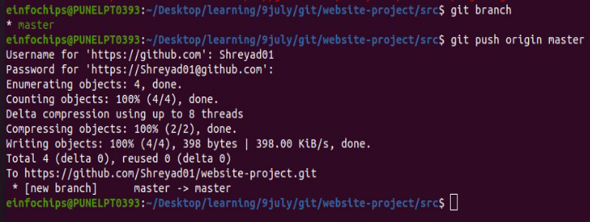
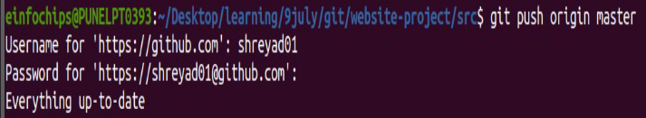

## Git Project

1) git directory created and then initate it as git using git init

2) copy the http url of repository  named  “website-project”  from github to clone it in local machine              

`git clone https://github.com/your-username/website-project.git`

3) moving in website-project directory and added new directory src and in that directory added new html file.

   `cd website-project `
   
   `mkdir src`

   `touch src/index.html`

4) add ,commit and push  that file 

`git add .`

`git commit -m "Initial commit: Added project structure and index.html"`

` git push origin main`

## Exercise 1:    Branching and Basic Operation

1) create new branch name it “ **feature/add-about-page** ” then create “ **about.html** ” file 

`git checkout -b feature/add-about-page `

2) add , commit and push 

`git add src/about.html`

`git commit -m "Added about page"`

`git push origin feature/add-about-page`

## Exercise 2 : Merging and Handling Merge Conflicts

1) go to master branch and create another branch “ **feature/update-homepage** ”

`git checkout main`

`git checkout -b feature/update-homepage`

2) update  “**index.html** “ file

3) add, commit  and push changes 

### create merge conflict

1) we modify index.html file on feature/add-about-page branch. 

`git checkout feature/add-about-page`

2) then add , commit and push changes. 

`git add src/index.html`

`git commit -m "Added conflicting content to homepage" `

`git push origin feature/add-about-page`

### Merge and Resolve conflict

1) To merge feature/add-about-page branch in master branch we need to switch to master branch 

`git checkout main`

`git merge feature/add-about-page`

Here Fast-forward merge happen because there are no new commits on currrent branch

## Exercise 3 : Rebasing 

 Rebase :** change the base of branch

it move entire branch to begin from the tip of another branch

1) We **rebase** “ **feature/update-homepage** ” onto “ **master** ”

`git checkout feature/update-homepage`

`git rebase main`

the feature/update-homepage commits are moved on top of the latest commits from the master branch.

2) Resolve  conflict which arise during rebase.

3) Push the rebase branch

`git push -f origin feature/update-homepage`

## Exercise 4 :Pulling and  collaboration

1) first we switch to master branch and then we check master branch is up-to-date

`git checkout main `

`git pull origin main`

2) do some change on github repository
2) pull the changes made by the collaborator

`git pull origin main`

## Exercise 5 : Versioning nd Rollback

1) Tag the current commit as “ v1\.0 ”

`git tag -a v1.0 -m "Version 1.0: Initial release" `

`git push origin v1.0`

### Make a change that needs reversion

1) update index file on features/update-homepage

### Revert to previous version

1) using revert  we can undo the last commit 

`git revert HEAD`

   ` `git revert :  This  command is used to create a new commit that undoes the changes made by a  previous commit.

   HEAD is a reference to the currently checked out commit, which in this case is the most recent commit on your current branch.

` git push origin main`

2) reset to a specific commit :

 git reset : use to reset the current branch to a specific state

here we are moving HEAD pointer to point to specific commit (v1.0)

--hard :    reset both working directory and staging area. It discard all changes in working directory and staging area that are not in commit being reset

`git reset --hard v1.0`

`git push -f origin main `

git push : This command is used to push commits from your local repository to a remote repository.

-f   : this force git to perform the push operation.

This can be necessary in cases where you have rewritten history locally and need to update the  remote branch accordingly.

### Stashing changes

`git stash`

1) git stash : It is used to temporarily store changes that are not ready to be committed yet. It saves the modifications in working directory and staged changes onto a stack of stashes.  

### Apply the stashed changes:

`git stash apply`

1) git stash apply : command is used to apply the most recent stash from the stash stack back into your working directory.

### Viewing commit history :

use git log to view commit history : `git log -–oneline`

git log –oneline : This command is used to display commit history in a single line format

## Cherry-Picking Commits :

Cherry-picking : Use to the process of selecting and applying a specific commit from    one branch onto another branch. 

This allows you to pick individual commits and apply them to your current branch,

1) create new branch “ feature/cherry-pick ” and cherry-pick commit from another branch : 

`git checkout -b feature/cherry-pick`

`git cherry-pick <commit-hash>`

2) After resolving conflict use ” git Cherry-pick  --continue ” to continue Cherry-pick operation and push to remote repository .

`git push origin feature/cherry-pick`

## Interactive Rebase :

Use interactive rebase to sqash commits :

`git checkout main `

`git rebase -i HEAD~3`

git rebase -i HEAD~3 :  This command use to reapply commit on top of HEAD~3 tip Here -i = interactive : This enables the interactive mode , here we specify how git should reapply each commit

HEAD~3 : points to the commit that is three commits behind the current HEAD.

After merging conflict we continue rebase

