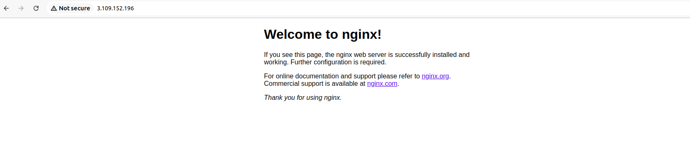

## Project 01


### 1.Inventory Plugins

+ **Activity:** Configure a dynamic inventory plugin to manage a growing number of web servers  dynamically. Integrate the plugin with Ansible to automatically detect and configure servers in various environments.

[aws_ec2.yml]()

```
plugin: aws_ec2
regions:
  - us-west-1
filters:
  instance-state-name:
    - running
  tag:Name:
    - Shreya
hostnames:
  - ip-address
compose:
  ansible_host: ip_address

```
+  test if the inventory plugin works correctly by running using following command :

```
ansible-inventory -i aws_ec2.yml --list
```
+ **This command will give output in a JSON representation of *aws_ec2.yml* inventory file, showing the EC2 instances that are currently running in the specified region.**

<br>


[inventory.json](inventory.json)

+ **Deliverable:** Dynamic inventory configuration file or script, demonstrating the ability to automatically update the inventory based on real-time server data.

### 2.Performance Tuning

+ **Activity:** Tune Ansible performance by adjusting settings such as parallel execution (forks), optimizing playbook tasks, and reducing playbook run time.

[ansible.cfg]()

```
[defaults]
fork = 10
gathering = smart
fact_caching = jsonfile
fact_caching_connection = /tmp/ansible_cache
private_key_file=/home/einfochips/Downloads/ansible-new.pem
ansible_user=ubuntu
host_key_checking = False

[ssh_connection]
ssh_args = -o ControlMaster=auto -o ControlPersist=60s
pipelining = True


[inventory]
enable_plugins = aws_ec2,yaml,ini
inventory=/home/einfochips/Desktop/learning/day20/aws_ec2.yml
```


+ **Deliverable:** Optimized ansible.cfg configuration file, performance benchmarks, and documentation detailing changes made for performance improvement.

### 3.Debugging and Troubleshooting Playbooks

+ **Activity:** Implement debugging strategies to identify and resolve issues in playbooks, including setting up verbose output and advanced error handling.

+ [deploy.yml]()

```
---
- name: Optimize Deployment
  hosts: all
  gather_facts: yes
  become: yes
  remote_user: ubuntu

  tasks:
    - name: Ensure nginx is installed
      apt:
        name: nginx
        state: present
      async: 300
      poll: 0
      register: async_results

    - name: Wait for nginx to be installed
      async_status:
        jid: "{{ async_results.ansible_job_id }}"
      register: results_status
      until: results_status.finished
      retries: 30
      delay: 10

    - name: Copy configuration file
      template:
        src: templates/nginx.conf.j2
        dest: /etc/nginx/nginx.conf
```

+ testing by manually trying to ssh connectivity to session

<br>


+ run following command to run playbook :

```
ansible-playbook -i aws_ec2.yml deploy.yml -u ubuntu
```

<br>


+ **verbose output with -v**

<br>


+ **verbose output with -vv**

<br>


+ **Deliverable:** Debugged playbooks with enhanced error handling and logging, including a troubleshooting guide with common issues and solutions.


### 4.Exploring Advanced Modules

+ **Activity:** Use advanced Ansible modules such as docker_container to manage containerized applications and aws_ec2 for AWS infrastructure management, demonstrating their integration and usage.

+ First we install the community.docker

```
ansible-galaxy collection install community.docker
```
<br>


+ We will create role for docker using following command :

```
 ansible-galaxy init roles/docker
```
<br>


+ go to role/docker and add the dependencies in meta file, task in task file

+ go to role/docker-dependencies and add task in task file


+ Update deploy.yml file  by adding  role and tasks for doccker

```
---

- name: Optimize Deployment
  hosts: all
  gather_facts: yes
  become: yes
  remote_user: ubuntu
  roles:
    - docker
    - docker-dependancies

  tasks:
    - name: Ensure nginx is installed
      apt:
        name: nginx
        state: present
      async: 300
      poll: 0
      register: async_results

    - name: Wait for nginx to be installed
      async_status:
        jid: "{{ async_results.ansible_job_id }}"
      register: results_status
      until: results_status.finished
      retries: 30
      delay: 10

    - name: Copy configuration file
      template:
        src: templates/nginx.conf.j2
        dest: /etc/nginx/nginx.conf

    - name: Ensure nginx container is running
      docker_container:
        name: my-nginx
        image: nginx:latest
        state: started
        ports:
          - "8080:80"
```

+ agagin run playbook 

```
ansible-playbook -i aws_ec2.yml deploy.yml -u ubuntu
```
+ **Deliverable:** Playbooks showcasing the deployment and management of Docker containers and AWS EC2 instances, along with documentation on the benefits and configurations of these advanced modules.

<br>


<br>


+ go to browser and run Ip 

<br>

