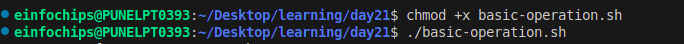
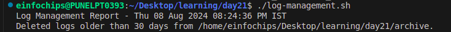
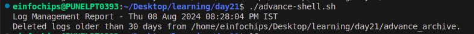
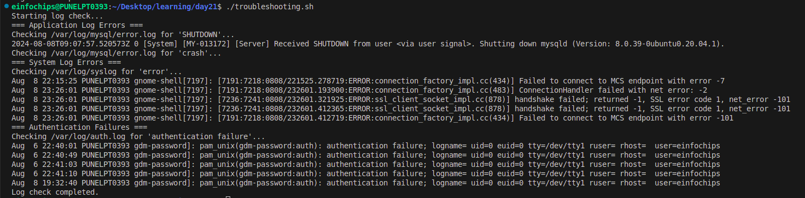
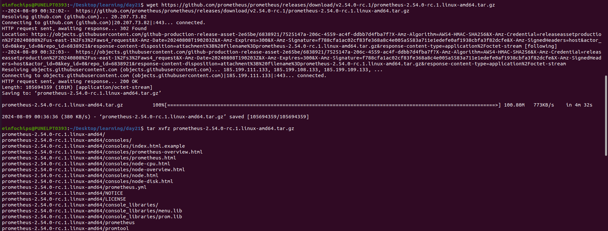
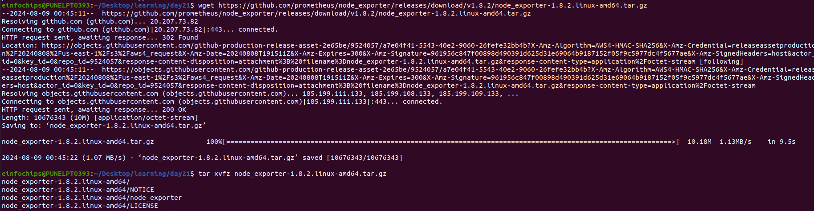
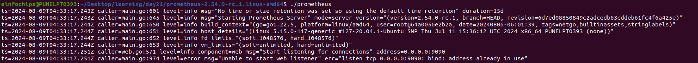
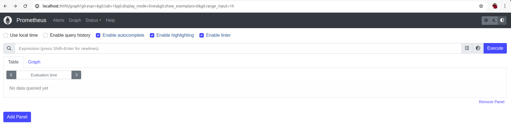
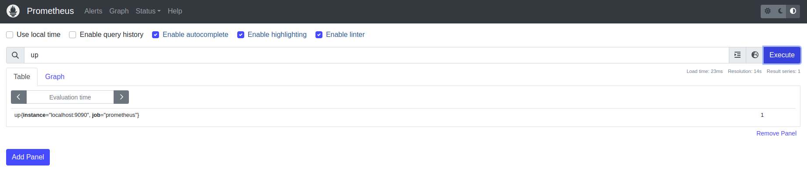
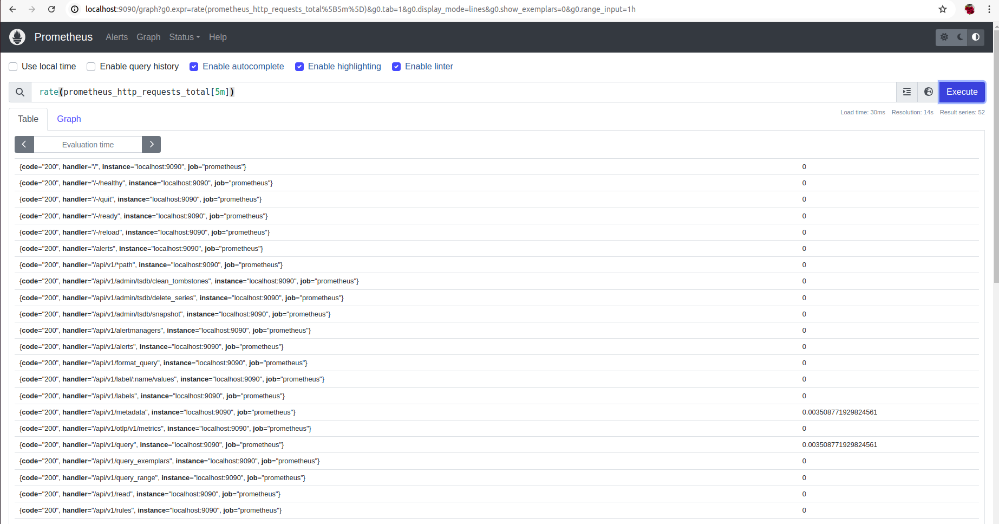

# Project 01: 

## Project Overview:
The goal of this capstone project is to combine shell scripting with system monitoring and log management practices. You will create a set of automated tools using shell scripts to manage logs, monitor system performance using Prometheus and Node Exporter, and generate insights using PromQL queries. The project will require a systematic approach, covering scripting fundamentals, log management, and monitoring setup.

## Project Deliverables:

### 1. **Shell Scripts for Basic Operations:**

+ **Task:** Write shell scripts to perform basic system operations, such as checking disk usage, memory usage, and CPU load.

+ **Deliverable:**
A collection of scripts that output system performance metrics.
Scripts should include error handling and logging.

[basic-operation.sh]()

```
#!/bin/bash

# Define log file
LOG_FILE="/home/einfochips/Desktop/learning/day21/system/system_performance.log"

# Create or clear the log file
> $LOG_FILE

# Function to log system date and time
log_date() {
    echo "System Performance Report - $(date)" >> $LOG_FILE
}

# Function to check disk usage
check_disk_usage() {
    echo "Checking Disk Usage..." >> $LOG_FILE
    df -h >> $LOG_FILE
    if [ $? -eq 0 ]; then
        echo "Disk usage check completed successfully." >> $LOG_FILE
    else
        echo "Error occurred during disk usage check." >> $LOG_FILE
    fi
}

# Function to check memory usage
check_memory_usage() {
    echo "Checking Memory Usage..." >> $LOG_FILE
    free -h >> $LOG_FILE
    if [ $? -eq 0 ]; then
        echo "Memory usage check completed successfully." >> $LOG_FILE
    else
        echo "Error occurred during memory usage check." >> $LOG_FILE
    fi
}

# Function to check CPU load
check_cpu_load() {
    echo "Checking CPU Load..." >> $LOG_FILE
    top -bn1 | grep "Cpu(s)" >> $LOG_FILE
    if [ $? -eq 0 ]; then
        echo "CPU load check completed successfully." >> $LOG_FILE
    else
        echo "Error occurred during CPU load check." >> $LOG_FILE
    fi
}

# Execute functions
log_date
check_disk_usage
check_memory_usage
check_cpu_load

# Print result to console
cat $LOG_FILE
```

+ First change the file permission then run the script 

```
chmod +x basic-operation.sh 

./basic-operation.sh
```
<br>



+ After running above command we wil get log file which is generated by **LOG_FILE**

[system_performance.log](system/system_performance.log)


2. **Log Management Script:**

+ **Task:** Develop a script to automate log management tasks such as log rotation and archiving. This script should include the ability to compress old logs and delete logs older than a specified number of days.

[log-management.sh]()

```
#!/bin/bash

# Define variables
LOG_DIR="/home/einfochips/Desktop/learning/day21/log"
ARCHIVE_DIR="/home/einfochips/Desktop/learning/day21/archive"
REPORT_FILE="/home/einfochips/Desktop/learning/day21/log/log_management_report.log"
DAYS_OLD=30
MAX_SIZE=10000000  # 10 MB in bytes

# Ensure directories exist
mkdir -p $ARCHIVE_DIR

# Create or clear the report file
> $REPORT_FILE

# Record date and time in the report
echo "Log Management Report - $(date)" >> $REPORT_FILE

# Rotate and compress logs
for log_file in $LOG_DIR/*.log; do
    if [ -f "$log_file" ]; then
        file_size=$(stat -c%s "$log_file")
        if [ $file_size -gt $MAX_SIZE ]; then
            # Rotate the log file
            mv "$log_file" "$ARCHIVE_DIR/$(basename "$log_file")-$(date +%F).log"
            gzip "$ARCHIVE_DIR/$(basename "$log_file")-$(date +%F).log"
            echo "Rotated and compressed: $(basename "$log_file")" >> $REPORT_FILE
        fi
    fi
done

# Delete old logs from the archive directory
find $ARCHIVE_DIR -type f -mtime +$DAYS_OLD -exec rm {} \;
echo "Deleted logs older than $DAYS_OLD days from $ARCHIVE_DIR." >> $REPORT_FILE

# Print the report to the console
cat $REPORT_FILE

```
+ change the permission of file and run the file

```
chmod +x log-management.sh

./log-management.sh

```
<br>




+ **Deliverable:**

+ A shell script that performs log rotation based on predefined conditions (e.g., log size, log age).

+ A report generated by the script detailing which logs were rotated, compressed, or deleted.


3. **Advanced Shell Scripting - Loops, Conditions, Functions, and Error Handling:**

+ **Task:**  Refactor the previous scripts to include loops, conditionals, and functions for modularity. Implement error handling to manage potential issues during script execution.

+ [advance-shell.sh]()

```
#!/bin/bash

# Define variables
LOG_DIR="/home/einfochips/Desktop/learning/day21/advance"
ARCHIVE_DIR="/home/einfochips/Desktop/learning/day21/advance_archive"
REPORT_FILE="/home/einfochips/Desktop/learning/day21/advance/advance_log_management_report.log"
DAYS_OLD=30
MAX_SIZE=10000000  # 10 MB in bytes

# Ensure the log directory exists
ensure_directory() {
    local dir="$1"
    if [ ! -d "$dir" ]; then
        echo "Directory $dir does not exist. Creating it."
        mkdir -p "$dir"
        if [ $? -ne 0 ]; then
            echo "Error: Failed to create directory $dir." >&2
            exit 1
        fi
    fi
}

# Initialize or clear the report file
initialize_report() {
    > "$REPORT_FILE"
    if [ $? -ne 0 ]; then
        echo "Error: Failed to initialize report file $REPORT_FILE." >&2
        exit 1
    fi
    echo "Log Management Report - $(date)" >> "$REPORT_FILE"
}

# Rotate and compress logs
rotate_and_compress_logs() {
    for log_file in "$LOG_DIR"/*.log; do
        if [ -f "$log_file" ]; then
            local file_size
            file_size=$(stat -c%s "$log_file")
            if [ $file_size -gt $MAX_SIZE ]; then
                local archived_file="$ARCHIVE_DIR/$(basename "$log_file")-$(date +%F).log"
                mv "$log_file" "$archived_file"
                if [ $? -ne 0 ]; then
                    echo "Error: Failed to move log file $log_file to $archived_file." >&2
                    continue
                fi
                gzip "$archived_file"
                if [ $? -ne 0 ]; then
                    echo "Error: Failed to compress log file $archived_file." >&2
                    continue
                fi
                echo "Rotated and compressed: $(basename "$log_file")" >> "$REPORT_FILE"
            fi
        else
            echo "Warning: No log files found in $LOG_DIR." >> "$REPORT_FILE"
        fi
    done
}

# Delete old logs from the archive directory
delete_old_logs() {
    find "$ARCHIVE_DIR" -type f -mtime +$DAYS_OLD -exec rm {} \;
    if [ $? -ne 0 ]; then
        echo "Error: Failed to delete old logs from $ARCHIVE_DIR." >&2
        exit 1
    fi
    echo "Deleted logs older than $DAYS_OLD days from $ARCHIVE_DIR." >> "$REPORT_FILE"
}

# Main function to execute log management tasks
main() {
    # Ensure required directories exist
    ensure_directory "$LOG_DIR"
    ensure_directory "$ARCHIVE_DIR"

    # Initialize the report file
    initialize_report

    # Perform log rotation and compression
    rotate_and_compress_logs

    # Delete old logs
    delete_old_logs

    # Print the report to the console
    cat "$REPORT_FILE"
}

# Execute the main function
main
```

+ change the permission of file and then run file 

```
chmod +x advance-shell.sh

./advance-shell.sh
```


+ **Deliverable:**

+ Modular shell scripts that use functions for repeatable tasks.

+ Error-handling mechanisms in place for scenarios like missing files, insufficient permissions, etc.
+ Logs that track script execution and any errors encountered.

<br>



4. **Log Checking and Troubleshooting:**

+ **Task:** Write a script that reads through system and application logs, identifies common issues (e.g., out of memory, failed service starts), and provides troubleshooting steps based on log analysis.

[troubleshooting.sh]()

```
#!/bin/bash

# Define log files and paths
LOG_FILE="/var/log/mysql/error.log"
SYSLOG_FILE="/var/log/syslog"
AUTH_LOG_FILE="/var/log/auth.log"


# Define function to check for specific issues
check_logs() {
    local file=$1
    local keyword=$2
    echo "Checking $file for '$keyword'..."
    grep "$keyword" "$file" | tail -n 5
}

# Check system logs for common issues
echo "Starting log check..."

echo "=== Application Log Errors ==="
check_logs $LOG_FILE "SHUTDOWN"
check_logs $LOG_FILE "crash"

echo "=== System Log Errors ==="
check_logs $SYSLOG_FILE "error"

echo "=== Authentication Failures ==="
check_logs $AUTH_LOG_FILE "authentication failure"

echo "Log check completed."
```

+ **Deliverable:**

+ A script that parses logs for errors or warnings and outputs possible root causes.

+ Documentation on the types of logs checked and the issues identified.

+ A troubleshooting guide based on common errors found in the logs.

<br>



5. **Installation and Setup of Prometheus and Node Exporter:**

+ **Task:** Install and configure Prometheus and Node Exporter on the system. Ensure that Node Exporter is properly configured to collect system metrics.

+ go to `https://prometheus.io/download/` and download the **prometheus**  and **node Exporter**

+ Update package index and install dependencies

```
sudo apt-get update
sudo apt-get install -y wget
```

+ Use following command to download and install Prometheus and node exporter

```
wget https://github.com/prometheus/prometheus/releases/download/v2.54.0-rc.1/prometheus-2.54.0-rc.1.linux-amd64.tar.gz

tar xvfz prometheus-2.54.0-rc.1.linux-amd64.tar.gz

wget https://github.com/prometheus/node_exporter/releases/download/v1.8.2/node_exporter-1.8.2.linux-amd64.tar.gz

tar xvfz node_exporter-1.8.2.linux-amd64.tar.gz
```

+ **Deliverable:**

+ A documented installation and configuration process for Prometheus and Node Exporter.

+ A running instance of Prometheus scraping metrics from Node Exporter.

<br>



<br>



6. **Prometheus Query Language (PromQL) Basic Queries:**

+ **Task:** Create a series of PromQL queries to monitor system performance, such as CPU usage, memory usage, and disk I/O.

+ go to prometheus folder and run prometheus script

<br>



+ on browser run folloing command you will get prometheus is running

```
localhost:9090
```

<br>



+ In the promethus use the below PromQL command

```
up 

rate(prometheus_http_requests_total[5m])
```

+ **Deliverable:**

+ A set of PromQL queries that can be used to monitor key system metrics.

+ A dashboard setup guide or configuration that visualizes these metrics in Prometheus or Grafana.

<br>



<br>



7. **Final Report and Presentation:**

+ **Task:** Prepare a final report documenting all scripts, the installation and configuration of monitoring tools, and the output of your PromQL queries.

+ **Deliverable:**
A comprehensive project report covering all steps, scripts, and results.
