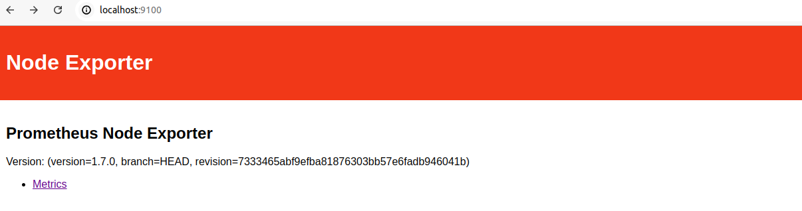
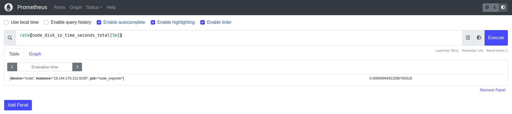

# Project 01

## Project Breakdown


### 1. Configuring Jobs and Targets


  + **Task:** Set up a Prometheus server to monitor multiple services running on different nodes.


  + **Deliverables:**


  + Configure Prometheus with jobs for monitoring different services like web servers, databases, and system metrics.
  + Define static and dynamic targets using file-based and service discovery methods (e.g., Consul or Kubernetes).

  ```
    #my global config
    global:
      scrape_interval: 15s # Set the scrape interval to every 15 seconds. Default is every 1 minute.
      evaluation_interval: 15s # Evaluate rules every 15 seconds. The default is every 1 minute.
      #scrape_timeout is set to the global default (10s).

    #Alertmanager configuration
    alerting:
      alertmanagers:
        - static_configs:
            - targets:
               - localhost:9093

    #Load rules once and periodically evaluate them according to the global 'evaluation_interval'.
    rule_files:
       - "alert_rule.yml"
      #- "second_rules.yml"

    #A scrape configuration containing exactly one endpoint to scrape:
    #Here it's Prometheus itself.
    scrape_configs:
      #The job name is added as a label `job=<job_name>` to any timeseries scraped from this config.
      - job_name: "prometheus"

        #metrics_path defaults to '/metrics'
        #scheme defaults to 'http'.

        static_configs:
          - targets: ["localhost:9090"]

      - job_name: "node_exporter"
        static_configs:
          - targets: ["localhost:9100"]

      - job_name: "mysql_exporter"
        static_configs:
          - targets: ["localhost:9104"]
  ```


### 2. Using Exporters (Node Exporter)


   + **Task:** Use Node Exporter to monitor system-level metrics like CPU, memory, disk usage, and network statistics.

     +  install **node Exporter on node** using following command :

     ```
     wget https://github.com/prometheus/node_exporter/releases/download/v1.8.2/node_exporter-1.8.2.linux-amd64.tar.gz

     tar xvfz node_exporter-1.8.2.linux-amd64.tar.gz
     ```

     <br>

       


   + **Deliverables:**

       + Install and configure Node Exporter on all nodes.
       + Ensure Node Exporter metrics are being correctly scraped by Prometheus.


### 3. Hands-on Exercise: Setting Up Exporters


   + **Task:** Configure at least two different types of exporters (e.g., Node Exporter and MySQL Exporter) and integrate them with Prometheus.
  
   + go to **prometheus.yml** file and change node_exporter target **Ip**

   ```
    - job_name: "node_exporter"
        static_configs:
      - targets: ["localhost:9100"]

   ```
   
   + After installing the node_exporter on node go inside node_exporter folder and  run the node Exporter script  using following command

   ```
     ./node_exporter 
   ```
   <br>

   

   + check on browser by using command `node_address:9100`

   <br>

   

   +  install **MySql Exporter on node** using following command :

   ```
   wget https://github.com/prometheus/mysqld_exporter/releases/download/v0.15.1/mysqld_exporter-0.15.1.linux-amd64.tar.gz

   tar -xvf mysqld_exporter-0.15.1.linux-amd64.tar.gz
   ```
   <br>

   

   + Now we need to create user and password

   ```
   sudo mysql -u root -ppassword

   CREATE USER 'mysqld_exporter'@'localhost' IDENTIFIED BY 'your password';

   exit
   ```

  <br>

  

   + before starting mysql_exporter first edit the .my.cnf file

   ```
   [client]
   user=mysqld_exporter
   password=user@123
   ```
   + After editing cnf file run the mysql scrip :

  ```
    ./mysqld_exporter
  ```
  <br>

  

  <br>

  

   + **Deliverables:**

      + Demonstrate successful data collection from both exporters.
      + Create a basic Prometheus dashboard to visualize key metrics from these exporters.
### 4. Introduction to PromQL


   + **Task:** Learn and implement basic PromQL queries to extract meaningful data from the metrics collected.

  + **Deliverables:**

    + Write basic queries to retrieve metrics like average CPU usage, memory consumption, and disk I/O over time.
 
      + 1. **average cpu usage**

         + to check avaerage cpu usage  on prometheus use following command:

         ```
         avg(rate(node_cpu_seconds_total[5m])) by (instance)
         ```

       <br>

      

      <br>

      

      + 2. **memory consumption** 

        + to check memory consumption on prometheus use following command :

         ```
         node_memory_MemTotal_bytes - node_memory_MemFree_bytes
         ```
        <br>

        

        <br>

        

      + 3. **disk I/O over time**

        + to check disk I/O over time on prometheus use follwing command:

        ```
          rate(node_disk_io_time_seconds_total[5m])
        ```

        <br>

        

        <br>

        

### 5. Basic Queries (Selectors, Functions, Operators)


   + **Task:** Create PromQL queries using selectors, functions, and operators to filter and manipulate time-series data

   + **Deliverables:**

     + Write PromQL queries to calculate the 95th percentile of CPU usage.
   
     + Use functions like rate(), increase(), and histogram_quantile() to perform more complex analysis.


### 6. Advanced Queries and Aggregations

   + **Task:** Perform advanced data aggregation using PromQL.

   + **Deliverables:**

     + Write queries to calculate the total memory usage across all nodes.

     ```
     sum by (instance)(node_memory_MemTotal_bytes - node_memory_MemAvailable_bytes)
     ```

     <br>

     

     <br>

     

     + Aggregate data to find the maximum disk space usage among all nodes.

     ```
      max(node_filesystem_size_bytes - node_filesystem_free_bytes)
     ```

  <br>

  

  <br>

  

### 7. Configuring Alertmanager

   + **Task:** Set up Alertmanager to handle alerts generated by Prometheus.

     + got to **https://prometheus.io/download/**  and download alertmanager

      <br>

      

      <br>

      

      + Go inside alertmanager folder and run alertmanager script

      ```
      ./alertmanager
      ```

      <br>

      

      + got to browser and run `localhost:9093`

      <br>

      


   + **Deliverables:**

       + Configure Alertmanager in Prometheus.yml file .

       ```
       # Alertmanager configuration
         alerting:
           alertmanagers:
             - static_configs:
                 - targets:
                    - localhost:9093
       ```

       
   
       + Create routing rules to manage alert notifications based on severity and service type.


### 8. Writing Alerting Rules


   + **Task:** Write custom alerting rules in Prometheus to trigger alerts based on specific conditions.
  
   + **Deliverables:**

        + Create alerting rules for high CPU usage, memory leaks, and disk space running low.

        + we will create alert_rule.yml file at same location of prometheus.yml file

        ```
         groups:
          - name: low_disk
            rules:
              - alert: LowDiskSpace
                expr: node_filesystem_free_bytes / node_filesystem_size_bytes < 0.10
                for: 2m
                labels:
                  severity: critical
                annotations:
                  summary: "Low Disk Space on instance {{ $labels.instance }}"
                  description: "Disk space is below 10%."

          - name: high_cpu
            rules:
              - alert: HighCPUUsage
                expr: avg(rate(node_cpu_seconds_total[5m])) by (instance) > 0.85
                for: 2m
                labels:
                  severity: warning
                annotations:
                  summary: "High CPU Usage on instance {{ $labels.instance }}"
                  description: "CPU usage is above 85% for more than 2 minutes."

          - name: instance_down
            rules:
              - alert: InstanceDown
                expr: up == 0
                for: 2m
                labels:
                  severity: critical
                annotations:
                  summary: "Instance {{ $labels.instance }} is down"
                  description: "The instance {{ $labels.instance }} is not reachable."
        ```
     
  + Ensure alerts are correctly generated and sent to Alertmanager.

    <br>

    


### 9. Setting Up Notification Channels (Email, Slack, etc.)


   + **Task:** Integrate Alertmanager with multiple notification channels like Email and Slack.

   + go to Alertemanager folder and open alertmanager.yml file and put following data

   ```
    route:
      receiver: 'email'
      group_by: ['alertname']

    receivers:
      - name: 'email'
        email_configs:
          - to: 'admin@example.com'
            from: 'prometheus@example.com'
            smarthost: 'smtp.example.com:587'
            auth_username: 'user'
            auth_password: 'password'

      - name: 'slack'
        slack_configs:
          - api_url: ' https://hooks.slack.com/services/T0000000000/B0000000000/xxxxxxxxxxxxxxxx'
            channel: '#prometheus'
   ```

+ in above code you have to put receiver and sender email address in api_url you have to put your slack incoming webhook url and in channel your slack channel name 

   + **Deliverables:**

       + Set up Email notifications for critical alerts.
       + Integrate Slack for real-time alerts and notifications.


### 10. Hands-on Exercise: Creating Alerts


   + **Task:** Test the entire alerting pipeline by creating and triggering custom alerts.

   <br>

   
  
   <br>

   

   + **Deliverables:**

      + Simulate a scenario where a node exceeds 90% CPU usage and ensure alerts are triggered and sent to both Email and Slack.
      + Validate the alerts in both notification channels.
