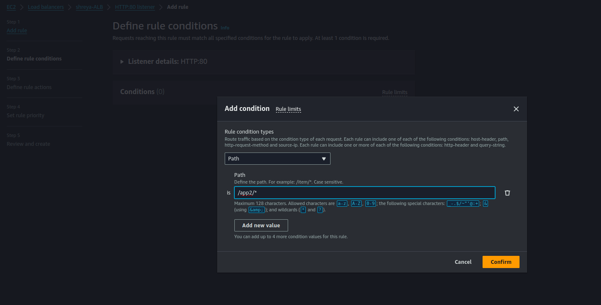

# Project - 14th August

## Deploying a Path-Based Routing Web Application on AWS

## Objective
  + To evaluate your skills in deploying a web application on AWS using EC2 instances, configuring security groups, and setting up an Application Load Balancer (ALB) with path-based routing. You will deploy two simple web applications, configure the ALB to route traffic based on the URL path, and terminate all resources once the project is complete.

## Project Scenario:
 + A small company needs to deploy two lightweight web applications, "App1" and "App2," on AWS. The traffic to these applications should be routed through a single Application Load Balancer (ALB) based on the URL path. The company has opted for t2.micro instances for cost efficiency.

## Project Steps and Deliverables:

**1. EC2 Instance Setup (30 minutes):**

 + **Launch EC2 Instances:**
    + Launch four EC2 t2.micro instances using the Ubuntu  AMI.

    <br>
    
    

    + SSH into each instance 
    + `instance1 `:
    <br>

    

     + `instance2`:
    <br>

    

    + to deploy simple web application

     ```
     sudo apt-get update
     sudo apt-get install apache2 -y 
     sudo mkdir -p /var/www/html/app1
     sudo nano /var/www/html/web/index.html
     cd /etc/apache2
     cd sites-available
     sudo cp 000-default.conf web.conf
     sudo nano web.conf
     sudo a2dissite 000-default.conf
     sudo a2ensite web.conf
     sudo service apache2 restart
     ```
    
    + Do `same process for instance2`

    + Deploy "App1" on two instances.

   <br>

   

    + Deploy "App2" on the other two instances.

   <br>

   

   + Assign tags to the instances for identification (e.g., "App1-Instance1," "App1-Instance2," "App2-Instance1," "App2-Instance2").

   <br>

   

   <br>

   

**2. Security Group Configuration (20 minutes):**

 + **Create Security Groups:**
   + Create a security group for the EC2 instances that allows inbound HTTP (port 80) and SSH (port 22) traffic from your IP address.
   + Create a security group for the ALB that allows inbound traffic on port 80.
   + Attach the appropriate security groups to the EC2 instances and ALB.

    <br>

    

**3. Application Load Balancer Setup with Path-Based Routing (40 minutes):**

 + **Create an Application Load Balancer (ALB):**
   + Set up an ALB in the same VPC and subnets as your EC2 instances.

   <br>

   

   <br>

   

   <br>

   

   <br>

   

   + Configure the ALB with two target groups:
     + Target Group 1: For "App1" instances.

     <br>

       

     + Target Group 2: For "App2" instances.

     <br>

     

   + Register the appropriate EC2 instances with each target group.


 + **Configure Path-Based Routing:**
  + Set up path-based routing rules on the ALB:
    + Route traffic to "App1" instances when the URL path is /app1.
     
    <br>

    

    + Route traffic to "App2" instances when the URL path is /app2.

    + go to your load balancer then fo to  Listeners and rule in that select `http:80` 
     + in `http:80` click on add rule 
     + give name and tags and press next

    <br>

     

     + then select add condition and press next

     <br>

     

     + select target  group  `in Action`

     <br>

     

     + set `priority` `in set rule`

    <br>

    

    + review it and press create 

    <br>

    

  + Set up health checks for each target group to ensure that the instances are healthy and available.

**4. Testing and Validation (20 minutes):**

  + **Test Path-Based Routing:**
     + Access the ALB's DNS name and validate that requests to /app1 are correctly routed to the "App1" instances and that /app2 requests are routed to the "App2" instances.

  + **Security Validation:**
     + Attempt to access the EC2 instances directly via their public IPs to ensure that only your IP address can SSH into the instances.

**5. Resource Termination (10 minutes):**

  + **Terminate EC2 Instances:**
      + Stop and terminate all EC2 instances.

  + **Delete Load Balancer and Target Groups:**
    + Delete the ALB and the associated target groups.

  + **Cleanup Security Groups:**
    + Delete the security groups created for the project.

**6.Documentation and Reporting (10 minutes):**

  + **Brief Documentation:**
    + Document the steps taken during the project, including the setup of EC2 instances, security groups, and ALB configuration.

  + **Final Report:**
   + Summarize the project, highlighting any challenges faced and how they were resolved.
