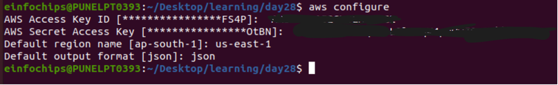
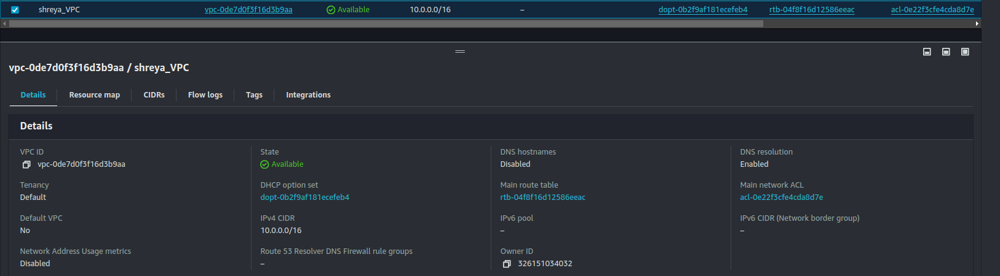
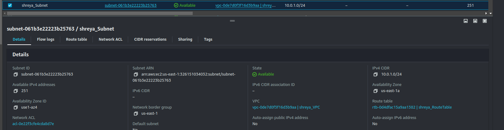
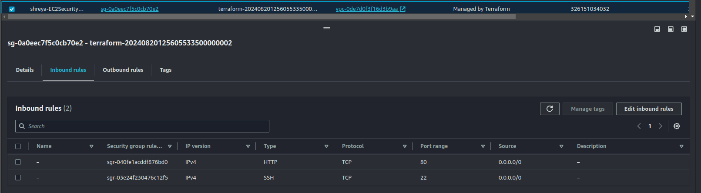
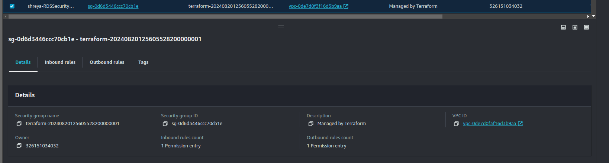
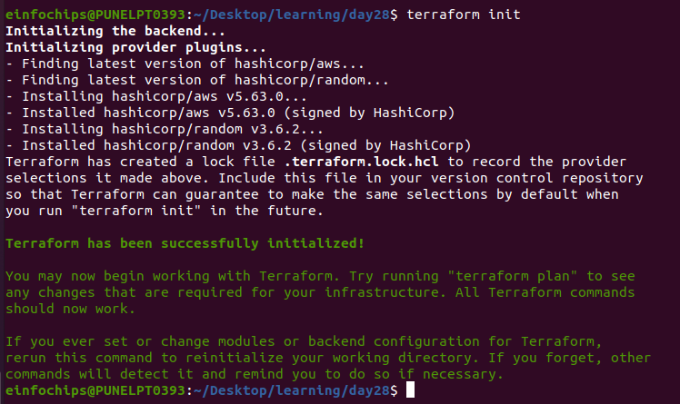
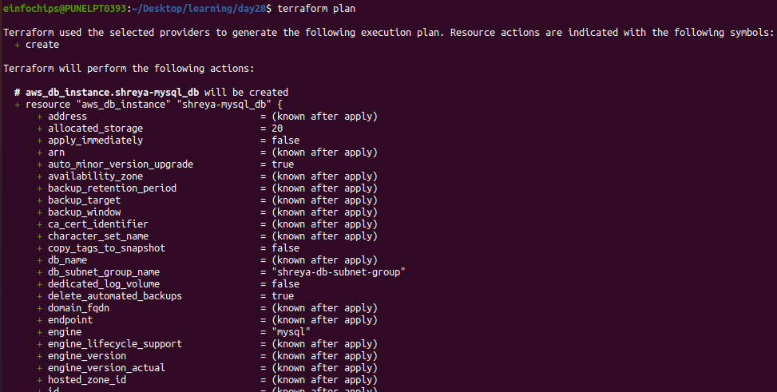
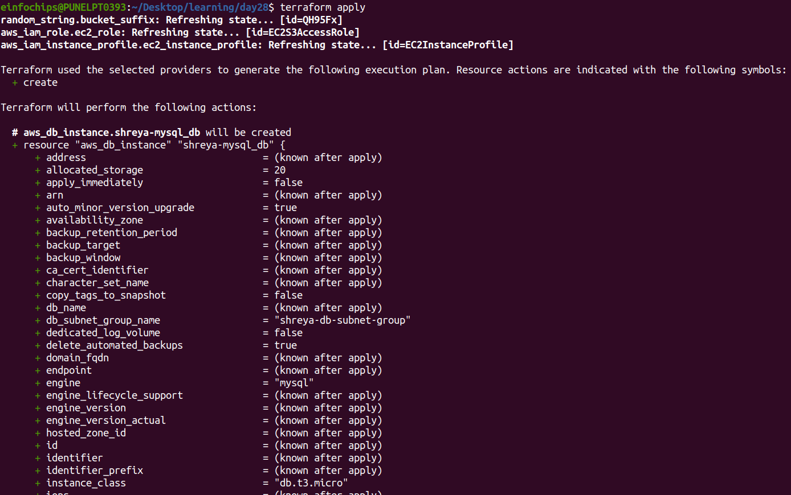
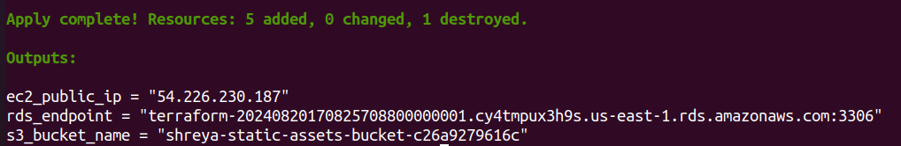

# Project: Deploying a Multi-Tier Architecture Application on AWS using Terraform


## Project Objective:

+ This project will assess your ability to deploy a multi-tier architecture application on AWS using Terraform. The deployment will involve using Terraform variables, outputs, and change sets. The multi-tier architecture will include an EC2 instance, an RDS MySQL DB instance, and an S3 bucket.

## Project Overview:
+ You are required to write Terraform configuration files to automate the deployment of a multi-tier application on AWS. The architecture should consist of:
 
 1. **EC2 Instance:** A `t2.micro` instance serving as the application server.

 2. **RDS MySQL DB Instance:** A `t3.micro` instance for the database backend.

 3. **S3 Bucket:** For storing static assets or configuration files.

## Specifications:

+ **EC2 Instance:**Use the `t2.micro` instance type with a public IP, allowing HTTP and SSH access.

+ **RDS MySQL DB Instance:** Use the `t3.micro` instance type with a publicly accessible endpoint.

+ **S3 Bucket:** Use for storing static assets, configuration files, or backups.

+ **Terraform Configuration:**
  + Utilize Terraform variables to parameterize the deployment (e.g., instance type, database name).

  [variables.tf](variables.tf)

  + Use Terraform outputs to display important information (e.g., EC2 public IP, RDS endpoint).

  + Implement change sets to demonstrate how Terraform manages infrastructure changes.

  [main.tf](main.tf)

+ **No Terraform Modules:** Focus solely on the core Terraform configurations without custom or external modules.

## Key Tasks:

### 1. Setup Terraform Configuration:
  + **Provider Configuration:**

    + Configure the AWS provider to specify the region for deployment.

    <br>

    

    + Ensure the region is parameterized using a Terraform variable.
  
  + **VPC and Security Groups:**
    + Create a VPC with a public subnet for the EC2 instance.

```
# VPC Configuration
resource "aws_vpc" "shreya_vpc" {
  cidr_block = var.vpc_cidr

  tags = {
    Name = "shreya_VPC"
  }
}

# Subnet Configuration
# public subnet
resource "aws_subnet" "shreya_publicsubnet" {
  vpc_id            = aws_vpc.shreya_vpc.id
  cidr_block        = "10.0.1.0/24"
  map_public_ip_on_launch = true

  tags = {
    Name = "shreya_publicSubnet"
  }
}

# private subnet
resource "aws_subnet" "shreya_privateSubnet_az1" {
  vpc_id            = aws_vpc.shreya_vpc.id
  cidr_block        = var.subnet_cidr1
  availability_zone = "${var.region}a"
  map_public_ip_on_launch = false

  tags = {
    Name = "shreya_privateSubnet_az1"
  }
}

resource "aws_subnet" "shreya_privateSubnet_az2" {
  vpc_id            = aws_vpc.shreya_vpc.id
  cidr_block        = var.subnet_cidr2
  availability_zone = "${var.region}b"
  map_public_ip_on_launch = false

  tags = {
    Name = "shreya_privateSubnet_az2"
  }
}

# Internet Gateway
resource "aws_internet_gateway" "shreya_igw" {
  vpc_id = aws_vpc.shreya_vpc.id

  tags = {
    Name = "shreya_IGW"
  }
}

# Route Table
resource "aws_route_table" "shreya_route_table" {
  vpc_id = aws_vpc.shreya_vpc.id

  route {
    cidr_block = "0.0.0.0/0"
    gateway_id = aws_internet_gateway.shreya_igw.id
  }

  tags = {
    Name = "shreya_RouteTable"
  }
}

# Associate Route Table with Subnet
resource "aws_route_table_association" "shreya_route_table_assoc" {
  subnet_id      = aws_subnet.shreya_publicsubnet.id
  route_table_id = aws_route_table.shreya_route_table.id
}

```
  <br>

  

  <br>

  

  + Define security groups allowing HTTP and SSH access to the EC2 instance, and MySQL access to the RDS instance.

```
# Security Group for EC2
resource "aws_security_group" "shreya-ec2_sg" {
  vpc_id = aws_vpc.shreya_vpc.id

  ingress {
    from_port   = 22
    to_port     = 22
    protocol    = "tcp"
    cidr_blocks = [var.allowed_ssh_cidr]
  }

  ingress {
    from_port   = 80
    to_port     = 80
    protocol    = "tcp"
    cidr_blocks = [var.allowed_http_cidr]
  }

  egress {
    from_port   = 0
    to_port     = 0
    protocol    = "-1"
    cidr_blocks = ["0.0.0.0/0"]
  }

  tags = {
    Name = "shreya-EC2SecurityGroup"
  }
}

# Security Group for RDS
resource "aws_security_group" "shreya-rds_sg" {
  vpc_id = aws_vpc.shreya_vpc.id

  ingress {
    from_port   = 3306
    to_port     = 3306
    protocol    = "tcp"
    cidr_blocks = [var.allowed_mysql_cidr]
  }

   ingress {
    from_port = 3306
    to_port = 3306
    protocol = "tcp"
    cidr_blocks = ["0.0.0.0/0"]
   }

   ingress {
    from_port = 22
    to_port = 22
    protocol = "tcp"
    cidr_blocks = ["0.0.0.0/0"]
   }
   
  egress {
    from_port   = 0
    to_port     = 0
    protocol    = "-1"
    cidr_blocks = ["0.0.0.0/0"]
  }

  tags = {
    Name = "shreya-RDSSecurityGroup"
  }
}
```

  + **EC2 Instance:**
    + Define the EC2 instance using a `t2.micro` instance type.

```
# EC2 Instance
resource "aws_instance" "shreya" {
  ami           = var.ami_id
  instance_type = var.instance_type
  subnet_id     = aws_subnet.shreya_publicsubnet.id
  security_groups = [aws_security_group.shreya-ec2_sg.id]
  key_name      =  "ansible-new.pem"
  iam_instance_profile   = aws_iam_instance_profile.ec2_instance_profile.name

  associate_public_ip_address = true

  depends_on = [aws_security_group.shreya-ec2_sg]

  tags = {
    Name = "shreya"
  }
}
```
  + Configure the instance to allow SSH and HTTP access.

  <br>

  
  
  + Use Terraform variables to define instance parameters like AMI ID and instance type.

```
# EC2 Instance Variables
variable "ami_id" {
  description = "The AMI ID for the EC2 instance"
  default     = "ami-04a81a99f5ec58529"
}

variable "instance_type" {
  description = "The EC2 instance type"
  default     = "t2.micro"
}
```

  + **RDS MySQL DB Instance:**
    + Create a `t3.micro` MySQL DB instance within the same VPC.

```
# RDS MySQL Instance
resource "aws_db_instance" "shreya-mysql_db" {
  allocated_storage    = 20
  engine               = "mysql"
  instance_class       = "db.t3.micro"
  db_name              = var.db_name
  username             = var.db_username
  password             = var.db_password
  publicly_accessible  = false
  vpc_security_group_ids = [aws_security_group.shreya-rds_sg.id]

  db_subnet_group_name = aws_db_subnet_group.shreya_db_subnet_group.name

  tags = {
    Name = "shreya-RDSInstance"
  }
}
```
  + Use Terraform variables to define DB parameters like DB name, username, and password.

```
# RDS Variables
variable "db_name" {
  description = "The name of the RDS MySQL database"
  default     = "mydb"
}

variable "db_username" {
  description = "The master username for the RDS MySQL instance"
  default     = "admin"
}

variable "db_password" {
  description = "The master password for the RDS MySQL instance"
  default     = "password123"
  sensitive   = true  # Marks the variable as sensitive, so it won't be logged or displayed in output
}
```
  + Ensure the DB instance is publicly accessible, and configure security groups to allow access from the EC2 instance.

    <br>

    

  + **S3 Bucket:**
    + Create an S3 bucket for storing static files or configurations.
    
```
# S3 Bucket
resource "aws_s3_bucket" "shreya-static_bucket" {
  bucket = "${var.bucket_prefix}-${random_id.bucket_suffix.hex}"

  tags = {
    Name = "shreya-static_bucket"
  }
}

resource "random_id" "bucket_suffix" {
  byte_length = 6
}    
```

  + Allow the EC2 instance to access the S3 bucket by assigning the appropriate IAM role and policy.

```
# IAM Role for EC2 to Access S3
resource "aws_iam_role" "ec2_role" {
  name = "EC2S3AccessRole"

  assume_role_policy = jsonencode({
    Version = "2012-10-17",
    Statement = [{
      Action    = "sts:AssumeRole",
      Effect    = "Allow",
      Principal = {
        Service = "ec2.amazonaws.com"
      }
    }]
  })
}

# IAM Policy for S3 Access
resource "aws_iam_policy" "s3_access_policy" {
  name        = "EC2S3AccessPolicy"
  description = "Policy to allow EC2 instance to access S3 bucket"

  policy = jsonencode({
    Version = "2012-10-17",
    Statement = [{
      Action   = ["s3:ListBucket", "s3:GetObject", "s3:PutObject"],
      Effect   = "Allow",
      Resource = [
        aws_s3_bucket.shreya-static_bucket.arn,
        "${aws_s3_bucket.shreya-static_bucket.arn}/*"
      ]
    }]
  })
}
```

  + **Outputs:**
    
    + Define Terraform outputs to display the EC2 instance’s public IP address, the RDS instance’s endpoint, and the S3 bucket name.

    ```
    # Outputs
    output "ec2_public_ip" {
      value = aws_instance.shreya.public_ip
    }

    output "rds_endpoint" {
      value = aws_db_instance.shreya-mysql_db.endpoint
    }

    output "s3_bucket_name" {
      value = aws_s3_bucket.shreya-static_bucket.bucket
    }
    ```

### 2. Apply and Manage Infrastructure:

  + **Initial Deployment:**
    
    + Run `terraform init` to initialize the configuration.

    <br>

    

    + Use `terraform plan` to review the infrastructure changes before applying.

    <br>

    

    + Deploy the infrastructure using `terraform apply`, and ensure that the application server, database, and S3 bucket are set up correctly.

    <br>

    

    <br>

    
  
  + **Change Sets:**
    + Make a minor change in the Terraform configuration, such as modifying an EC2 instance tag or changing an S3 bucket policy.

    + Use `terraform plan` to generate a change set, showing what will be modified.

    + Apply the change set using `terraform apply` and observe how Terraform updates the infrastructure without disrupting existing resources.

### 3. Testing and Validation:
  + Validate the setup by:
    + Accessing the EC2 instance via SSH and HTTP.

    + Connecting to the MySQL DB instance from the EC2 instance.

    + Verifying that the EC2 instance can read and write to the S3 bucket.

  + Check the Terraform outputs to ensure they correctly display the relevant information.


### 5. Documentation:
 + Document the entire process, including Terraform configurations, the purpose of each Terraform file, variables used, and outputs.

 + Include screenshots or logs demonstrating the deployment, testing, and destruction of the resources.


