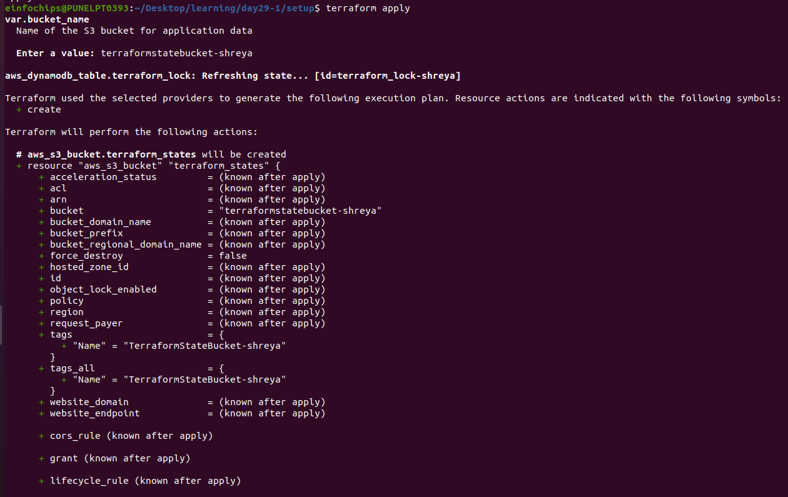
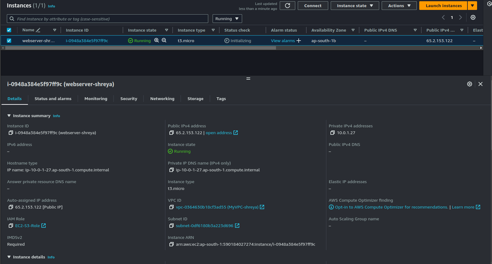
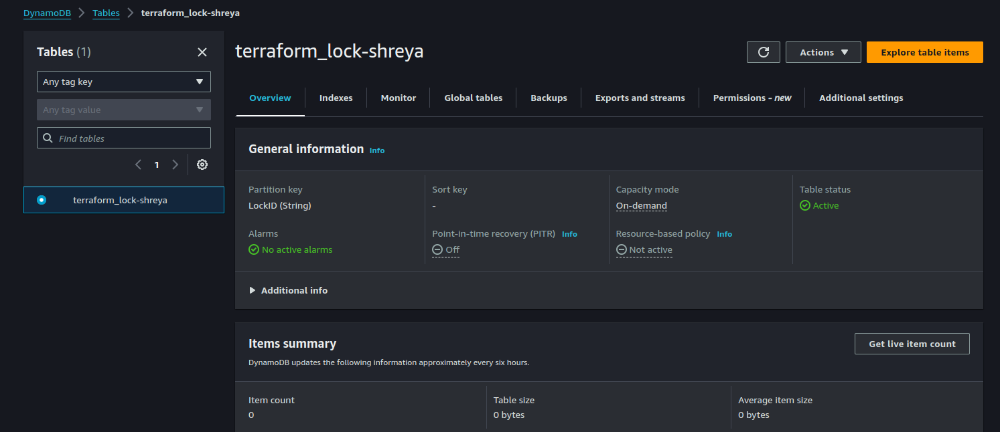

# Advanced Terraform with Modules, Functions, State Locks, Remote State Management, and Variable Configuration

## Project Objective

This project tests your ability to work with Terraform modules, functions, variables, state locks, and remote state management by deploying infrastructure on AWS. You will use a custom Terraform module to deploy infrastructure and manage the state remotely in an S3 bucket while testing the locking mechanism with DynamoDB. You will also configure variables and outputs using Terraform functions.

## Project Overview

You will create a Terraform configuration that uses a custom module to deploy a multi-component infrastructure on AWS. The state files will be stored remotely in an S3 bucket, and state locking will be handled by DynamoDB. This project involves creating a flexible and reusable Terraform module using input variables (`.tfvars`) and Terraform functions to parameterize configurations.

## Specifications

- **Terraform Modules**: Create a reusable module to deploy both an EC2 instance and an S3 bucket.
- **Terraform Functions**: Use built-in functions (e.g., `length`, `join`, `lookup`) to compute variable values.
- **State Management**: Store the Terraform state remotely in an S3 bucket and configure DynamoDB for state locking.
- **Variable Configuration**: Parameterize infrastructure using variables for instance type, region, and other configurable options.
- **Outputs**: Display important information such as EC2 instance details and the S3 bucket name after deployment.

## Key Tasks

### Remote State Management

1. **S3 Bucket for State**:
    - Create an S3 bucket using Terraform to store the state file.
    - in `s3-state.tf` file write following contetnt
```
 provider "aws" {
  region = var.region
}

# terraform/s3-state.tf
resource "aws_s3_bucket" "terraform_states" {
  bucket = var.bucket_name

  lifecycle {
    prevent_destroy = true
  }

  tags = {
    Name = "TerraformStateBucket-shreya"
  }
}

# s3 bucket versioning
resource "aws_s3_bucket_versioning" "s3-version"{
  bucket = aws_s3_bucket.terraform_state.id
  versioning_configuration {
    status = "Enabled"
  }
}  

# Output the S3 bucket name used for Terraform remote state
output "terraform_state_bucket_name" {
  description = "The name of the S3 bucket used to store the Terraform remote state"
  value       = aws_s3_bucket.terraform_state.bucket
}
```

2. **State Locking with DynamoDB**:
    - Create a DynamoDB table to handle state locks using Terraform (or manually if required).
```
# terraform/dynamodb-lock.tf
resource "aws_dynamodb_table" "terraform_lock" {
  name           = "terraform_lock-shreya"
  billing_mode   = "PAY_PER_REQUEST"
  hash_key       = "LockID"
  
  attribute {
    name = "LockID"
    type = "S"
  }

  tags = {
    Name = "dynamodbLock-shreya"
  }
}

# Output the name of the DynamoDB table used for state locking
output "dynamodb_table_name" {
  description = "The name of the DynamoDB table used for state locking"
  value       = aws_dynamodb_table.terraform_locks.name
}
```

- Configure Terraform to store the state file in S3 bucket and to use this DynamoDB table for state locking.

```
# terraform/backend.tf
terraform {
  backend "s3" {
    bucket         = "TerraformStateBucket-shreya" # same as s3 bucket name
    key            = "terraform.tfstate" # replace with the path where you want to store the state file
    region         = "us-east-1" # samae as s3 bucket region
    dynamodb_table = "terraform_lock-shreya" #same as Dynam0db table name 
    encrypt        = true
  }
}


```

<br>


<br>


<br>


<br>


<br>


<br>


<br>


### Terraform Module Creation

1. **Custom Module**:
    - Create a Terraform module to deploy AWS resources:
        - **EC2 instance**: Use a region-specific AMI and allow SSH access through a security group.
        - **S3 bucket**: Create an S3 bucket for storing application data.
    - Parameterize the module using variables for:
        - Instance Type (e.g., `t2.micro`)
        - AWS Region
        - S3 Bucket Name

2. **Terraform Functions**:
    - Use functions like `join`, `lookup`, and `length` to process variable data in your module.
- in module create vpc folder in that create main.tf file and provide following details    

```
variable "cidr_blocks" {
  type    = list(string)
  default = []
}

# Output the combined CIDR blocks as a single string
output "cidr_blocks_string" {
  value = join(", ", var.cidr_blocks)
}
```
- USe `lookup` to set default values if a variable is not provided
- In `ec2` folder in main.tf file
```
# Create EC2 instance
resource "aws_instance" "webserver" {
  ami                         = lookup(var.ami_map, "ami1", "ami-05134c8ef96964280")
  instance_type               = var.instance_type
  iam_instance_profile        = var.iam_ec2_profile_name
  associate_public_ip_address = true
  subnet_id                   = var.public_subnet_id
  vpc_security_group_ids      = [var.security_group_id]
  key_name                    = var.key_pair
  tags = {
    Name = var.instance_name
    Project = var.project_name
  }
}
```

### Input Variables and Configuration

- Define input variables in `.tfvars` files to make the infrastructure flexible. Variables include:
    - EC2 instance type
    - S3 bucket name
    - AWS region
- Use the `default` argument for variables where appropriate.

### Output Configuration

- Define outputs in Terraform to display key information after deployment, such as:
    - EC2 Public IP
    - S3 Bucket Name
    - AWS Region

## Testing State Locking and Remote State

### State Locking

- Run `terraform apply` from two different terminals simultaneously to test the state locking mechanism.

<br>



- Confirm that DynamoDB handles the state lock correctly, preventing concurrent changes.

<br>


### Remote State Management

- Verify that the state file is stored in the S3 bucket and that changes are reflected in the remote state file.

## Apply and Modify Infrastructure

1. **Initial Deployment**:
    - Run `terraform plan` and `terraform apply` to deploy the infrastructure.

    <br>

    

    <br>

    

    <br>

    

    <br>

    

    <br>

    

    - `terraform apply`

    <br>

    

    <br>

    

    - Verify that the EC2 instance, S3 bucket, and configurations are correctly set up.

  <br>

  

  <br>

  

2. **Modify Infrastructure**:
    - Update a variable (e.g., change the instance type) and re-run `terraform apply`.
    - Observe how Terraform plans and applies only the necessary changes with state locking in effect.

3. **Resource Termination**:
    - Run `terraform destroy` to tear down all resources created by Terraform.

    <br>

    

    <br>

    
    
    - Ensure that the S3 bucket, EC2 instance, and DynamoDB table (if not reused) are deleted.

## Documentation

1. **Terraform Module Documentation**:
    - Explain how to use the module, variables, and functions, and how state management works.
    - Include instructions on how to configure and manage remote state and the locking mechanism.

2. **Testing Evidence**:
    - Provide screenshots or logs showing the deployment process and successful state locking tests.

   
## Deliverables

1. **Terraform Configuration Files**: All `.tf` files including the main configuration and custom module.
2. **Documentation**: Detailed documentation explaining the variables, functions, state management, and testing of the locking mechanism.
3. **Test Results**: Evidence that state locking was tested successfully (e.g., screenshots of simultaneous `terraform apply` attempts).
4. **Resource Teardown Confirmation**: Confirmation that all AWS resources were destroyed using `terraform destroy`.
