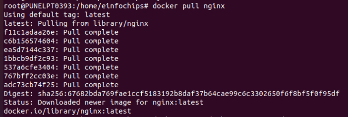
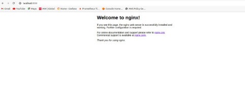

## Docker Project 1

### Creating a container from a pulled Image

1) first pull nginx image by using docker pull nginx  command



2) run nginx container and verify the container is running by using docker run --name my-nginx -d -p 8080:80 nginx   command


3) verify the container is running byr visiting  in browser





**Modifying the Container and Creating a New Image**

**Objective:** Modify the running Nginx container to serve a custom HTML page and create a new image from this modified container.

1) Access the Running container by using    docker exec -it my-nginx /bin/bash  command and create HTML page by using  
```
echo "<html><body><h1>Hello from 

   Docker!</h1></body></html>" > /usr/share/nginx/html/index.html 
```   
command


2) comit the changes to create new Image  by using  

`docker commit my-nginx custom-nginx  command`

   and run the container from new Image by using 
   
`docker run --name my-custom-nginx -d -p 8081:80 custom-nginx` command 


3) verify new container by visiting link in browser


### Creating Docker to build and Deploy a web Application

**Objective:** Write a Dockerfile to create an image for a simple web application and run it as a container.

1) create project directory name “ my-webapp” and move to that directory by using `mkdir my-webapp`
`cd my-webapp `

2) In my-webapp create “ index.html “ file to write html code .


3) create Dockerfile 


4) Build the docker Image   `docker build -t my-webapp-image .`

and run the container from the build Image  

`docker run --name my-webapp-container -d -p 8082:80 my-webapp-image`


5) verify by visiting browser using URL


### Remove all reated containers and images to clean up environment

+ 1) stop , remove containers and remove Images

`docker stop my-nginx my-custom-nginx my-webapp-container`

`docker rm my-nginx my-custom-nginx my-webapp-container`

`docker rmi nginx custom-nginx my-webapp-image`


## Docker  Project 2

build full-stack applicaton using docker.

Applocation consist of front-end web server (Nginx) , back-end appication server (node.js)  and postgreSQL database.

For database and handle inter-container communication persistent volume is used

1) create project directory name “ fullstack-docker-app”

`mkdir fullstack-docker-app  `   

`cd fullstack-docker-app`

2) In Directory create subdirectories  name “ frontend  , backend  ,database  ” for each service        

`mkdir frontend backend database`

3) create network to allow communication between containers 

`docker network create fullstack-network`


4) create volume for PostgreSQL database 

`docker volume create pgdata`


### set up database with docker

1) In “ database ”  directory create dockerfile for database


2) build postgreSQL Image 

`docker build -t my-postgres-db . `


3) Run postgreSQL container

`docker run --name postgres-container --network fullstack-network -v pgdata:/var/lib/postgresql/data -d my-postgres-db`


### create node.js application with Express and set it up with Docker

1) Initialize the node.js Application. Before that we checke version of node and npm

`npm init -y`


2) install Express and pg . This are postgreSQL client for Node.js 

`npm install express pg`


3) In backend directory create file name “ index.js ”


4) create “ dockerfile ” in “ backend ” directory


5) build backend image ` docker build -t my-node-app .`


6) run backend container

`docker run --name backend-container --network fullstack-network -d my-node-app`


### create static front-end and set it up with docker

1) in “ frontend ” directory create “ index.html “ file


2) in “ frontend ” directory create “ dockerfile ”


3) build frontend Image and Run frontend conatiner 

`docker build -t my-nginx-app .`

` cd ..`

`docker run --name frontend-container --network fullstack-network -p 8080:80 -d my- nginx-app`


### Connecting the Backend and Database
+ Backend can communicate with database and handle data requests

1) Access backend container

 `docker exec -it backend-container /bin/bash`


2) Test the connection to  the database using psql 

`apt-get update && apt-get install -y postgresql-client`

`psql -h postgres-container -U user -d mydatabase -c "SELECT NOW();"`


### Final Integration and Testing

1) visit the browser use localhost:8080 to se the Nginx welcome page


2) On “ frontend ” branch update  “ index.html ” file to include  backend link . Using this we will verify full Integration

   

3) Rebuild and run the updated Frontend Container 

`docker build -t my-nginx-app .`

`docker run --name frontend-container --network fullstack-network -p 8080:80 -d my- nginx-app `


4) to verify  visit browser by using `localhost:8080`

   

### Remove all created containers,Images , networks and volumes to cleanup environment

1) stop and remove the container

`docker stop frontend-container backend-container postgres-container `

`docker rm frontend-container backend-container postgres-container`


2) Remove the images :

`docker rmi my-nginx-app my-node-app my-postgres-db`


3) remove the network and volume

`docker network rm fullstack-network `

`docker volume rm pgdata`


