# Project: Advanced Terraform with Provisioners, Modules, and Workspaces

## Project Objective
This project aims to demonstrate the usage of Terraform provisioners, modules, and workspaces. The goal is to deploy basic AWS infrastructure using Terraform modules, execute commands on provisioned resources using provisioners, and manage multiple environments via Terraform workspaces. All resources are within the AWS Free Tier limits.

## Project Overview
The Terraform configuration will deploy:
- An EC2 instance (t2.micro)
- An S3 bucket with standard storage.

You'll use a custom Terraform module for these deployments. Additionally, Terraform provisioners will execute scripts on the EC2 instance to install Apache HTTP Server. Finally, Terraform workspaces will be used to manage separate environments, such as `dev` and `prod`, with distinct configurations.
<br>

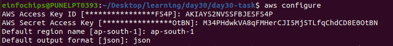

<br>

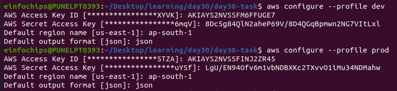

## Specifications

### Terraform Modules
- **Module Scope**: A reusable module to deploy an EC2 instance and an S3 bucket.
- **Instance Type**: t2.micro
- **S3 Bucket**: Standard storage
- **Module Inputs**:
  - EC2 instance type
  - AMI ID
  - Key pair name
  - S3 bucket name
- **Outputs**:
  - EC2 instance public IP
  - S3 bucket ARN

### Terraform Provisioners
- **Remote Exec**: Connect to the EC2 instance via SSH and run a script to install Apache HTTP Server.
- **Local Exec**: Output a message on the local machine confirming the successful provisioning of the EC2 instance with Apache.

### Terraform Workspaces
- **Workspaces**: Manage multiple environments (e.g., `dev` and `prod`).
- **Environment Specificity**: Different configurations for EC2 instance tags and S3 bucket names for each environment.
- **State Management**: Separate state for each workspace to avoid conflicts between environments.

## Key Tasks

### 1. Module Development
- **Module Setup**: Create a directory for the module (e.g., `modules/aws_infrastructure`).

<br>

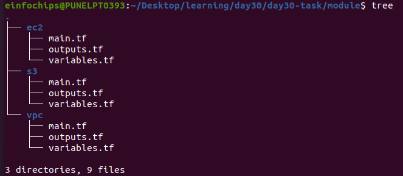

- **Resource Definitions**: Define resources for an EC2 instance and an S3 bucket.
```
# Create EC2 instance
resource "aws_instance" "webserver" {
  ami                         = lookup(var.ami_map, "ami1")
  instance_type               = var.instance_type
  iam_instance_profile        = var.iam_ec2_profile_name
  associate_public_ip_address = true
  subnet_id                   = var.public_subnet_id
  vpc_security_group_ids      = [var.security_group_id]
  key_name                    = var.key_pair
  tags = {
    Name = var.instance_name
    Project = var.project_name
  }
}
```

```
resource "aws_s3_bucket" "this" {
  bucket = var.bucket_name
  tags = {
    Name = var.bucket_name
  }
}

# associate iam role with ec2 instance
resource "aws_iam_instance_profile" "ec2_instance_profile" {
  name = "ec2_instance_profile"
  role = basename(var.ec2_iam_role_arn)
}

resource "aws_s3_bucket_policy" "s3_policy" {
  bucket = aws_s3_bucket.this.id

  policy = jsonencode({
    Version = "2012-10-17"
    Statement = [
      {
        Effect = "Allow"
        Principal = {
          AWS = var.ec2_iam_role_arn
        }
        Action = [
          "s3:GetObject",
          "s3:PutObject",
          "s3:ListBucket"
        ]
        Resource = [
          aws_s3_bucket.this.arn,
          "${aws_s3_bucket.this.arn}/*"
        ]
      }
    ]
  })
}
```
- **Variable Inputs**: Input variables for instance type, AMI ID, key pair, and bucket name.

```
variable "ami_map" {
  description = "AMI ID for the EC2 instance"
  type        = map(string)
  default = {
    "ami1" = "ami-0522ab6e1ddcc7055"  #ubuntu version 24.40
  }
}

variable "instance_type" {
  description = "Instance type for the EC2 instance"
  type        = string
}

variable "instance_name" {
  description = "Name tag for the EC2 instance"
  type        = string
}

variable "key_pair" {
  description = "Name of your private key pair"
  type = string
}

variable "iam_ec2_profile_name" {
  description = "iam profile name for ec2"
  type = string
}

variable "public_subnet_id" {
  description = "public subnit id for ec2"
  type = string
}

variable "security_group_id" {
  description = "security group id for ec2"
  type = string
}

variable "project_name" {
  description = "Adding Project Tag to Ec2 instance"
  type = string
}
```

```
variable "bucket_name" {
  description = "The name of the S3 bucket"
  type        = string
}

# EC2 IAM Role ARN
variable "ec2_iam_role_arn" {
  description = "The ARN of the IAM role attached to the EC2 instance."
  type = string
}
```
- **Outputs**: Outputs for EC2 instance public IP and S3 bucket ARN.

```
output "instance_id" {
  description = "The ID of the EC2 instance"
  value       = aws_instance.webserver.id
}

output "instance_public_ip" {
  description = "The public IP address of the EC2 instance"
  value       = aws_instance.webserver.public_ip
}
```

```
output "bucket_arn" {
  description = "The ARN of the S3 bucket"
  value       = aws_s3_bucket.this.arn
}

output "bucket_name" {
  description = "The name of the S3 bucket"
  value       = aws_s3_bucket.this.bucket
}

output "iam_ec2_profile_name" {
  description = "name of the ec2 instance profle name"
  value       = aws_iam_instance_profile.ec2_instance_profile.name
}
```

### 2. Main Terraform Configuration
- **Main Config Setup**: Call the custom module from the root directory.
- **Backend Configuration**: Use local state storage (optional).

```
provider "aws" {
  region = "ap-south-1"
}

module "ec2" {
  source         = "./module/ec2"
  # ami            = var.ami
  instance_type  = var.instance_type
  instance_name  = var.instance_name
  key_pair       = var.key_pair
  public_subnet_id = module.vpc.ec2_instance_subnet_id
  security_group_id = module.vpc.vpc_ec2_sg_id
  iam_ec2_profile_name = module.s3.iam_ec2_profile_name
  project_name = var.project_name
}

module "s3" {
  source       = "./module/s3"
  bucket_name  = var.bucket_name
  ec2_iam_role_arn = var.ec2_iam_role_arn
}

module "vpc" {
  source = "./module/vpc"
  vpc_cidr = var.vpc_cidr_ip
  pub_subnet_cidr = var.pub_subnet_cidr_ip
}
```
### 3. Provisioner Implementation
- **Remote Execution**: Use `remote-exec` to SSH into the EC2 instance and install Apache.
- **Local Execution**: Use `local-exec` to print a confirmation message post-deployment.

### 4. Workspace Management
- **Workspace Creation**: Create workspaces for `dev` and `prod`.

`dev`

<br>

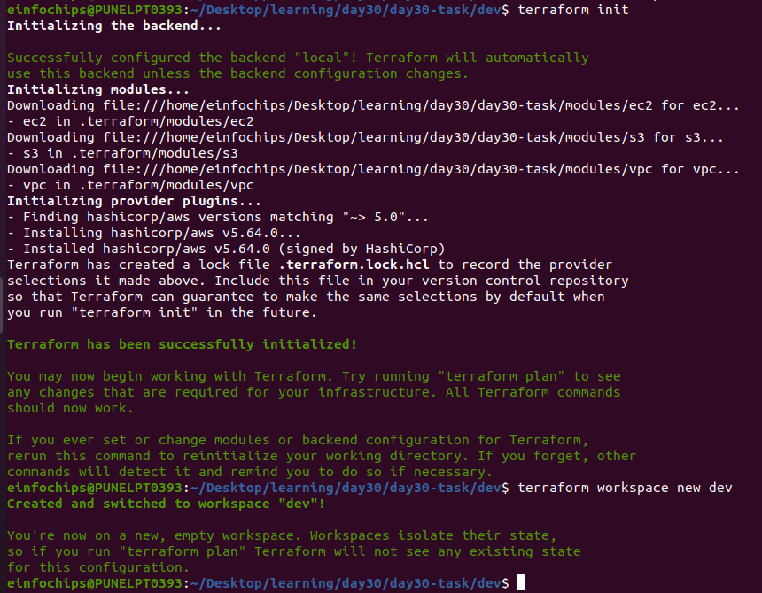

<br>

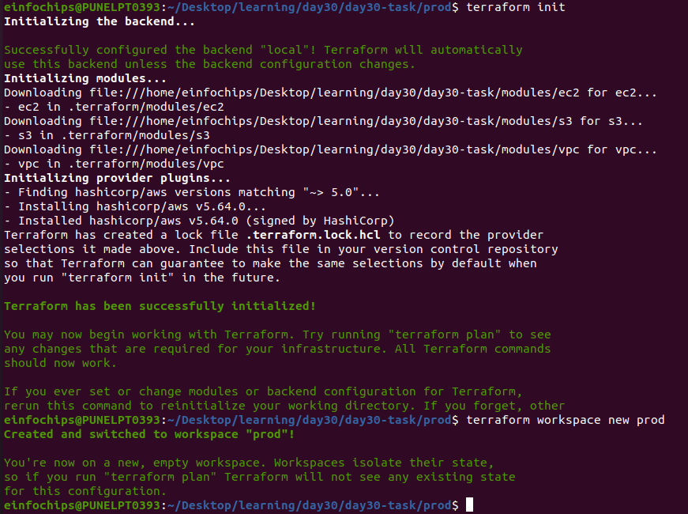

<br>

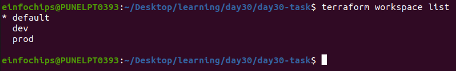

<br>

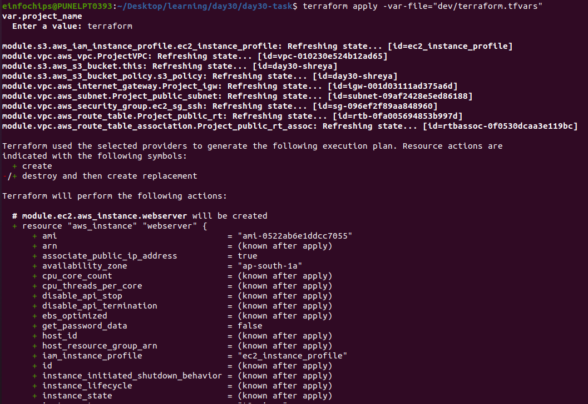

<br>

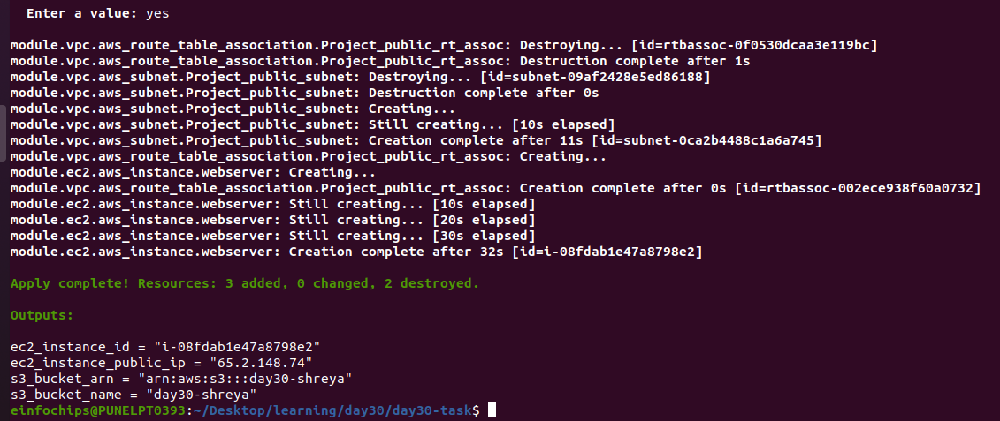


`prod`

<br>

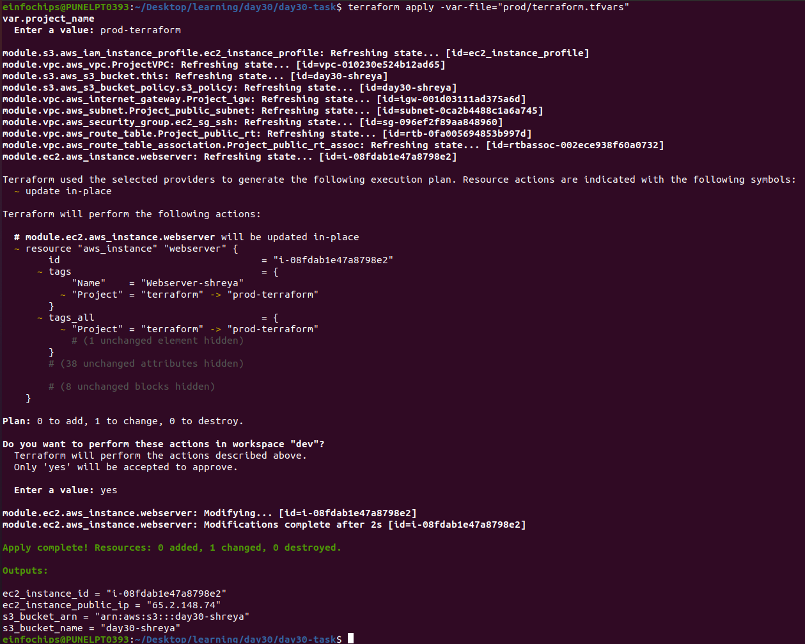

- **Environment Configurations**: Different tags and bucket names per workspace.
- **Deployment**: Deploy the infrastructure separately in each workspace.

### 5. Validation and Testing
- **Apache Installation Verification**: Access the EC2 instance's public IP to verify Apache installation.
- **Workspace Separation**: Confirm isolated infrastructure in each workspace.
- **Provisioner Logs**: Review logs from `local-exec` for success confirmation.

### 6. Resource Cleanup
- **Destroy Resources**: Use `terraform destroy` to remove resources in both environments.

<br>

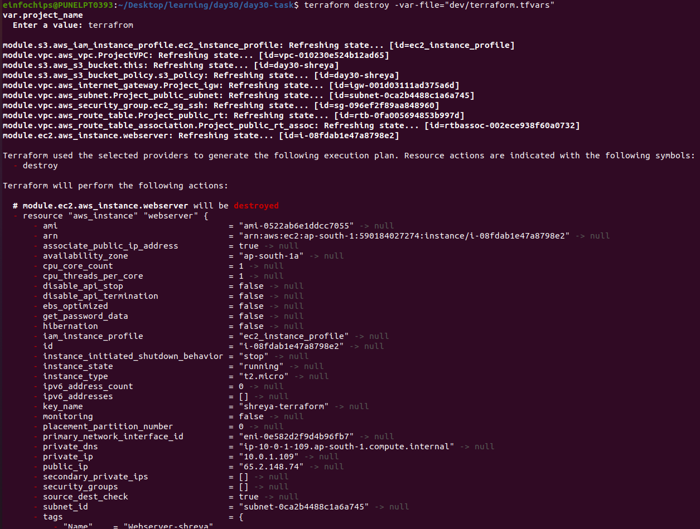

<br>

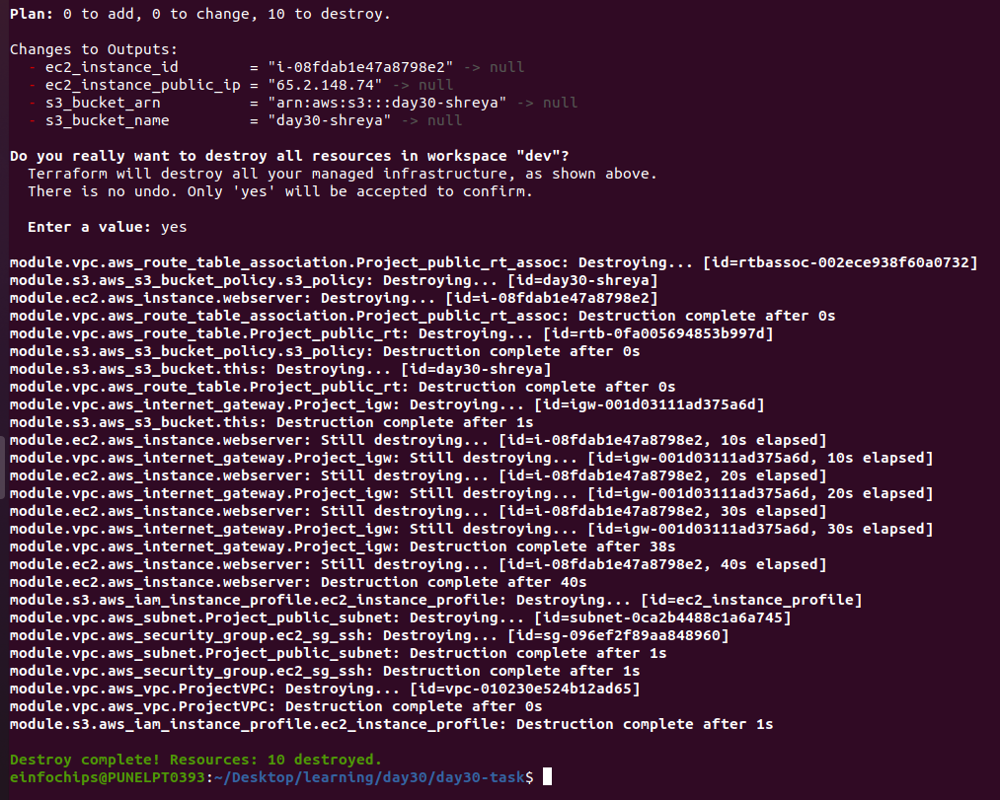


- **Workspace Management**: Ensure state files are updated and reflect the destruction of resources.

## Deliverables
1. **Terraform Module**: The module files in `modules/aws_infrastructure`.
2. **Main Terraform Configuration**: The root Terraform configuration files.
3. **Provisioner Scripts**: Scripts used by `remote-exec` for configuration.
4. **Workspace Documentation**: Explanation of workspace usage.
5. **Validation Logs**: Logs or screenshots showing successful provisioning and Apache installation.
6. **Cleanup Confirmation**: Evidence of resource destruction across all workspaces.

## Documentation
1. **Module Documentation**: Detailed documentation of the Terraform module, including variables, provisioners, and outputs.
2. **Workspace Documentation**: Instructions on how to create and manage workspaces.
3. **Provisioner Documentation**: Descriptions of the provisioners and their purpose.

---

### Validation Screenshots/Logs

Screenshots and logs should show:
- Successful execution of provisioners.
- Apache running on the EC2 instance.

### Cleanup Confirmation

Provide evidence that all resources have been destroyed in both the `dev` and `prod` environments.
