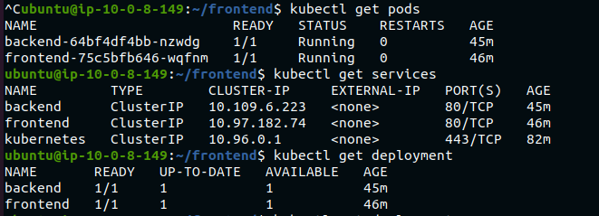

# Deploying a Multi-Tier Application Using Helm on Kubernetes and AWS Free Tier Services

## Overview
This project involves deploying a multi-tier application using Helm on Kubernetes, integrated with AWS Free Tier services. You will learn to manage Helm charts, handle dependencies, implement secrets management, and use Role-Based Access Control (RBAC) while working with AWS services such as S3 and RDS (MySQL).

**Estimated Duration:**

## Project Objectives
- Deploy a multi-tier application using Helm on Minikube.
- Integrate AWS Free Tier services (S3 for storage, RDS for MySQL database).
- Manage Helm charts, including versioning, packaging, and rollbacks.
- Implement Helm secrets management and RBAC.
- Handle dependencies between different components of the application.

## Project Deliverables

### 1. Setup Helm and Minikube
- Ensure Minikube is running.

<br>


- Install and configure Helm on your local machine.
```
curl https://raw.githubusercontent.com/helm/helm/main/scripts/get-helm-3 | bash
helm repo add stable https://charts.helm.sh/stable
helm repo update
```
<br>


### 2. AWS Services Setup
- **S3 Bucket:** Create an S3 bucket to store application assets (e.g., frontend static files).

<br>


- **RDS Instance:** Set up an Amazon RDS MySQL instance within the free tier.

<br>


### 3. Create Helm Charts
- **Frontend Chart:** Develop a Helm chart for the frontend service (e.g., NGINX) that pulls static files from the S3 bucket.

```
helm create frontend
```
- **Backend Chart:** Create a Helm chart for the backend service (e.g., a Python Flask API) that connects to the RDS MySQL database.

```
helm create backend
```

<br>


- **Database Chart:** Include configurations in the backend chart for connecting to the RDS MySQL instance.

```
helm create database
```

<br>


### 4. Package Helm Charts
- Package each Helm chart into a `.tgz` file.

```
helm package frontend
helm package backend
```
- Ensure that each chart is properly versioned.

<br>


### 5. Deploy Multi-Tier Application Using Helm
- Deploy the **database chart** (connected to the RDS instance).
- Deploy the **backend chart** with a dependency on the database chart.

```
helm install backend backend-0.1.0.tgz
```

<br>


- Deploy the **frontend chart** with a dependency on the backend service, ensuring it pulls assets from the S3 bucket.

```
 helm install frontend frontend-0.1.0.tgz
```

<br>


<br>


### 6. Manage Helm Secrets
- Implement Helm secrets for managing sensitive data such as database credentials and S3 access keys.

```
apiVersion: v1
kind: Secret
metadata:
  name: backend-secrets
  labels:
     {{- include "backend.labels" . | nindent 4 }}
type: Opaque
data:
  db_host: {{ .Values.mysql.host | b64enc | quote }}
  db_port: {{ .Values.mysql.port | b64enc | quote }}
  db_user: {{ .Values.mysql.user | b64enc | quote }}
  db_password: {{ .Values.mysql.password | b64enc | quote }}
```
- Update the backend chart to use these secrets for connecting to the RDS instance and S3.
```
# update the deployment.yaml file by adding this
  env:
    - name: DB_HOST
        valueFrom:
        secretKeyRef:
            name: backend-secrets
            key: db_host
    - name: DB_PORT
        value: {{ .Values.mysql.port | quote }}
    - name: DB_USER
        valueFrom:
        secretKeyRef:
            name: backend-secrets
            key: db_user
    - name: DB_PASSWORD
        valueFrom:
        secretKeyRef:
            name: backend-secrets
            key: db_password
    resources:
    {{- toYaml .Values.resources | nindent 12 }}
```

### 7. Implement RBAC
- Define RBAC roles and role bindings to manage permissions for Helm deployments.

```
kubectl apply -f helm-service-account.yaml
kubectl apply -f helm-Role.yaml
kubectl apply -f helm-rolebinding.yaml
```

<br>


- Ensure that only authorized users can deploy or modify Helm releases.
```
kubectl auth can-i get pods --as system:serviceaccount:default:helm-service-account
kubectl auth can-i list pods --as system:serviceaccount:default:helm-service-account
kubectl auth can-i create pods --as system:serviceaccount:default:helm-service-account
kubectl auth can-i update pods --as system:serviceaccount:default:helm-service-account
```

<br>


<br>


### 8. Versioning and Rollback
- Update the version of one of the Helm charts (e.g., update the frontend service).
- Perform a rollback if necessary and validate the application's functionality.

### 9. Validate Deployment
- Ensure the frontend service is serving files from the S3 bucket.

`kubectl port-forward service/frontend-service 8085:80`

<br>


<br>


- Validate that the backend service is successfully communicating with the RDS MySQL database.
- Test the overall functionality of the deployed application.
```
kubectl get pods
kubectl get services
kubectl get deployments
```

<br>



### 10. Cleanup
- Delete all Helm releases and Kubernetes resources created during the project.
- Terminate the RDS instance and delete the S3 bucket.

`s3`
<br>


<br>


`database`

<br>


- Stop Minikube if it is no longer needed.

