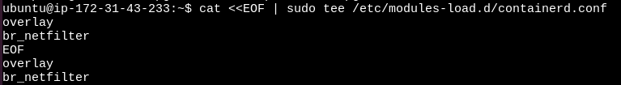
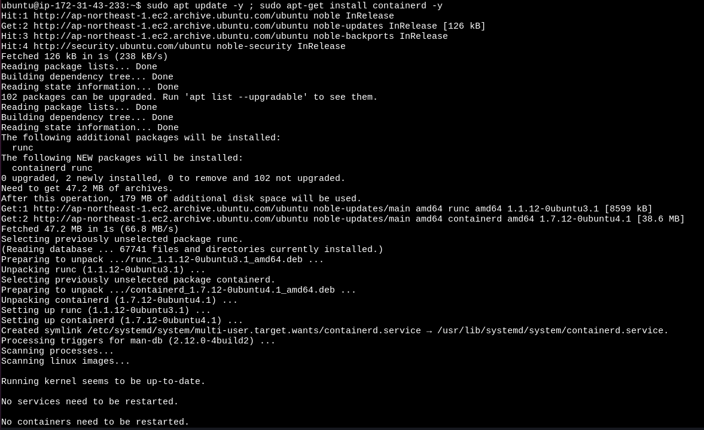
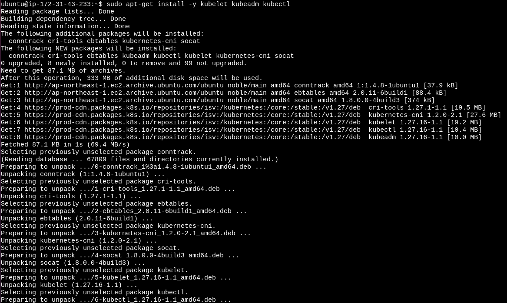

# Activity Deploying a Kubeadm Cluster

 - Deploy two EC2 instances, 

 - T2.medium for Control Node
 - T2.micro for Worker Node

 `master`
 <br>


`worker`
<br>


`security_group for both nodes`
<br>


## 1. Log in to Control Node

## 2. Install Packages
 - On All Nodes (Control Plane and Workers)
 - 1. Log in to the control plane node.
 - Create the Configuration File for containerd:
```
cat <<EOF | sudo tee /etc/modules-load.d/containerd.conf
overlay
br_netfilter
EOF
```
`master`
<br>


`worker`
<br>



 - Load the Modules:
```
sudo modprobe overlay
sudo modprobe br_netfilter
```

`master`
<br>


`worker`
<br>


- Set the System Configurations for Kubernetes Networking:

```
cat <<EOF | sudo tee /etc/sysctl.d/99-kubernetes-cri.conf
net.bridge.bridge-nf-call-iptables = 1
net.ipv4.ip_forward = 1
net.bridge.bridge-nf-call-ip6tables = 1
EOF
```

`master`
<br>


`worker`
<br>


- Apply the New Settings:

```
sudo sysctl --system
```

`master`
<br>


`worker`
<br>


- Install containerd:

```
sudo apt update -y ; sudo apt-get install containerd -y
```
`master`
<br>


`worker`
<br>



- Create the Default Configuration File for containerd:
```
sudo mkdir -p /etc/containerd
```

- Generate the Default containerd Configuration and Save It:
```
sudo containerd config default | sudo tee /etc/containerd/config.toml
sudo sed -i "s/SystemdCgroup = false/SystemdCgroup = true/g" /etc/containerd/config.toml 
```
`master`
<br>


`worker`
<br>


- Restart containerd:
```
sudo systemctl restart containerd
```
- Verify that containerd is Running:
```
sudo systemctl status containerd
```
`master`
<br>


`worker`
<br>


- Disable Swap:
```
sudo swapoff -a
```

- Install Dependency Packages:
```
sudo apt-get update && sudo apt-get install -y apt-transport-https curl
```

`master`
<br>


`worker`
<br>


- Download and Add the GPG Key:
```
curl -fsSL https://pkgs.k8s.io/core:/stable:/v1.27/deb/Release.key | sudo gpg --dearmor -o /etc/apt/keyrings/kubernetes-apt-keyring.gpg
```

- Add Kubernetes to the Repository List:
```
cat <<EOF | sudo tee /etc/apt/sources.list.d/kubernetes.list
deb [signed-by=/etc/apt/keyrings/kubernetes-apt-keyring.gpg] https://pkgs.k8s.io/core:/stable:/v1.27/deb/ /
EOF
```
`master`
<br>


`worker`
<br>


- Update the Package Listings:
```
sudo apt-get update
```

- Install Kubernetes Packages:
```
sudo apt-get install -y kubelet kubeadm kubectl
```
`master`
<br>


`worker`
<br>



- 2. Note: If you encounter a dpkg lock message, wait a minute or two and try again.

 - Turn Off Automatic Updates:
```
sudo apt-mark hold kubelet kubeadm kubectl
```
`master`
<br>


`worker`
<br>


- 3. Log in to Both Worker Nodes and Repeat the Above Steps.

## 3. Initialize the Cluster
On the Control Plane Node, Initialize the Kubernetes Cluster:
```
sudo kubeadm init --pod-network-cidr "<vpc_ip>" --kubernetes-version 1.27.11
```

`master`
<br>


- Set kubectl Access:
```
mkdir -p $HOME/.kube
sudo cp -i /etc/kubernetes/admin.conf $HOME/.kube/config
sudo chown $(id -u):$(id -g) $HOME/.kube/config
```

`master`
<br>


- Test Access to the Cluster:
```
kubectl get nodes
```
`master`
<br>


## 4. Install the Calico Network Add-On

- On the Control Plane Node, Install Calico Networking:
```
kubectl apply -f https://raw.githubusercontent.com/projectcalico/calico/v3.25.0/manifests/calico.yaml
```
`master`
<br>


- Check the Status of the Control Plane Node:
```
kubectl get nodes
```
`master`
<br>


## 5. Join the Worker Nodes to the Cluster

- On the Control Plane Node, Create the Token and Copy the Join Command:
```
kubeadm token create --print-join-command
```
`master`
<br>


- 1. Note: Copy the full output starting with kubeadm join.

- On Each Worker Node, Paste the Full Join Command:
```
sudo kubeadm join…
```
`worker`
<br>


- On the Control Plane Node, View the Cluster Status:
```
kubectl get nodes
```
`master`
<br>

