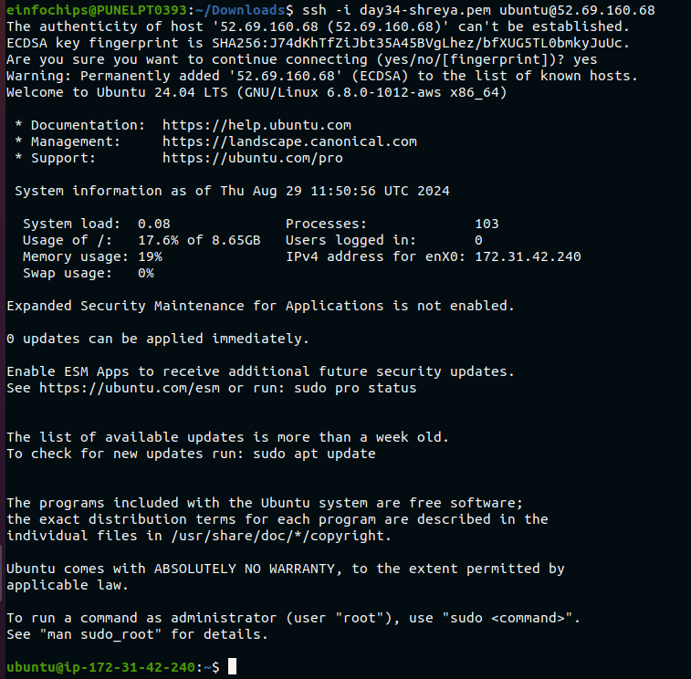
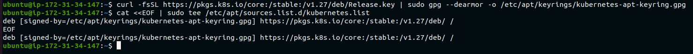
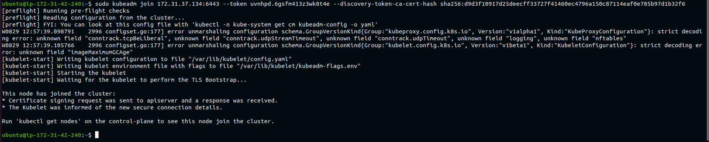

# Monitoring Kubernetes Applications Using Prometheus and Grafana on EC2 Instances

## Project Overview

This project involves deploying a Kubernetes application on AWS EC2 instances and setting up a monitoring stack using Prometheus and Grafana. The goal is to monitor the application's performance and visualize metrics using Grafana dashboards. This project tests your ability to deploy and configure monitoring solutions in a Kubernetes environment on AWS.

## Project Objectives

- Deploy a Kubernetes cluster on EC2 instances.
- Install Prometheus to monitor Kubernetes cluster metrics.
- Install Grafana and configure it to visualize metrics from Prometheus.
- Create custom Grafana dashboards to monitor specific application metrics.
- Set up alerts in Grafana based on specific thresholds.
- Terminate all AWS resources after completing the project.

## Project Requirements

- **AWS EC2 Instances**: Launch at least 3 t2.micro instances for Kubernetes master and worker nodes.
- **Kubernetes Cluster**: Set up using Kubeadm on the EC2 instances.
- **Prometheus**: Deployed on the Kubernetes cluster to collect metrics.
- **Grafana**: Deployed on the Kubernetes cluster and configured to use Prometheus as a data source.
- **Custom Dashboards**: Create dashboards to monitor application metrics.
- **Alerting**: Basic alerts for key metrics (e.g., CPU usage, memory usage).
- **Termination**: Ensure all AWS resources are terminated after the project is complete.

## Step-by-Step Project Tasks

### 1. Launch AWS EC2 Instances

- Launch three t2.micro for `worker` and t2.medium for `master`EC2 instances in the same VPC and availability zone.

<br>


- Configure security groups to allow SSH (port 22) and necessary ports for Kubernetes, Prometheus, and Grafana (e.g., ports 9090, 3000).

<br>


- SSH into the instances and update the package manager.

`master`
<br>


`worker`

<br>



### 2. Set Up a Kubernetes Cluster
- 1. Create the Configuration File for containerd:
```
cat <<EOF | sudo tee /etc/modules-load.d/containerd.conf
overlay
br_netfilter
EOF
```
`master`
<br>


- 2. Load the Modules:
```
sudo modprobe overlay
sudo modprobe br_netfilter
```
`master`
<br>


- 3. Set the System Configurations for Kubernetes Networking:
```
cat <<EOF | sudo tee /etc/sysctl.d/99-kubernetes-cri.conf
net.bridge.bridge-nf-call-iptables = 1
net.ipv4.ip_forward = 1
net.bridge.bridge-nf-call-ip6tables = 1
EOF
```
`master`
<br>


- 4. Apply the New Settings:
```
sudo sysctl --system
```
`master`
<br>


- 5. Install containerd:
```
sudo apt-get update && sudo apt-get install -y containerd
``` 
`master`
<br>


- 6. Create the Default Configuration File for containerd:
```
sudo mkdir -p /etc/containerd
```

- 7. Generate the Default containerd Configuration and Save It:
```
sudo containerd config default | sudo tee /etc/containerd/config.toml
```
`master`
<br>


- 8. Restart containerd & Verify that containerd is Running:

```
sudo systemctl restart containerd
sudo systemctl status containerd
```
`master`
<br>


- 9. Disable Swap:
```
sudo swapoff -a
```

- 10. Install Dependency Packages:
```
sudo apt-get update && sudo apt-get install -y apt-transport-https curl
```
`master`
<br>


- 11. Download and Add the GPG Key:
```
curl -fsSL https://pkgs.k8s.io/core:/stable:/v1.29/deb/Release.key | sudo gpg --dearmor -o /etc/apt/keyrings/kubernetes-apt-keyring.gpg
```

- 12. Add Kubernetes to the Repository List:
```
cat <<EOF | sudo tee /etc/apt/sources.list.d/kubernetes.list
deb [signed-by=/etc/apt/keyrings/kubernetes-apt-keyring.gpg] https://pkgs.k8s.io/core:/stable:/v1.29/deb/ /
EOF
```
`master`
<br>



- 13. Update the Package Listings:
```
sudo apt-get update
```
`master`
<br>


- Install Kubeadm, Kubelet, and Kubectl on the master node.
```
sudo apt-get install -y kubelet kubeadm kubectl
```
`master`
<br>


- Turn Off Automatic Updates:
```
sudo apt-mark hold kubelet kubeadm kubectl
```
`master`
<br>


- On `master` initialize the Kubernetes cluster using Kubeadm.
```
sudo kubeadm init --pod-network-cidr 172.31.0.0/16 --kubernetes-version 1.27.11
```
`master`
<br>


<br>


- set kubectl Access
```
mkdir -p $HOME/.kube
sudo cp -i /etc/kubernetes/admin.conf $HOME/.kube/config
sudo chown $(id -u):$(id -g) $HOME/.kube/config
```
`master`
<br>


- On the Control Plane Node, Install Calico Networking:
```
kubectl apply -f https://raw.githubusercontent.com/projectcalico/calico/v3.25.0/manifests/calico.yaml
```
`master`
<br>


- Check the Status of the Control Plane Node:
```
kubectl get nodes
```
`master`
<br>


- Join the worker nodes to the master node.

```
sudo kubeadm join 172.31.37.134:6443 --token uvnhpd.6gsfm413z3wk8t4e --discovery-token-ca-cert-hash sha256:d9d3f10917d25deecff33727f41460ec4796a150c87114eaf0e705b97d1b32f6 
```
`worker`
<br>



- On the master Node, View the Cluster Status:
```
kubectl get nodes
```
`master`
<br>


- Verify the cluster by deploying a sample application (e.g., Nginx).

### 3. Deploy Prometheus on Kubernetes 

- Create a Kubernetes namespace for monitoring tools.
```
# install the helm on the Master Node
# to install helm use below commands
curl https://raw.githubusercontent.com/helm/helm/main/scripts/get-helm-3 | bash
helm repo add stable https://charts.helm.sh/stable
helm repo update
```
<br>


- Use a Helm chart or manually deploy Prometheus using Kubernetes manifests.
```
# use the below cmd to add the prometheus repo
helm repo add prometheus-community https://prometheus-community.github.io/helm-charts
helm repo update
```
<br>


```
# create the namespace for prometheus
kubectl create namespace prometheus

# install prometheus using helm
helm install prometheus prometheus-community/prometheus --namespace prometheus
```

<br>


- Expose Prometheus using a Kubernetes service.
```
# use below command to expose the prometheus service on the 9090 port
kubectl port-forward service/prometheus --address 0.0.0.0 9090:80 --namespace prometheus
```
- Verify Prometheus is collecting metrics from the Kubernetes cluster.
<br>


### 4. Deploy Grafana on Kubernetes (20 Minutes)

- Deploy Grafana in the monitoring namespace.
```
# create namespace for grafana
kubectl create namespace grafana
# Add the helm repo for grafana
helm repo add grafana https://grafana.github.io/helm-charts

# Install the grafana usng helm
helm install grafana grafana/grafana --namespace grafana
```
<br>


```
# to get the grafana login password for admin user use below cmd
kubectl get secret --namespace grafana grafana -o jsonpath="{.data.admin-password}" | base64 --decode ; echo

# use below command to expose the grafana service on the 3000 port
kubectl port-forward service/grafana --address 0.0.0.0 3000:80 --namespace grafana
```

- Expose Grafana using a Kubernetes service and set up port forwarding or a LoadBalancer for external access.
<br>


- Configure Grafana to use Prometheus as a data source.
- Verify Grafana can visualize metrics from Prometheus.
<br>


### 5. Create and Configure Custom Dashboards (20 Minutes)

- Create dashboards in Grafana to monitor CPU usage, memory usage, pod status, and network traffic.
- Save the dashboards for future use.
- Share the dashboard URLs for easy access.

### 6. Clean Up Resources (10 Minutes)

- Delete all Kubernetes resources (Prometheus, Grafana, and sample application).
- Terminate all EC2 instances to avoid unnecessary charges.
```
helm uninstall grafana -n grafana
helm uninstall prometheus -n prometheus
```

## Deliverables

- **Kubernetes Cluster**: A functioning cluster with at least one master node and two worker nodes.
- **Prometheus Deployment**: Prometheus deployed on the Kubernetes cluster, collecting metrics.
- **Grafana Deployment**: Grafana deployed on the Kubernetes cluster, configured with Prometheus as a data source.
- **Custom Dashboards**: Dashboards displaying relevant metrics.
- **Alerting Setup**: Basic alerting rules configured in Grafana.
- **Clean-Up**: All AWS resources terminated upon project completion.

