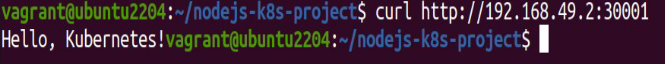
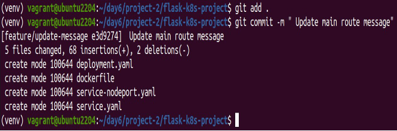
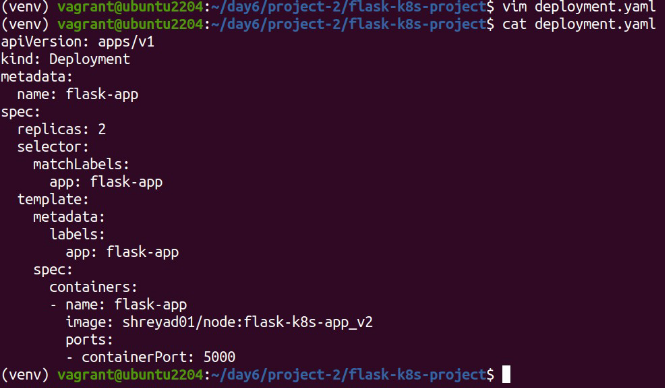

**Project 01**

**Deploying a Node.js App Using Minikube Kubernetes**

**Overview**

This project guides you through deploying a Node.js application using Minikube Kubernetes. You'll use Git for version control, explore branching and fast-forward merges, and set up Kubernetes services and deployment pods, including ClusterIP and NodePort service types.

**Prerequisites**

- Minikube installed
- kubectl installed
- Git installed
- Node.js installed ([https://nodejs.org/en/download/package-manager/all#debian-and-ubuntu- based-linux-distributions](https://nodejs.org/en/download/package-manager/all#debian-and-ubuntu-based-linux-distributions))


`  `**Project Steps**

#### 1. Set Up Git Version Control
1. **Initialize a Git Repository**

Create a new directory for your project: 

`mkdir nodejs-k8s-project`

`cd nodejs-k8s-project`

Initialize a Git repository: 
`git init`

2. **Create a Node.js Application**

Initialize a Node.js project: `npm init -y`


Install Express.js: `npm install express`


Create an **index.js** file with the following content: 
```
const express = require('express');
const app = express();
const port = 3000;

app.get('/', (req, res) => {
    res.send('Hello, Kubernetes!');
});

app.listen(port, () => {
    console.log(`App running at http://localhost:${port}`);
});
```


Create a **.gitignore** file to ignore node_modules: `node_modules`


3. **Commit the Initial Code**

Add files to Git: `git add .`


Commit the changes:

`git commit -m "Initial commit with Node.js app"`


#### 2. **Branching and Fast-Forward Merge**
1. **Create a New Branch**

Create and switch to a new branch feature/add-route: 
`git checkout -b feature/add-route`


2. **Implement a New Route**

Modify index.js to add a new route: 
```
   app.get('/newroute', (req, res) => {
   res.send('This is a new route!'); });
```


`    `Commit the changes: `git add .`

`git commit -m "Add new route"`


3. **Merge the Branch Using Fast-Forward**

Switch back to the main branch: `git checkout master`


Merge the feature/add-route branch using fast-forward: 
`git merge --ff-only feature/add-route`


Delete the feature branch:

`git branch -d feature/add-route`


#### 3. **Containerize the Node.js Application**
1. **Create a Dockerfile**

Create a **Dockerfile** with the following content: 
```
FROM node:14
WORKDIR /app

COPY package\*.json ./ RUN npm install

COPY . .

EXPOSE 3000

CMD ["node", "index.js"]
```


2. **Build and Test the Docker Image**

Build the Docker image: 

`docker build -t nodejs-k8s-app .`


Run the Docker container to test: 

`docker run -p 3000:3000 nodejs-k8s-app`


1 Access `http://localhost:3000`to see the app running.


#### 4. **Deploying to Minikube Kubernetes**
1. **Start Minikube**

Start Minikube:

`minikube start`


2. **Create Kubernetes Deployment and Service Manifests** Create a deployment.yaml file:

```
   apiVersion: apps/v1
kind: Deployment
metadata:
  name: nodejs-app
spec:
  replicas: 2
  selector:
    matchLabels:
      app: nodejs-app
  template:
    metadata:
      labels:
        app: nodejs-app
    spec:
      containers:
      - name: nodejs-app
        image: nodejs-k8s-app:latest
        ports:
        - containerPort: 3000

```


Create a service.yaml file for ClusterIP: 
```
apiVersion: v1
kind: Service
metadata:
  name: nodejs-service
spec:
  selector:
    app: nodejs-app
  ports:
  - protocol: TCP
    port: 80
    targetPort: 3000
  type: ClusterIP
```


Create a service-nodeport.yaml file for NodePort: 
```
apiVersion: v1
kind: Service
metadata:
  name: nodejs-service-nodeport
spec:
  selector:
    app: nodejs-app
  ports:
  - protocol: TCP
    port: 80
    targetPort: 3000
    nodePort: 30001
  type: NodePort
```


3. **Apply Manifests to Minikube**

Apply the deployment:

`kubectl apply -f deployment.yaml`


Apply the ClusterIP service: 

`kubectl apply -f service.yaml`


Apply the NodePort service:

`kubectl apply -f service-nodeport.yaml`


4. **Access the Application**

Get the Minikube IP: `minikube ip`


1 Access the application using the NodePort:

` curl http://192.168.49.2:30001 `


**Making Changes to the App and Redeploying Using Kubernetes**

#### 6. **Making Changes to the Node.js Application**
1. **Create a New Branch for Changes**

Create and switch to a new branch feature/update-message: 

`git checkout -b feature/update-message`


2. **Update the Application**

Modify index.js to change the message: 
```
const express = require('express');
const app = express();
const port = 3000;

app.get('/', (req, res) => {
    res.send('Hello, Kubernetes! Updated version.');
});

app.get('/newroute', (req, res) => {
    res.send('This is a new route!');
});

app.listen(port, () => {
    console.log(`App running at http://localhost:${port}`);
});
```


3. **Commit the Changes**

Add and commit the changes: `git add .`

`git commit -m "Update main route message"`


#### 7. **Merge the Changes and Rebuild the Docker Image**
1. **Merge the Feature Branch**

Switch back to the main branch: `git checkout master`


Merge the feature/update-message branch: `git merge --ff-only feature/update-message`


Delete the feature branch:

`git branch -d feature/update-message`


2. **Rebuild the Docker Image**

Rebuild the Docker image with a new tag: `docker build -t nodejs-k8s-app:v2 .`


#### 8. **Update Kubernetes Deployment**
1. **Update the Deployment Manifest**

Modify deployment.yaml to use the new image version: 
```
apiVersion: apps/v1
kind: Deployment
metadata:
  name: nodejs-app
spec:
  replicas: 2
  selector:
    matchLabels:
      app: nodejs-app
  template:
    metadata:
      labels:
        app: nodejs-app
    spec:
      containers:
      - name: nodejs-app
        image: shreyad01/node:nodejs-k8s-app_v2
        ports:
        - containerPort: 3000
```


2. **Apply the Updated Manifest**

Apply the updated deployment: 
`kubectl apply -f deployment.yaml`


3. **Verify the Update**

Check the status of the deployment:

`kubectl rollout status deployment/nodejs-app`


#### 9. **Access the Updated Application**
1. **Access Through ClusterIP Service**

Forward the port to access the ClusterIP service: 
`kubectl port-forward service/nodejs-service 8083:80`


1 Open your browser and navigate to `http://localhost:8080` to see the updated message.

2. **Access Through NodePort Service**

1 Access the application using the NodePort:

`curl http://192.168.49.2:30001`



### Project 02 

**Deploying a Python Flask App Using Minikube Kubernetes**

**Overview**

This project guides you through deploying a Python Flask application using Minikube Kubernetes. You'll use Git for version control, explore branching and fast-forward merges, and set up Kubernetes services and deployment pods, including ClusterIP and NodePort service types.

**Prerequisites**

- Minikube installed
- kubectl installed
- Git installed
- Python installed

**Project Steps**

#### 1. **Set Up Git Version Control**
1. **Initialize a Git Repository**

Create a new directory for your project: 

`mkdir flask-k8s-project`

`cd flask-k8s-project`


Initialize a Git repository: 
sh
Copy code

`git init`

2. **Create a Python Flask Application**

Create a virtual environment: 
`python -m venv venv`
`source venv/bin/activate`

Install Flask: 
sh
Copy code
`pip install Flask`

Create an **app.py** file with the following content: 
python
Copy code
```
from flask import Flask

app = Flask(__name__)

@app.route('/')
def hello_world():
    return 'Hello, Kubernetes!'

if __name__ == '__main__':
    app.run(host='0.0.0.0', port=5000)
```


Create a **requirements.txt** file to list the dependencies: 
Copy code

`Flask`


Create a **.gitignore** file to ignore venv: 
Copy code

`venv`


3. **Commit the Initial Code**

Add files to Git: 
+ `git add .`

Commit the changes:

`git commit -m "Initial commit with Flask app"`


#### 2. **Branching and Fast-Forward Merge**
+ 2.1. **Create a New Branch**

Create and switch to a new branch **feature/add-route**: 
`git checkout -b feature/add-route`


+ 2.2. **Implement a New Route**

Modify **app.py** to add a new route: 
```
@app.route('/newroute')
def new_route():
    return 'This is a new route!'
```


+ Commit the changes: 
`git add .`

`git commit -m "Add new route"`


+ 2.3. **Merge the Branch Using Fast-Forward**

Switch back to the **main** branch: 
`git checkout master`


Merge the **feature/add-route** branch using fast-forward: 
`git merge --ff-only feature/add-route`


Delete the feature branch:

`git branch -d feature/add-route`


#### 3. **Containerize the Flask Application**
1. **Create a Dockerfile**

Create a **Dockerfile** with the following content: 
```
FROM python:3.8-slim
WORKDIR /app
COPY requirements.txt requirements.txt
RUN pip install -r requirements.txt
COPY . .
EXPOSE 5000
CMD ["python", "app.py"]
```


2. **Build and Test the Docker Image**

Build the Docker image: `docker build -t flask-k8s-app .`


Run the Docker container to test: `docker run -p 5000:5000 flask-k8s-app`

2 Access `http:192.168.56.13:5000` to see the app running.


#### 4. **Deploying to Minikube Kubernetes**
1. **Start Minikube**

Start Minikube: minikube start


2. **Create Kubernetes Deployment and Service Manifests** 

Create a **deployment.yaml** file:
```
   apiVersion: apps/v1
kind: Deployment
metadata:
  name: flask-app
spec:
  replicas: 2
  selector:
    matchLabels:
      app: flask-app
  template:
    metadata:
      labels:
        app: flask-app
    spec:
      containers:
      - name: flask-app
        image: flask-k8s-app:latest
        ports:
        - containerPort: 5000
```


Create a **service.yaml** file for ClusterIP: 
```
apiVersion: v1
kind: Service
metadata:
  name: flask-service
spec:
  selector:
    app: flask-app
  ports:
  - protocol: TCP
    port: 80
    targetPort: 5000
  type: ClusterIP
```


Create a **service-nodeport.yaml** file for NodePort: 
```
apiVersion: v1
kind: Service
metadata:
  name: flask-service-nodeport
spec:
  selector:
    app: flask-app
  ports:
  - protocol: TCP
    port: 80
    targetPort: 5000
    nodePort: 30001
  type: NodePort
```


3. **Apply Manifests to Minikube**

Apply the deployment:

`kubectl apply -f deployment.yaml`


Apply the ClusterIP service: 

`kubectl apply -f service.yaml`


Apply the NodePort service:

`kubectl apply -f service-nodeport.yaml`


4. **Access the Application**

Get the Minikube IP: 
`minikube ip`

Access the application using the NodePort: 
`curl http://192.168.49.2:30002`


#### 5. **Clean Up** 

Stop Minikube: 

`minikube stop`


Delete Minikube cluster: 
   
`minikube delete`


#### 6. **Making Changes to the Flask Application**
1. **Create a New Branch for Changes**

Create and switch to a new branch feature/update-message: 

`git checkout -b feature/update-message`


2. **Update the Application**

Modify app.py to change the message: 
```
@app.route('/')
def hello_world():
    return 'Hello, Kubernetes! Updated version.'
cat 
@app.route('/newroute')
def new_route():
    return 'This is a new route!'
```


3. **Commit the Changes**

Add and commit the changes: 

`git add .`

`git commit -m "Update main route message"`



#### 7. **Merge the Changes and Rebuild the Docker Image**
1. **Merge the Feature Branch**

Switch back to the main branch: 

`git checkout master`


Merge the feature/update-message branch: 

`git merge --ff-only feature/update-message`


Delete the feature branch:

`git branch -d feature/update-message`


2. **Rebuild the Docker Image**

Rebuild the Docker image with a new tag: 

`docker build -t flask-k8s-app:v2 .`


#### 8. **Update Kubernetes Deployment**
1. **Update the Deployment Manifest**

Modify **deployment.yaml** to use the new image version: 
```
apiVersion: apps/v1
kind: Deployment
metadata:
  name: flask-app
spec:
  replicas: 2
  selector:
    matchLabels:
      app: flask-app
  template:
    metadata:
      labels:
        app: flask-app
    spec:
      containers:
      - name: flask-app
        image: shreyad01/node:flask-k8s-app_v2
        ports:
- containerPort: 5000
```



2. **Apply the Updated Manifest**

Apply the updated deployment: 
sh
Copy code

`kubectl apply -f deployment.yaml`

3. **Verify the Update**

Check the status of the deployment: 
sh
Copy code

`kubectl rollout status deployment/flask-app`

9. **Access the Updated Application**
1. **Access Through ClusterIP Service**

Forward the port to access the ClusterIP service: 

`kubectl port-forward service/flask-service 8080:80`

1 Open your browser and navigate to `http://192.168.49.2:8080` to see the updated message.

2. **Access Through NodePort Service**

1 Access the application using the NodePort:

`curl http://192.168.49.2:30001`


