### project

#### Stage 1: Setting Up the Kubernetes Cluster and Static Web App

+ 1) start minikube 
    + Ensure Minikube is installed and running on the local Ubuntu machine.
          use command  ` Minikube start ` 
           
          
    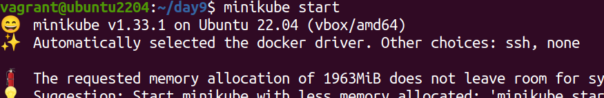
     

    + Verify the Kubernetes cluster is functioning correctly by using ` kubectl get all `

         

        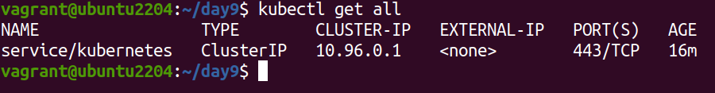

  + Create a Dockerfile for a simple static web application (e.g., an HTML page served by Nginx)

+  2) Deploy Static Web App:
    
    + Create a Dockerfile for a simple static web application (e.g., an HTML page served by Nginx).
     
      
 
     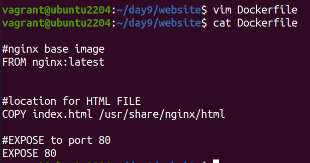
    
    + we need index file for frontend and backend 

       
        
        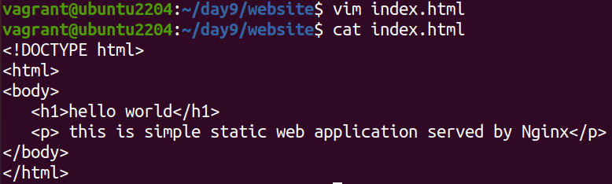

        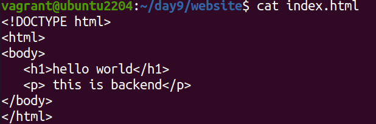
        
     + Build a Docker image for  frontend  static web application with command 
     ` docker build -t webapp-image .`
    
        
        
    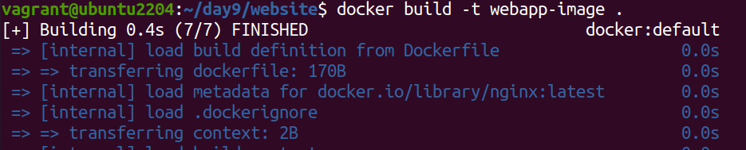

    + Build a Docker image for  backend  static web application 
     ` docker build -t webapp2-image .`
      
        
         
         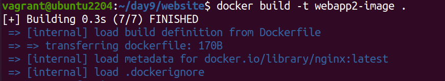 

    + Push the Docker image to Docker Hub or a local registry
    `docker push shreyad01/webapp-image:latest`  for frontend image
    `docker push shreyad01/webapp2-image_v2`   for backend image 

       
       
       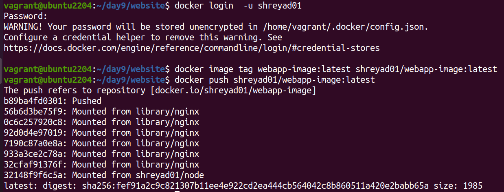
       
       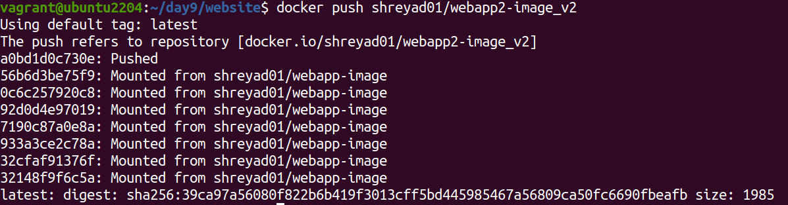

+ 3) Kubernetes Deployment:

  + Write a Kubernetes  frontend – deployment and backend - deployment manifest to deploy the static web application.

   
  
    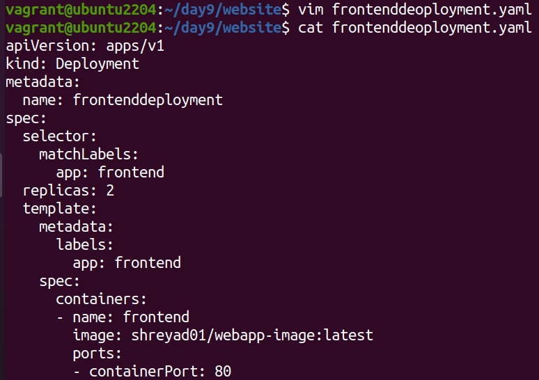

    

  + Write a Kubernetes frontend service and backend service manifest to expose the static web application within the cluster.

   

    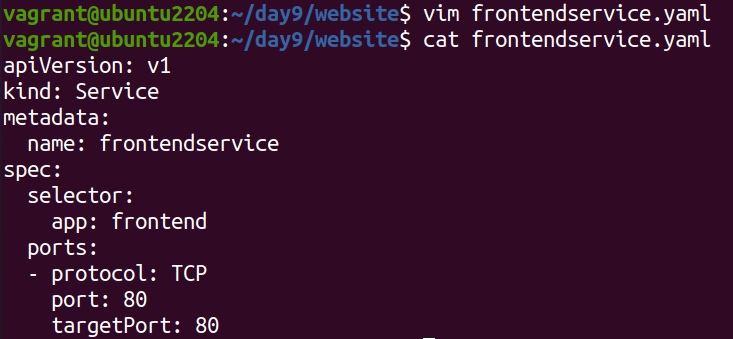

    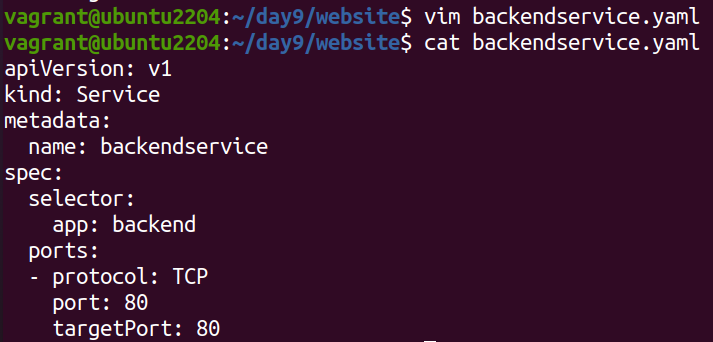

   + Apply the deployment manifests to the Kubernetes cluster.
   `kubectl apply -f frontenddeoployment.yaml` for frontend deployment
  `kubectl apply -f backenddeployment.yaml`    for backend deployment

     
      
    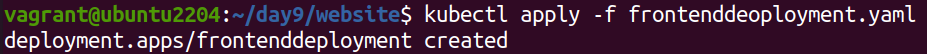

    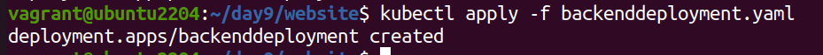

   + Apply the service manifests to the Kubernetes cluster.
   ` kubectl apply -f frontendservice.yaml` for frontend service 
   `kubectl apply -f backendservice.yaml` fro backend service
    
     

    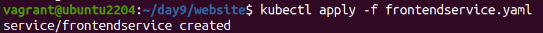

    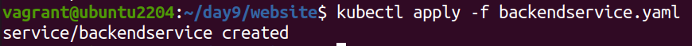

+ To get Docker images run `docker image ` command
 
  

   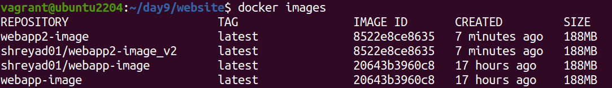

#### Stage 2: Configuring Ingress Networking

 4) Install and Configure Ingress Controller:

    + Install an ingress controller (e.g., Nginx Ingress Controller) in the Minikube cluster.
    ` git clone https://github.com/nginxinc/kubernetes-ingress.git --branch v3.6.1.`

    + Verify the ingress controller is running and accessible.
    ` kubectl describe ingress`

     + to enable ingress use command ` minikube addons enable ingress `

      

     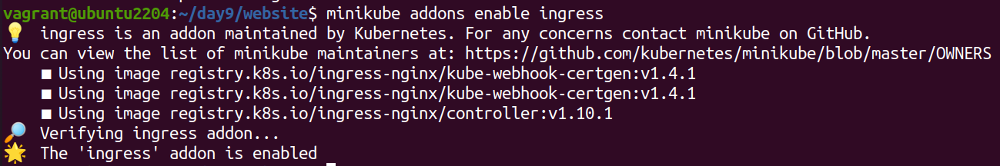

   5) Create Ingress Resource:

   +  Write an ingress resource manifest to route external traffic to the static web application. Configure advanced ingress rules for path-based routing and host-based routing (use at least two different hostnames and paths).

    

   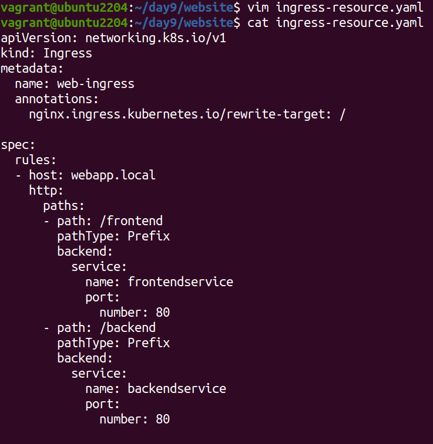

   + Implement TLS termination for secure connections.
   + To generate tls.crt and tls.key use command :
      +  ` openssl req -x509 -sha256 -nodes -days 365 -newkey rsa:2048 -keyout tls.key -out tls.crt -subj "/CN=nginxsvc/O=nginxsvc-tls" `
   + it will give 2 file `tis.crt` and `tls.key`

    
    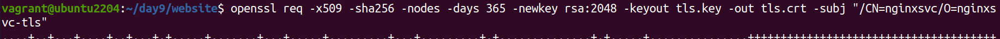

    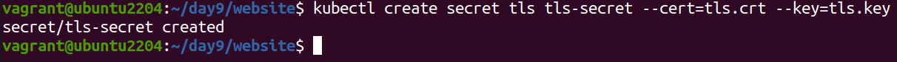

  + use following command to see tls-sectet file  
    + `kubectl get secrets`
     

     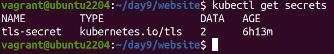

   + Configure URL rewriting in the ingress resource to modify incoming URLs before they reach the backend services.

     
     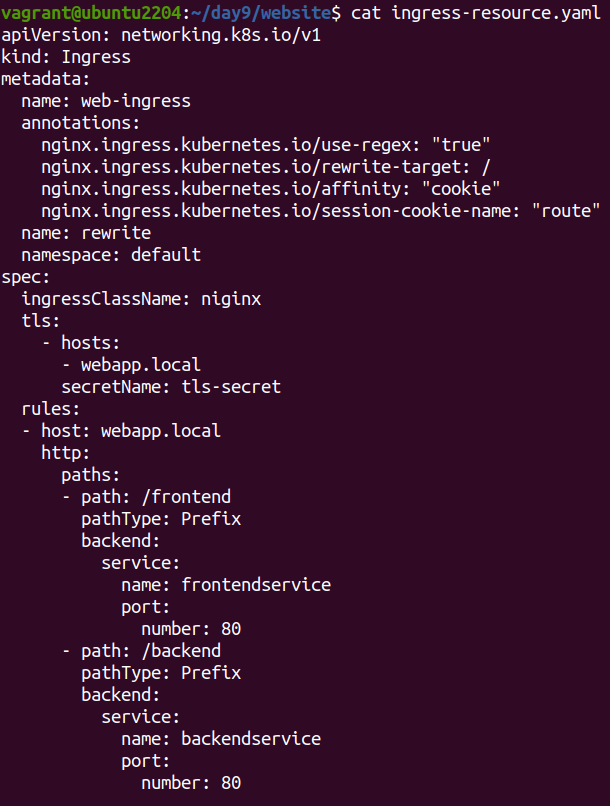
 
   + when we curl we get following output
     + for frontend :
      + `curl http://webapp.local/frontend`

       
      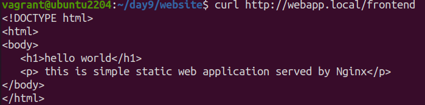

      + for frontens using TLS certificate  use command 
       + `curl https://webapp.local/frontend -Lk`

        
        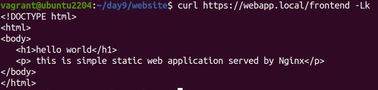

        + for backend :
          + `curl http://webapp.local/backend  `

        + for backend using TLS certificate use command 
          + ` curl https://webapp.local/backend -Lk `  

           

          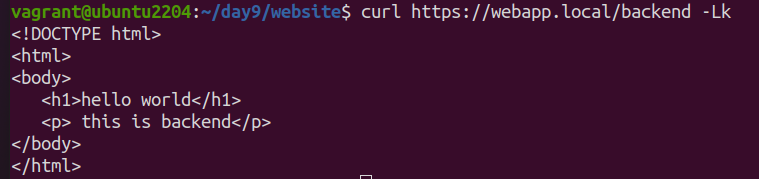

+  Enable sticky sessions to ensure that requests from the same client are directed to the same backend pod.

     +    `  annotations:
     +         nginx.ingress.kubernetes.io/ssl-redirect: "true"
     +         nginx.ingress.kubernetes.io/rewrite-target: /
     +         nginx.ingress.kubernetes.io/affinity: "cookie"
     +         nginx.ingress.kubernetes.io/session-cookie-name: “route” `

      
     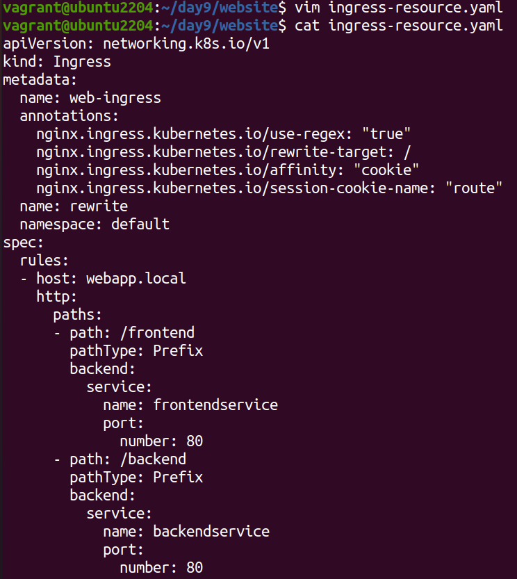

#### Stage 3: Implementing Horizontal Pod Autoscaling
  + 6) Configure Horizontal Pod Autoscaler:
     + Write a horizontal pod autoscaler (HPA) manifest to automatically scale the static web application pods based on CPU utilization.
     + Use command to run autoscaler in frontend 
      +  `kubectl autoscale deployment frontenddeployment --cpu-percent=50 --min=1 –max=7 `
       
      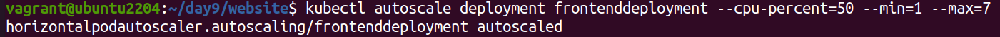
      + use command to run autoscaler in backend
      ‘`kubectl autoscale deployment backenddeployment  --cpu-percent=50 --min=1 –max=7 ` 
       
      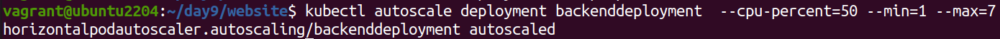

+ to check current status of newly-made hpa  use command ` kubectl get hpa `

 

+ 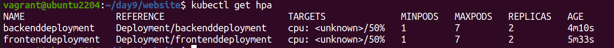

+ Set thresholds for minimum and maximum pod replicas.
 + Write below code in request 
    +           `resources:
                    requests:
                       cpu: 10m
                       memory: 50Mi `

  + Use command 
     + `kubectl edit deployment backenddeployment `
  
   
 

  + Use command 
       +   `kubectl edit deployment frontdeployment `
 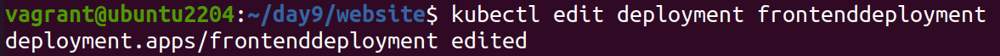

  + `kubectl get all `
   
   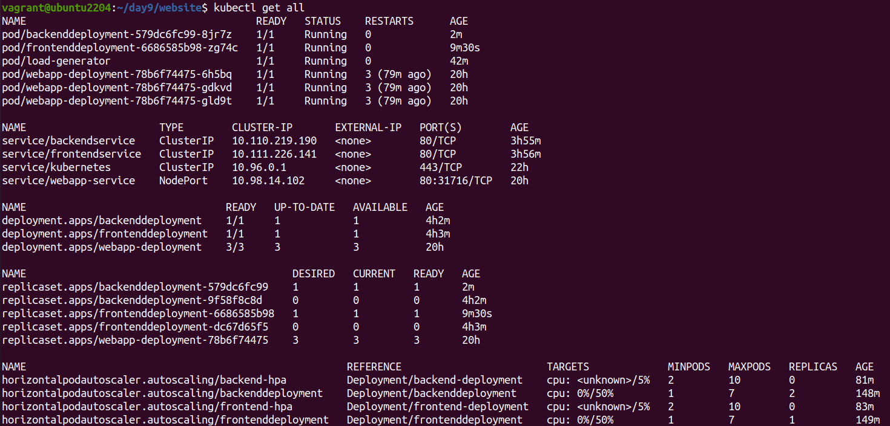
   + 7) Stress Testing:
     + Perform stress testing to simulate traffic and validate the HPA configuration.
     + For frontend stress testing we need to first create load generator pod and open sh terminal for that use below command 
    +  ` kubectl run -i --tty load-generator --rm --image=busybox --restart=Never -- /bin/sh`
+  in terminal enter following command to send the request to website
  + ` while sleep 0.01; do wget -q -O- http://webapp.local/frontend ; done `
 + Same for backend stress testing use command 
     + ` kubectl run -i --tty load-generator --rm --image=busybox --restart=Never -- /bin/sh `
     + ` while sleep 0.01; do wget -q -O- http://webapp.local/backend ; done `
      
   +   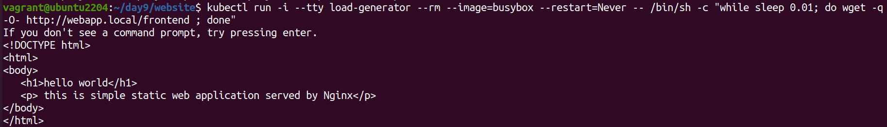
+  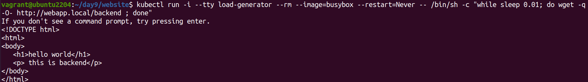
+ Monitor the scaling behavior and ensure the application scales up and down based on the load.
 

+ 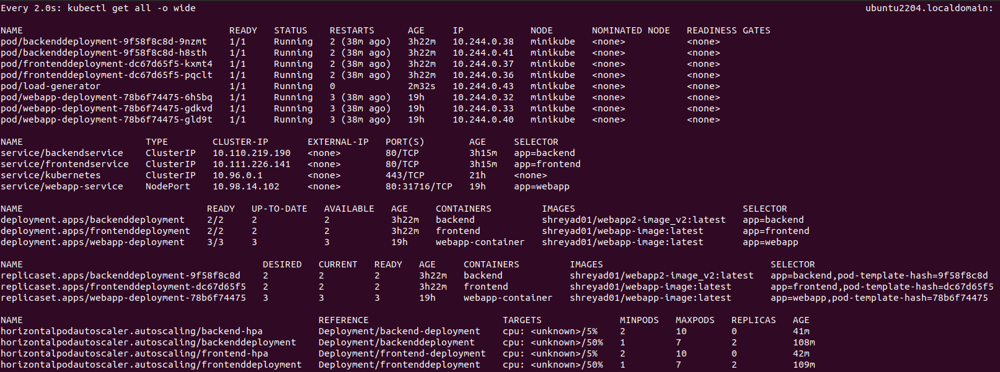

#### Stage 4: Final Validation and Cleanup
+ 8) Final Validation:
    + `kubectl get all`
    +  `kubectl delete all --all -n frontend `
    + `kubectl delete all -n backend`
     + `minikube delete`