# Modular E-Commerce Application Deployment with S3 Integration

## Project Overview

In this project, participants will deploy a modular e-commerce application using AWS services and DevOps tools. The application will be set up to fetch static assets from an S3 bucket. Participants will use Terraform to manage infrastructure as code with modularization, Docker for containerization, Kubernetes for orchestration, and Helm for deployments. The goal is to create a scalable, maintainable solution that integrates various AWS services and DevOps practices.

## Project Duration

- **Total Duration:** 8 Hours

## Project Objectives

1. **Modular Infrastructure:** Use Terraform to create and manage modular infrastructure components.
2. **Static Asset Storage:** Store and fetch static assets from an S3 bucket.
3. **Containerization:** Package the application using Docker.
4. **Orchestration:** Deploy the application on Kubernetes.
5. **CI/CD Pipeline:** Automate the build and deployment process using Jenkins.
6. **Configuration Management:** Use Ansible for configuration management.
7. **Deployment:** Deploy the application using Helm charts.
8. **AWS Resources:** Utilize AWS EC2 free tier instances for deployment.

## Project Tasks and Timeline

### 1. Set Up AWS EC2 Instances (30 Minutes)
- **Launch three EC2 instances** of type t2.micro (1 master node, 2 worker nodes) within the free tier.
 

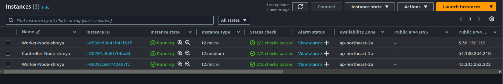

- **Configure security groups** to allow necessary ports (e.g., 22 for SSH, 80 for HTTP, 443 for HTTPS).
`master`
 

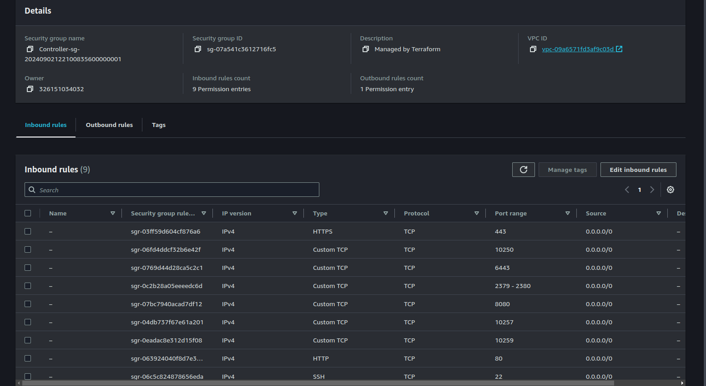

`worker`
 

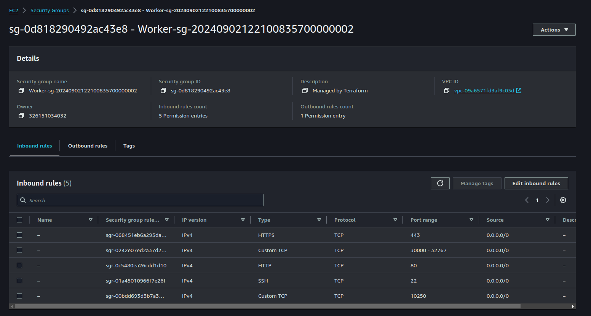

- **SSH into the instances** and prepare for Kubernetes installation.
 

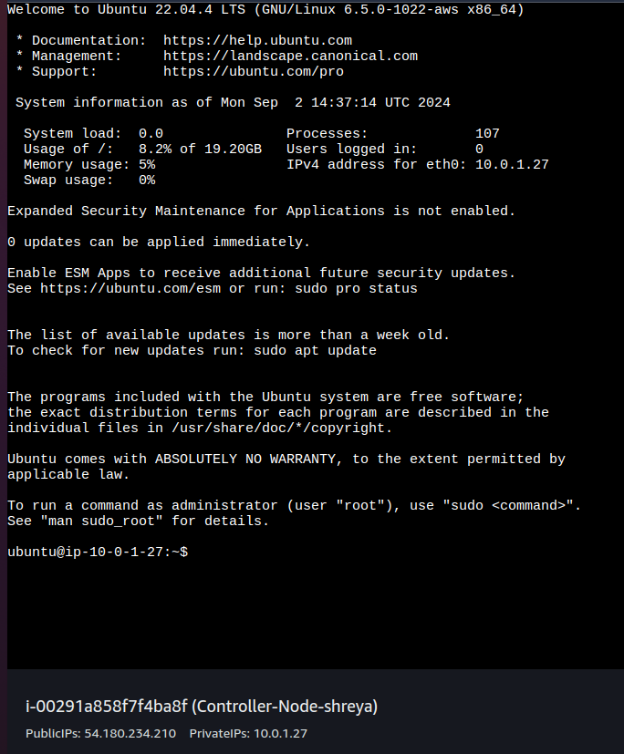

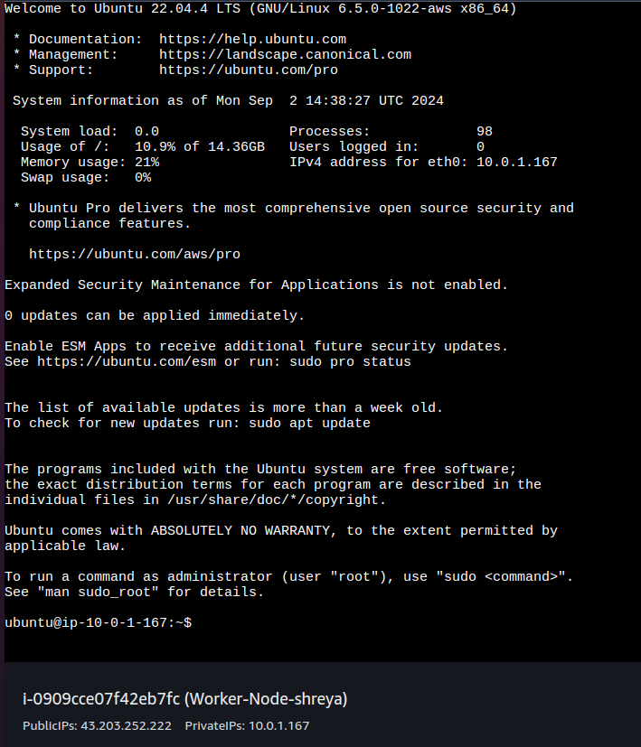

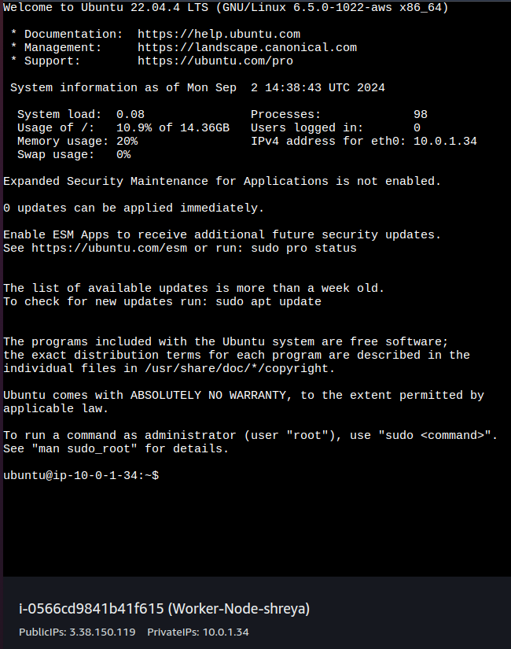

### 2. Create and Configure S3 Bucket (30 Minutes)
- **Create an S3 bucket** to store static assets (e.g., product images, stylesheets).
- **Upload sample static files** to the S3 bucket.
- **Configure bucket policy** to allow read access for the application.
 

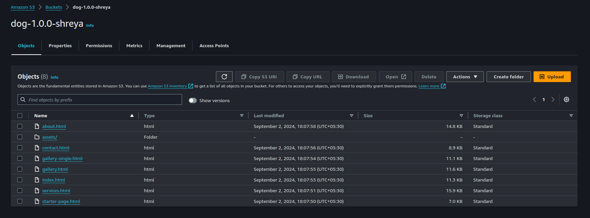

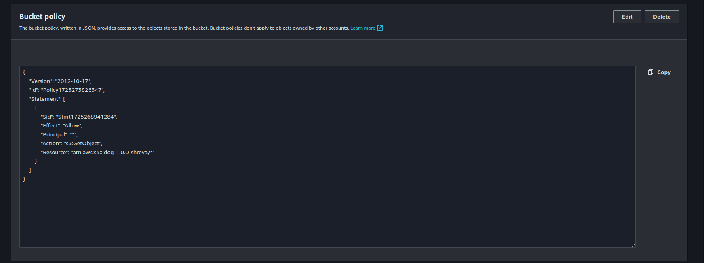

### 3. Set Up Kubernetes Cluster (60 Minutes)
- **On Master Node:**
  - Install Kubeadm, Kubelet, and Kubectl.
  - Initialize the Kubernetes cluster using Kubeadm.
  - Set up a network plugin (e.g., Calico, Flannel).
- **On Worker Nodes:**
  - Join worker nodes to the master node.
- **Verify Cluster:** Deploy a sample application (e.g., Nginx) to ensure the cluster is functional.

### 4. Modularize Infrastructure with Terraform (60 Minutes)
- **Create Terraform Modules:**
  - **Network Module:** Define VPC, subnets, and security groups.
  - **Compute Module:** Define EC2 instances for Kubernetes nodes.
  - **Storage Module:** Define S3 bucket for static assets.
- **Main Configuration:**
  - Create a `main.tf` file to utilize the modules and provision the entire infrastructure.
- **Initialize and Apply:**
  - Run `terraform init`, `terraform plan`, and `terraform apply` to provision the infrastructure.

  `terraform init`
   

  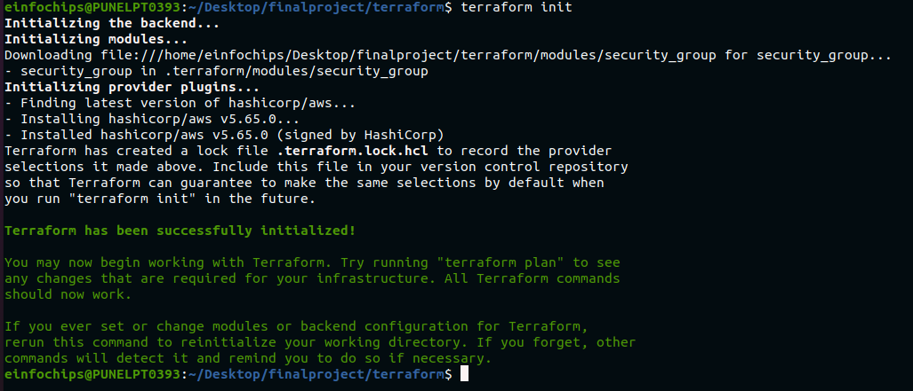

  `terraform plan`
   

  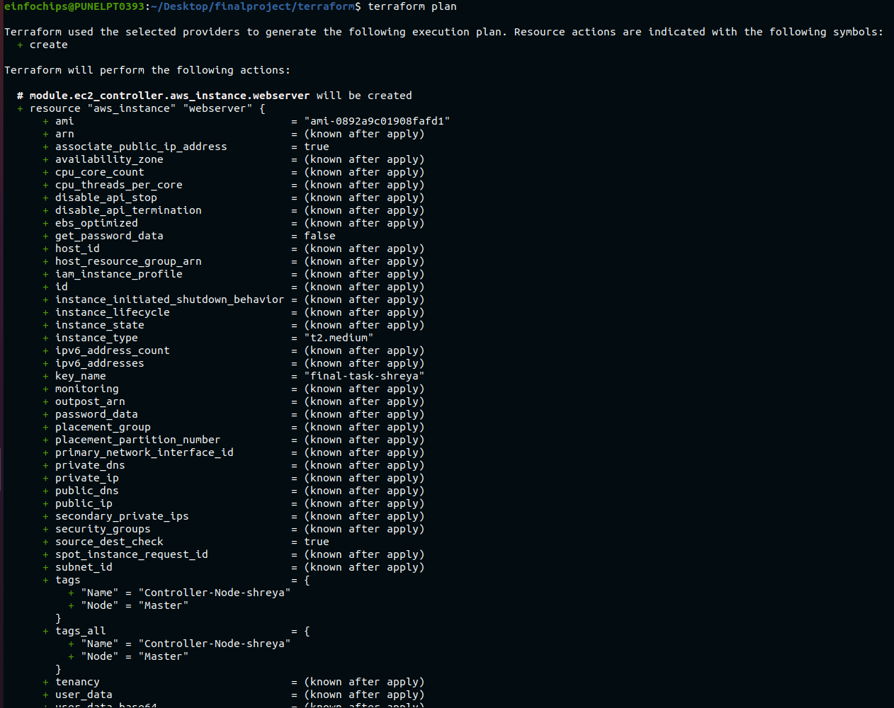

  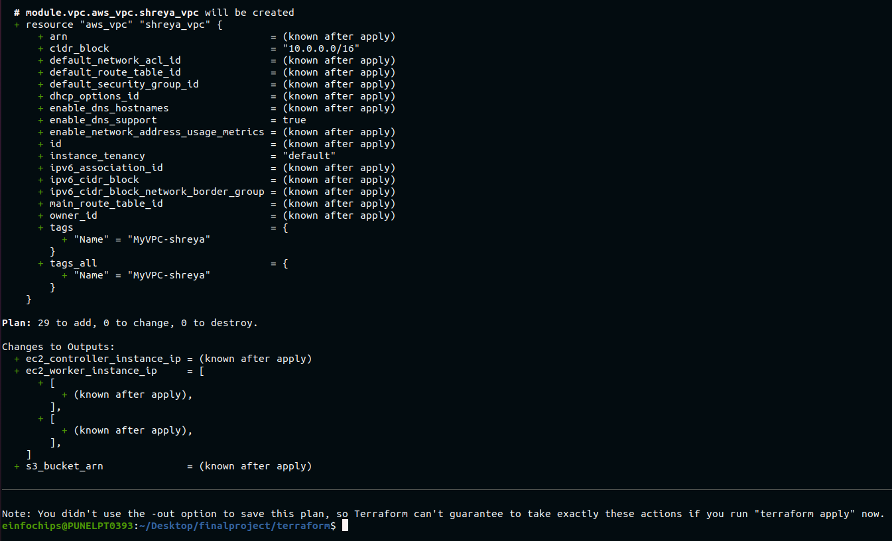

  `terraform apply`
   

  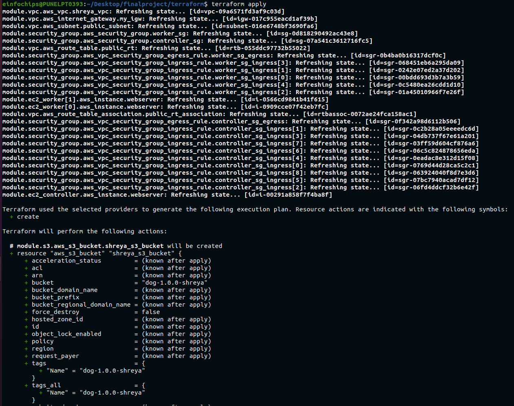

  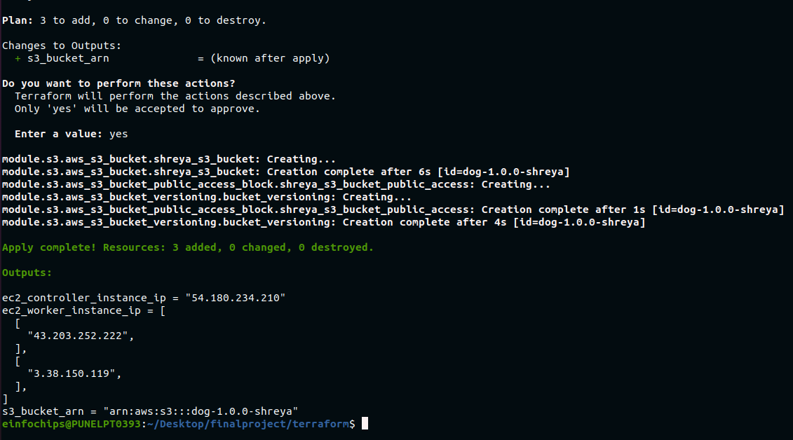

### 5. Containerize the Application with Docker (60 Minutes)
- **Dockerfile:** Write Dockerfile for the e-commerce application.
- **Build Docker Image:** Build Docker images using the Dockerfile.

 

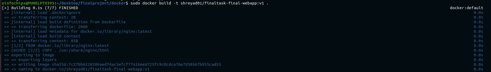

- **Push to Registry:** Push Docker images to a Docker registry (e.g., Docker Hub, Amazon ECR).
 

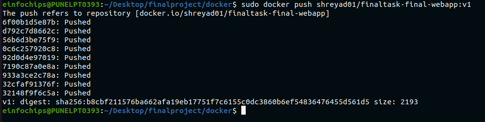

### 6. Configure Ansible for Application Deployment (30 Minutes)
- **Ansible Playbooks:** Write playbooks to configure Kubernetes nodes and deploy the application.

 

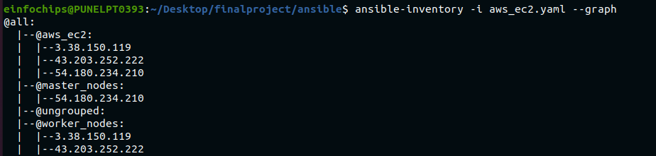

 

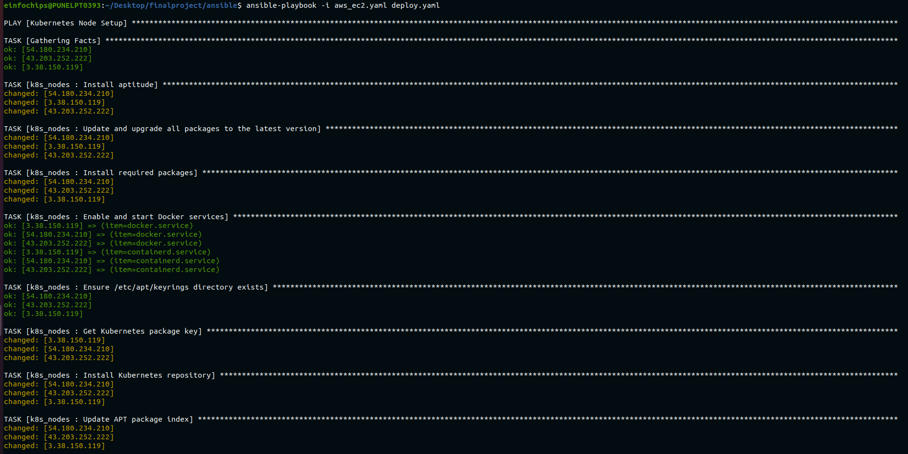

- **Test Playbooks:** Run Ansible playbooks to ensure correct configuration.

### 7. Set Up Jenkins for CI/CD (60 Minutes)
- **Deploy Jenkins:** Deploy Jenkins on Kubernetes using a Helm chart.
- **Configure Pipeline:**
  - Create a Groovy pipeline script in Jenkins for CI/CD.

  [Jenkinsfile](Jenkinsfile)

  - The pipeline should include stages for:
    - **Source Code Checkout:** Pull code from the Git repository.
    - **Build Docker Image:** Build Docker images from the Dockerfile.
    - **Push Docker Image:** Push Docker image to Docker registry.
    - **Deploy to Kubernetes:** Use Helm charts to deploy the Docker image to Kubernetes.

### 8. Deploy the Application with Helm (60 Minutes)
- **Create Helm Charts:** Define Helm charts for the e-commerce application deployment.
  - Include configuration to fetch static files from the S3 bucket.
- **Install Helm Charts:** Deploy the application to Kubernetes using Helm charts.
- **Verify Deployment:** Ensure the application is running correctly and fetching static files from S3.

### 9. Clean Up Resources (30 Minutes)
- **Terminate Resources:** Use Terraform to destroy all provisioned infrastructure by running `terraform destroy`.

